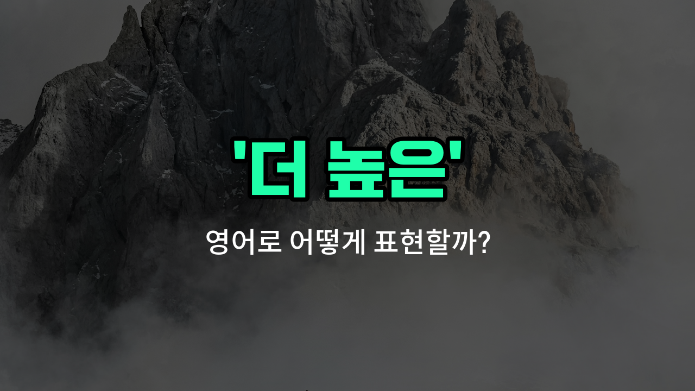

## 🌟 영어 표현 - higher

안녕하세요 👋 오늘은 '더 높은'이라는 뜻을 가진 영어 표현 '**higher**'에 대해 알아보려고 해요.

'higher'는 '높은'의 비교급으로, 어떤 것보다 더 위에 있거나 수준이 더 높을 때 사용해요. 예를 들어, 건물의 층수, 점수, 가격, 위치 등 다양한 상황에서 쓸 수 있어요.

예를 들어, 시험 점수가 더 높을 때 "My score is higher than yours."라고 말할 수 있어요. 또는, 산의 높이를 비교할 때 "Mount Everest is higher than any other mountain."이라고 할 수 있죠.

또한, 'higher'는 단순히 물리적인 높이뿐만 아니라, 수준이나 등급, 가치 등이 더 높을 때도 사용할 수 있어요. 예를 들어, "higher education"은 '고등 교육'을 의미해요.

## 📖 예문

1. "이 빌딩은 저 빌딩보다 더 높아요."

   "This building is higher than that one."

2. "그녀는 나보다 더 높은 점수를 받았어요."

   "She got a higher score than me."

## 💬 연습해보기

<ul data-interactive-list>

  <li data-interactive-item>
    오늘 기온이 어제보다 올라갔어요. 물 많이 마시는 거 잊지 마세요.
    The <a href="/blog/in-english/1448.temperature/">temperature</a> today is higher than it was yesterday. Make sure to drink plenty of water.
  </li>

  <li data-interactive-item>
    음악이 잘 안 들려서 볼륨을 높였어요.
    I <a href="/blog/in-english/1117.set/">set</a> the volume higher because I couldn't hear the music well.
  </li>

  <li data-interactive-item>
    그 가게 가격이 예상보다 비싸서 다른 곳에서 쇼핑할까 해요.
    <a href="/blog/in-english/640.price/">Prices</a> at that store are higher than I expected, so I might shop elsewhere.
  </li>

  <li data-interactive-item>
    시험 점수가 내 것보다 높았는데, 다음 번에는 더 열심히 할 거예요.
    Her score on the test was higher than mine, but I'm going to try harder next time.
  </li>

  <li data-interactive-item>
    도시 중심의 건물은 우리 집 근처 건물보다 층수가 더 많아요.
    The building downtown has a higher <a href="/blog/in-english/1107.number/">number</a> of floors than the one near my house.
  </li>

  <li data-interactive-item>
    그는 오디션에서 팀원 중에 누구보다도 더 높이 점프했어요.
    He jumped higher than anyone else on the team during tryouts.
  </li>

  <li data-interactive-item>
    이 의자는 다른 방에 있는 것보다 높아서 책상에서 일하기에 더 편해요.
    This chair is higher than the one in the other <a href="/blog/in-english/1490.room/">room</a>, so it's more comfortable for <a href="/blog/in-english/1243.working/">working</a> at the desk.
  </li>

  <li data-interactive-item>
    이 달에는 이자율이 높아서 대출 비용이 더 비싸요.
    The interest rates are higher this month, which means loans cost more.
  </li>

  <li data-interactive-item>
    좋은 소식을 들었을 때 제 흥분 수준이 그 어느 때보다 높았어요.
    My excitement <a href="/blog/in-english/1124.level/">level</a> was higher than ever when I heard the good news.
  </li>

  <li data-interactive-item>
    비행기가 더 높은 고도로 날고 있어서 창밖 경치가 정말 멋져요.
    The airplane is flying at a higher altitude, so the view from the window is amazing.
  </li>

</ul>

## 🤝 함께 알아두면 좋은 표현들

### elevated (높은)

'elevated'는 '높은' 또는 '들어올려진'이라는 뜻으로, 일반적으로 물리적 위치가 더 위에 있거나 수준이 높을 때 사용해요. 'higher'와 비슷한 의미로 쓰이지만, 좀 더 공식적이거나 기술적인 상황에서 자주 사용돼요.

- "The building is located on an elevated platform to avoid flooding."
- "그 건물은 홍수를 피하기 위해 높은 플랫폼 위에 위치해 있어요."

### lower (더 낮은)

'lower'는 '더 낮은'이라는 뜻으로, 'higher'의 반대말이에요. 위치나 수준이 아래쪽에 있거나 감소했을 때 사용해요.

- "The temperature today is lower than yesterday."
- "오늘 기온은 어제보다 더 낮아요."

### taller (더 키가 큰)

'taller'는 '더 키가 큰'이라는 뜻으로, 주로 사람이나 물체의 높이 비교에 사용돼요. 'higher'와 비슷하지만, 보통 수직적인 신체나 물체의 크기를 말할 때 쓰여요.

- "She is taller than her brother by a few centimeters."
- "그녀는 오빠보다 몇 센티미터 더 커요."

---

오늘은 '더 높은'이라는 뜻의 영어 표현 '**higher**'에 대해 알아봤어요. 비교할 때나 수준을 말할 때 자주 쓰이는 단어이니 꼭 기억해두세요

오늘 배운 표현과 예문들을 소리 내서 여러 번 읽어보면 더 쉽게 익힐 수 있어요. 다음에도 더 유익한 영어 표현으로 찾아올게요! 감사합니다

