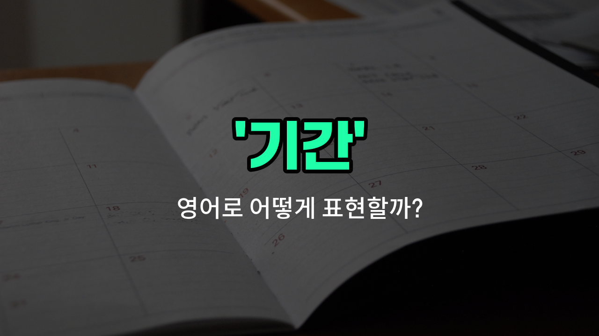

## 🌟 영어 표현 - term

안녕하세요 👋 오늘은 영어로 '기간'을 어떻게 표현하는지 알아보려고 해요. 바로 '**term**'이라는 단어인데요~

'**term**'은 어떤 일이 지속되는 **정해진 시간**이나 **기간**을 의미해요. 예를 들어, 학교에서 한 학기를 'a [school](/blog/in-english/1090.school/) term'이라고 하고, 어떤 직책을 맡는 임기를 'a term of office'라고 해요~

이 단어는 학교, 회사, 계약 등 다양한 상황에서 자주 쓰여요. 예를 들어, "이번 학기에는 새로운 과목을 들어요."를 영어로 "I'm taking a new subject this term."이라고 할 수 있어요~

또는, "그는 2년 임기로 선출되었어요."는 "He was elected for a two-[year](/blog/in-english/1065.year/) term."이라고 표현할 수 있어요~

## 📖 예문

1. "계약 기간이 1년이에요."

   "The term of the contract is one year."

2. "이번 학기는 언제 끝나요?"

   "When does this term end?"

## 💬 연습해보기

<ul data-interactive-list>

  <li data-interactive-item>
    임대 계약의 기간은 1년이고, 갱신해야 해요.
    The rental agreement has a term of one year before it needs to be renewed.
  </li>

  <li data-interactive-item>
    우리가 계약의 조건에 대해 이야기하고 있어요. 두 측이 모두 동의하는지 확인하려고요.
    We're discussing the term of the contract to make sure both sides agree.
  </li>

  <li data-interactive-item>
    대출은 5년 조건으로 되어 있으니까, 그에 맞춰 계획해야 해요.
    The loan comes with a five-year term, so we need to plan accordingly.
  </li>

  <li data-interactive-item>
    이 구독의 조건은 뭐예요? 월간인가, 연간인가요?
    What is the term for this subscription? Is it monthly or annual?
  </li>

  <li data-interactive-item>
    그녀는 임시로 머물 거라서 6개월짜리 임대 계약을 체결했어요.
    She signed a lease with a six-month term since she was only staying temporarily.
  </li>

  <li data-interactive-item>
    보증 기간은 구매 후 처음 2년 동안의 수리를 포함해요.
    The warranty term <a href="/blog/in-english/1145.cover/">covers</a> any <a href="/blog/in-english/863.repair/">repairs</a> for the first two years after purchase.
  </li>

  <li data-interactive-item>
    회의 중에 고용 조건과 복지에 대해 명확히 했어요.
    During the meeting, we clarified the term of employment and benefits.
  </li>

  <li data-interactive-item>
    이 제안의 조건은 자정에 끝나니까, 놓치지 마세요.
    The term for this offer ends at midnight, so don't miss out.
  </li>

  <li data-interactive-item>
    그의 인턴 기간은 여름 내내 계속될 거예요.
    His internship term will last through the summer months.
  </li>

  <li data-interactive-item>
    '블랙아웃 기간'이라는 용어는 거래가 허용되지 않는 시간을 의미해요.
    The term 'blackout period' refers to a time when no trades are allowed.
  </li>

</ul>

## 🤝 함께 알아두면 좋은 표현들

### duration

'duration'은 어떤 일이 지속되는 '기간'을 의미해요. 주로 어떤 사건이나 활동이 시작해서 끝날 때까지 걸리는 시간을 나타낼 때 사용해요. 'term'보다 조금 더 포괄적이고 일반적인 시간의 길이를 말할 때 쓰여요.

- "The duration of the movie is two [hours](/blog/in-english/1457.hours/)."
- "그 영화의 상영 기간은 두 시간이에요."

### short-term

'short-term'은 '단기간의'라는 뜻으로, 비교적 짧은 기간 동안 지속되는 것을 의미해요. 'term'과 관련 있지만, 기간이 짧다는 점에서 차이가 있어요. 주로 계획이나 목표가 가까운 미래에 이루어지는 경우에 사용해요.

- "We are [focusing on](/blog/in-english/186.focus-on/) short-term goals for this [project](/blog/in-english/1551.project/)."
- "우리는 이 프로젝트의 단기 목표에 집중하고 있어요."

### permanent

'permanent'는 '영구적인'이라는 뜻으로, 기간이 정해져 있지 않고 계속 지속되는 상태를 말해요. 'term'이 특정 기간을 의미하는 것과 반대로, 기간이 없는 상태를 나타내는 반의어예요.

- "She has a permanent position at the company."
- "그녀는 회사에서 정규직으로 일하고 있어요."

---

오늘은 '기간', '학기', '임기'라는 뜻을 가진 영어 표현 '**term**'에 대해 알아봤어요. 일상에서 기간이나 학기, 임기를 말할 때 이 표현을 떠올려 보세요~ 😊

오늘 배운 표현과 예문들을 꼭 소리 내서 여러 번 읽어보세요. 다음에도 더 유익한 영어 표현으로 찾아올게요! 감사합니다~

