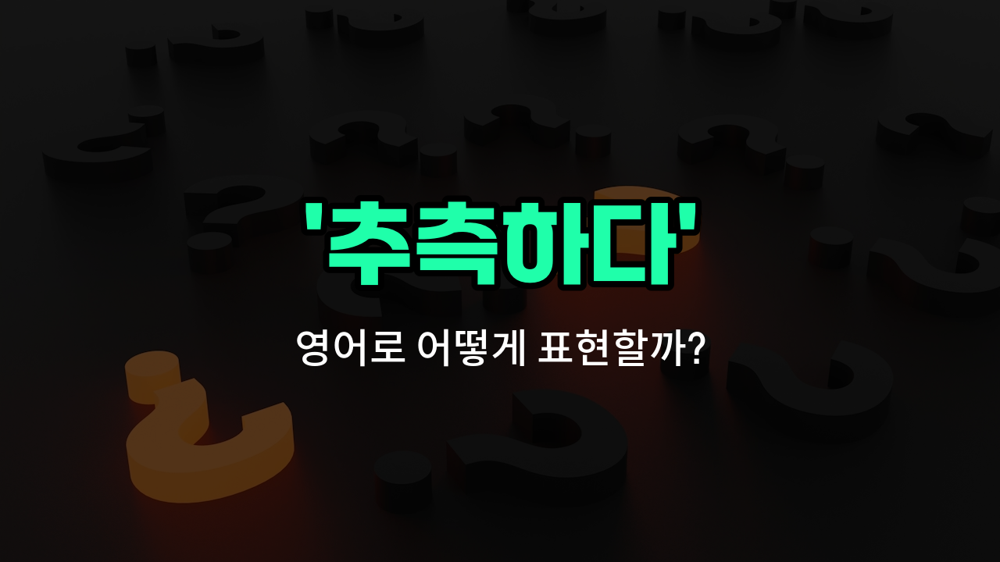

## 🌟 영어 표현 - guess

안녕하세요 👋 오늘은 우리가 일상에서 자주 쓰는 표현인 '**추측하다**'의 영어 표현 '**guess**'에 대해 알아보려고 해요.

'**guess**'는 어떤 사실이나 정답을 정확히 알지 못할 때, 자신의 경험이나 느낌을 바탕으로 **짐작하거나 예상하는 것**을 의미해요. 즉, 확실하지 않은 상황에서 '아마 이럴 거야'라고 생각할 때 쓰는 단어예요!

이 표현은 대화 중에 상대방의 의도를 짐작할 때, 문제의 답을 모를 때, 또는 미래의 일을 예상할 때 등 다양한 상황에서 자연스럽게 사용할 수 있어요. 예를 들어, 누군가 "내가 몇 살일 것 같아?"라고 물으면, "I guess you are 25."라고 대답할 수 있어요.

또한, 어떤 일이 일어날지 모를 때 "I guess it will [rain](/blog/in-english/1432.rain/) tomorrow."라고 말하면 "내일 비가 올 것 같아."라는 의미가 돼요.

## 📖 예문

1. "정답을 추측해 보세요."

   "Try to guess the answer."

2. "그녀가 왜 늦었는지 짐작할 수 있어요."

   "I can guess why she is late."

## 💬 연습해보기

<ul data-interactive-list>

  <li data-interactive-item>
    지금은 비 올 것 같으니까 우산 하나 챙기는 게 좋을 거 같아.
    I guess it's going to rain later, so you might want to <a href="/blog/in-english/1139.bring/">bring</a> an umbrella.
  </li>

  <li data-interactive-item>
    그녀가 말을 별로 안 해서 내가 그녀의 생각을 추측해야 했어.
    She didn't say much, so I just had to guess what she was thinking.
  </li>

  <li data-interactive-item>
    우리 7시에 만나는 것 같은데, 확인 문자는 내가 보낼게.
    I guess we're meeting at 7, but I'll send you a text to confirm.
  </li>

  <li data-interactive-item>
    정확한 정답은 모르겠고, 그냥 추측하고 맞길 바래.
    I don't know the answer for sure; I'm just going to guess and hope it's right.
  </li>

  <li data-interactive-item>
    그가 기분이 안 좋아 보였어서, 직장에서 뭔가 안 좋은 일이 있었던 것 같아.
    He looked <a href="/blog/in-english/395.upset/">upset</a>, so I guessed something bad happened at work.
  </li>

  <li data-interactive-item>
    지금 출발하면 영화 시작 부분은 볼 수 있을 것 같아.
    I guess if we leave now, we can still catch the beginning of the movie.
  </li>

  <li data-interactive-item>
    이 항아리에 들어있는 젤리빈이 몇 개인지 맞춰봐.
    Can you guess how many jellybeans are in this jar?
  </li>

  <li data-interactive-item>
    그녀가 초대에 답장을 안 하니까, 파티에 안 오는 것 같아.
    I guess she's not coming to the party since she hasn't replied to the <a href="/blog/in-english/347.invite/">invite</a>.
  </li>

  <li data-interactive-item>
    서프라이즈가 뭔지 맞추려고 했는데, 도저히 모르겠더라.
    I was <a href="/blog/in-english/1266.trying/">trying</a> to guess the surprise, but I couldn't figure it out.
  </li>

  <li data-interactive-item>
    내가 맞춘다면, 너 또 열쇠 잃어버린 거지?
    Let me guess, you forgot your keys again, didn't you?
  </li>

</ul>

## 🤝 함께 알아두면 좋은 표현들

### speculate

'speculate'는 "추측하다" 또는 "짐작하다"라는 뜻이에요. 주로 충분한 증거나 정보가 없을 때 어떤 일이 어떻게 될지 생각하거나 의견을 제시할 때 사용해요. 'guess'보다 좀 더 신중하고 분석적인 느낌을 줄 수 있어요.

- "People often speculate about the reasons behind the sudden resignation of the CEO."
- "사람들은 CEO의 갑작스러운 사임 이유에 대해 자주 추측하곤 해요."

### assume

'assume'은 "가정하다" 또는 "추정하다"라는 뜻이에요. 어떤 사실을 명확한 증거 없이 받아들이거나 믿을 때 쓰여요. 'guess'와 비슷하지만, 좀 더 확신을 가지고 생각하는 뉘앙스가 있어요.

- "We assumed the meeting would start [on time](/blog/vocab-1/043.on-time/), but it was delayed."
- "우리는 회의가 제시간에 시작할 거라고 가정했지만, 지연되었어요."

### know for sure

'know for sure'는 "확실히 알다"라는 뜻으로, 'guess'의 반대 개념이에요. 어떤 사실에 대해 의심 없이 명확하게 알고 있을 때 사용해요.

- "I don't just guess; I want to know for sure before [making a decision](/blog/vocab-1/010.make-a-decision/)."
- "나는 그냥 추측하는 게 아니라, 결정을 내리기 전에 확실히 알고 싶어요."

---

오늘은 '**추측하다**', '**짐작하다**', '**예상하다**'라는 뜻을 가진 영어 표현 '**guess**'에 대해 알아봤어요. 앞으로 누군가의 생각이나 상황을 짐작할 때 이 표현을 떠올려 보세요 😊

오늘 배운 표현과 예문들을 꼭 최소 3번씩 소리 내서 읽어보세요. 다음에도 더 재미있고 유익한 영어 표현으로 찾아올게요! 감사합니다!

