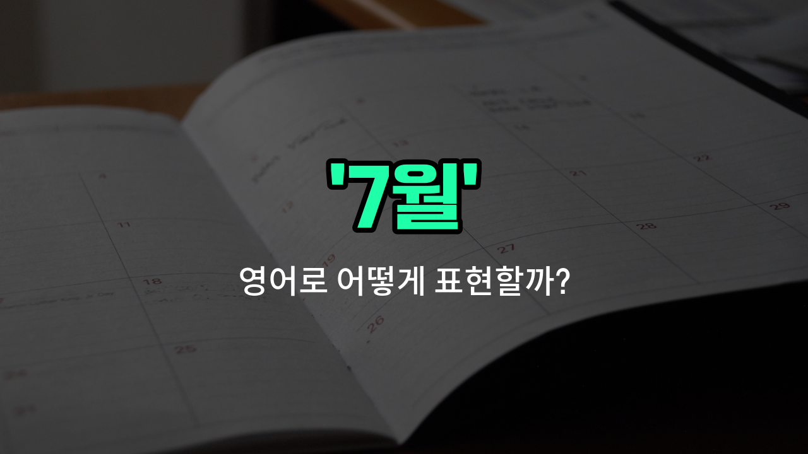

## 🌟 영어 표현 - july

안녕하세요 👋 오늘은 영어로 '**7월**'을 어떻게 표현하는지 알아보려고 해요. 바로 '**July**'라는 단어를 사용해요. 'July'는 1년 중 일곱 번째 달로, 한국에서는 본격적인 여름이 시작되는 시기죠. 그래서 '여름', '한여름'과도 밀접한 관련이 있어요~

'July'는 주로 날짜, 계절, 휴가, 방학 등과 관련된 대화에서 자주 등장해요. 예를 들어, 여름방학이 시작되는 달이기도 하고, 많은 나라에서 휴가 시즌이기도 해요. 그래서 영어로 대화할 때 'July'를 자연스럽게 사용할 수 있어요~

예를 들어, "나는 7월에 여행을 갈 거예요."라고 말하고 싶다면 "I'm going to travel in July."라고 표현할 수 있어요. 또, "7월은 정말 덥죠."라는 말은 "July is really hot."이라고 할 수 있어요~

## 📖 예문

1. "7월에 친구들과 바다에 갈 거예요."

   "I'm going to the beach with my friends in July."

2. "7월은 여름방학이 시작되는 달이에요."

   "July is the month when summer vacation [starts](/blog/in-english/1127.start/)."

## 💬 연습해보기

<ul data-interactive-list>

  <li data-interactive-item>
    7월에 가족 모임을 계획하고 있어요. 모두 기대하고 있답니다.
    We're planning a family reunion in July. Everyone is pretty excited about it.
  </li>

  <li data-interactive-item>
    7월부터 학교가 방학이라서 두 달 정도 쉴 수 있어요.
    <a href="/blog/in-english/1090.school/">School</a>'s out for the summer starting in July, so I have <a href="/blog/in-english/912.a-couple-of/">a couple of</a> months off.
  </li>

  <li data-interactive-item>
    매년 7월에는 날씨가 따뜻할 때 할머니 할아버지를 방문해요.
    I always visit my grandparents during July when the weather is warm.
  </li>

  <li data-interactive-item>
    불꽃놀이가 7월 4일로 예정되어 있는데, 그날이 미국의 독립기념일이에요.
    The fireworks show is scheduled for July 4th, which is Independence <a href="/blog/in-english/1067.day/">Day</a> in the US.
  </li>

  <li data-interactive-item>
    여기는 7월이 제일 더운 달이니 수분 섭취 잘하세요.
    July tends to be the hottest month around here, so be sure to stay hydrated.
  </li>

  <li data-interactive-item>
    비치가 정말 멋진 시즌이라 7월에 여행을 예약했어요.
    We booked our vacation for July because the beaches are amazing that time of <a href="/blog/in-english/1065.year/">year</a>.
  </li>

  <li data-interactive-item>
    여름 할인 덕분에 7월에는 매출이 올라가는 경향이 있어요.
    Sales usually pick up in July with all the summer discounts.
  </li>

  <li data-interactive-item>
    7월에는 낮이 길어져서 야외 활동을 더 즐길 수 있어요.
    In July, the days are longer, giving us more time to enjoy outdoor activities.
  </li>

  <li data-interactive-item>
    제 생일이 7월이라 대개 큰 파티를 해요.
    My birthday falls in July, so I usually have a <a href="/blog/in-english/1095.big/">big</a> celebration.
  </li>

  <li data-interactive-item>
    7월은 트레일이 마르고 하늘도 맑아서 하이킹하기 딱 좋은 시기에요.
    July is the perfect time for hiking since the trails are dry and the sky is clear.
  </li>

</ul>

## 🤝 함께 알아두면 좋은 표현들

### August (8월)

'August (8월)'은 7월 다음 달로, 한여름의 더운 시기를 계속 이어가는 달이에요. 7월과 비슷하게 여름 휴가철로 많이 알려져 있어요.

- "Many people go on vacation in August to enjoy the summer weather."
- "많은 사람들이 여름 날씨를 즐기기 위해 8월에 휴가를 가요."

### June (6월)

'June (6월)'은 7월 바로 전 달로, 여름이 시작되는 시기예요. 7월과 비교하면 조금 더 선선하고 초여름 느낌이 강해요.

- "The flowers bloom beautifully in June before the heat of July arrives."
- "7월의 더위가 오기 전에 6월에는 꽃들이 아름답게 피어요."

### Winter (겨울)

'[Winter](/blog/in-english/1421.winter/) (겨울)'은 7월과는 반대되는 계절로, 보통 12월부터 2월까지를 말해요. 7월의 한여름과 달리 매우 추운 날씨가 특징이에요.

- "While July is hot and sunny, winter is cold and snowy in many places."
- "7월이 덥고 화창한 반면, 겨울은 많은 곳에서 춥고 눈이 와요."

---

오늘은 '7월'을 영어로 어떻게 표현하는지, 그리고 관련된 예문까지 알아봤어요. 이제 7월에 관한 이야기를 영어로 할 때 'July'를 자신 있게 사용해보세요~ 😊

오늘 배운 표현과 예문들을 꼭 소리 내서 여러 번 읽어보세요. 다음에도 더 유익한 영어 표현으로 찾아올게요! 감사합니다~

