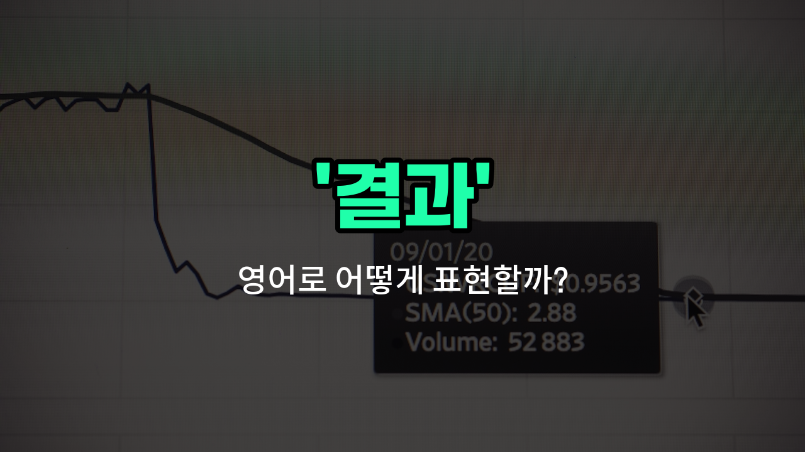

## 🌟 영어 표현 - results

안녕하세요 👋 오늘은 영어로 '결과'를 어떻게 표현하는지 알아보려고 해요. 바로 '**results**'라는 단어를 사용할 수 있어요. 'results'는 어떤 일이나 행동, 시험, 실험 등에서 **나타난 최종적인 상태나 성과**를 의미해요.

이 단어는 시험 점수, 연구 결과, 경기의 승패 등 다양한 상황에서 자연스럽게 쓰여요. 예를 들어, 시험을 본 후에 "시험 결과가 나왔어요."라고 말하고 싶을 때 "The test results are out."라고 할 수 있어요.

또한, 어떤 노력이 좋은 결실을 맺었을 때 "좋은 결과를 얻었어요."라고 말하고 싶다면 "I got good results."라고 표현할 수 있어요.

## 📖 예문

1. "프로젝트 결과가 기대 이상이에요."

   "The [project](/blog/in-english/1551.project/) results are better than expected."

2. "운동을 꾸준히 하니 좋은 결과가 나타났어요."

   "I got good results from exercising [regularly](/blog/in-english/252.regularly/)."

## 💬 연습해보기

<ul data-interactive-list>

  <li data-interactive-item>
    시험 때문에 긴장이 많이 됐는데, 어제 드디어 결과를 받아보고 내가 생각했던 것보다 잘했어.
    I was nervous about the exam, but I finally got my results yesterday and did better than I <a href="/blog/in-english/1118.thought/">thought</a>.
  </li>

  <li data-interactive-item>
    조사 결과에 따르면 대부분의 사람들이 가게에 가는 것보다 온라인 쇼핑을 더 선호하는 것 같아.
    The results of the survey showed that most people prefer online shopping over going to stores.
  </li>

  <li data-interactive-item>
    제품을 몇 주 동안 테스트해본 결과가 인상적이었고 우리의 기대를 뛰어넘었어.
    After <a href="/blog/in-english/1129.week/">weeks</a> of testing the product, the results were impressive and exceeded our expectations.
  </li>

  <li data-interactive-item>
    그녀는 취업 지원 결과를 확인하고 그 직위에 합격했다는 소식에 욱씬 기뻤어.
    She <a href="/blog/in-english/1358.check/">checked</a> the results of her job application and was thrilled to see she got the position.
  </li>

  <li data-interactive-item>
    의사 선생님이 검사 결과는 다음 주까지 나올 거라고 하셔서 기다리기만 하면 돼.
    The doctor said the test results will be available by next week, so we just have to wait.
  </li>

  <li data-interactive-item>
    우리 팀이 열심히 일했지만 이번 대회의 결과는 실망스러웠어.
    Our team worked hard, but the results of the competition were disappointing this time.
  </li>

  <li data-interactive-item>
    회의 결과 좀 나한테 보내줄까? 어떤 결정을 했는지 검토해보고 싶어.
    Can you send me the results from the meeting? I want to review what was decided.
  </li>

  <li data-interactive-item>
    지난 분기 매출이 꽤 좋았어서 회사에서 미래에 대해 긍정적으로 보고 있어.
    The results from the last quarter's sales were pretty good, so the company is optimistic about the future.
  </li>

  <li data-interactive-item>
    그는 면접 결과가 너무 궁금해서 좋은 소식을 기다리고 있었어.
    He was <a href="/blog/vocab-1/036.anxious/">anxious</a> to hear the results of the interview, hoping for good news.
  </li>

  <li data-interactive-item>
    우리는 실험 결과를 분석해봤는데, 프로젝트 방향을 바꿀 수 있는 흥미로운 트렌드가 발견됐어.
    We analyzed the experiment results and <a href="/blog/in-english/1083.find/">found</a> some interesting trends that could change the direction of the project.
  </li>

</ul>

## 🤝 함께 알아두면 좋은 표현들

### outcome

'outcome'은 '결과'와 비슷한 의미로, 어떤 사건이나 과정이 끝난 후에 나타나는 최종 상태나 효과를 의미해요. 주로 어떤 행동이나 결정의 직접적인 결과를 말할 때 사용해요.

- "The outcome of the experiment was better than we expected."
- "실험의 결과가 우리가 예상한 것보다 더 좋았어요."

### consequence

'consequence'는 '결과'라는 뜻이지만, 특히 어떤 행동이나 결정에 따른 부정적이거나 중요한 영향을 강조할 때 쓰여요. 원인과 결과의 관계를 나타낼 때 자주 사용돼요.

- "Every action has a consequence, so think carefully before you act."
- "모든 행동에는 결과가 있으니 행동하기 전에 신중하게 생각해야 해요."

### cause

'cause'는 '원인'이라는 뜻으로, '결과'의 반대 개념이에요. 어떤 일이 일어나게 만든 이유나 동기를 나타낼 때 사용해요.

- "The cause of the fire is still under investigation."
- "화재의 원인은 아직 조사 중이에요."

---

오늘은 '결과'라는 뜻을 가진 영어 표현 '**results**'에 대해 알아봤어요. 앞으로 시험이나 프로젝트, 운동 등에서 결과를 이야기할 때 이 표현을 떠올려 보세요 😊

오늘 배운 표현과 예문들을 꼭 최소 3번씩 소리 내서 읽어보세요. 다음에도 더 재미있고 유익한 영어 표현으로 찾아올게요! 감사합니다!

