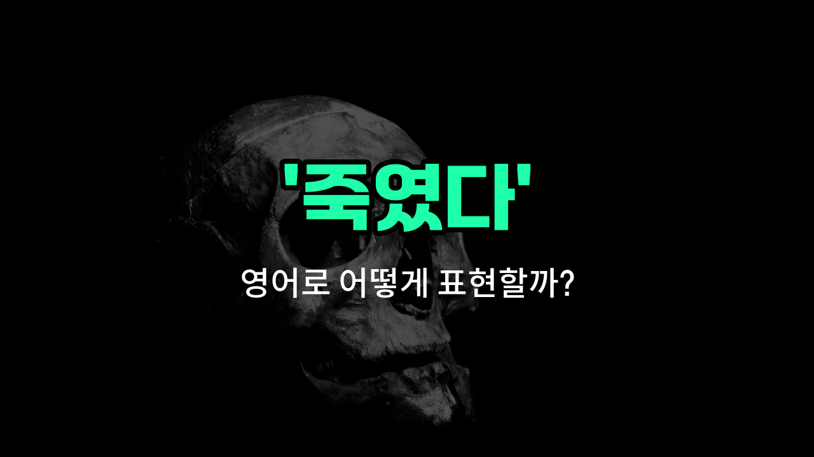

## 🌟 영어 표현 - killed

안녕하세요 👋 오늘은 영어로 '죽였다'라는 표현을 어떻게 하는지 알아보려고 해요. 바로 '**killed**'라는 단어를 사용해요. 이 단어는 누군가의 생명을 빼앗거나, 동물이나 곤충 등을 죽였을 때도 쓸 수 있어요.

'killed'는 '살해했다', '목숨을 빼앗았다'와 같은 의미로도 자주 쓰여요. 범죄 뉴스, 영화, 소설 등에서 많이 들을 수 있는 단어예요. 예를 들어, "He killed the villain."이라고 하면 "그는 악당을 죽였다."라는 뜻이에요.

또한, 'kill'은 동사 원형이고, 'killed'는 과거형이에요. 즉, 이미 일어난 일을 말할 때 'killed'를 사용해요.

## 📖 예문

1. "그는 그 벌레를 죽였어요."

   "He killed the bug."

2. "누군가가 그 사자를 죽였어요."

   "Someone killed the lion."

## 💬 연습해보기

<ul data-interactive-list>

  <li data-interactive-item>
    지난 주말 그 호러 영화가 박스오피스에서 정말 대박쳤어. 올 한 해 본 영화 중에서 최고의 하나였어.
    That horror movie really killed it at the box office last weekend. It was one of the <a href="/blog/in-english/1073.best/">best</a> <a href="/blog/in-english/1578.film/">films</a> I've seen all <a href="/blog/in-english/1065.year/">year</a>.
  </li>

  <li data-interactive-item>
    그녀가 어제 발표 진짜 잘했어. 모두 그녀의 아이디어에 감명받았어.
    She totally killed the presentation yesterday. Everyone was impressed with her ideas.
  </li>

  <li data-interactive-item>
    내가 실수로 핸드폰을 물에 빠뜨려서 망가뜨렸어. 이제 아예 켜지지도 않아.
    I <a href="/blog/in-english/314.accidentally/">accidentally</a> killed my phone by dropping it in water. Now it won't <a href="/blog/in-english/310.turn-on/">turn on</a> at all.
  </li>

  <li data-interactive-item>
    그가 농구 경기에서 경쟁자를 초토화시키고 점수도 제일 많이 내었어.
    He killed the competition at the basketball game and scored the most points.
  </li>

  <li data-interactive-item>
    와, 너 노래방에서 그 노래 진짜 잘 부른다! 목소리가 정말 멋져.
    Wow, you killed that song during karaoke! You have an amazing voice.
  </li>

  <li data-interactive-item>
    프로젝트가 잘 진행되고 있었는데 몇 가지 오류가 우리 진행을 망쳤어. 그래서 다시 시작해야 했어.
    The <a href="/blog/in-english/1551.project/">project</a> was going great until a few errors killed our progress. We had to start over.
  </li>

  <li data-interactive-item>
    내 개가 장난감을 5분도 안 돼서 망가뜨렸어. 정말 씹는 걸 좋아해.
    My dog killed the toy in less than five minutes. He really loves chewing on it.
  </li>

  <li data-interactive-item>
    그녀가 파티에서 논쟁을 시작해서 분위기를 망쳤어. 너무 어색했어.
    She killed the vibe at the party by starting an argument. That was awkward.
  </li>

  <li data-interactive-item>
    공항에서 시간을 보내기 위해 책도 읽고 핸드폰으로 영화도 봤어.
    I killed time at the airport by reading a book and watching movies on my phone.
  </li>

  <li data-interactive-item>
    그들은 공연 시작하느라 극장에서 불을 껐어. 모두 아주 신났어.
    They killed the lights in the theater to start the show. Everyone was super excited.
  </li>

</ul>

## 🤝 함께 알아두면 좋은 표현들

### murdered

'murdered'는 '고의적으로 사람을 죽였다'는 뜻이에요. 'killed'보다 더 강한 범죄적 의미를 가지고 있어서 법적, 도덕적으로 매우 심각한 행위를 나타낼 때 사용해요.

- "The detective [found](/blog/in-english/1083.find/) evidence that the victim was murdered."
- "형사는 피해자가 살해당했다는 증거를 찾았어요."

### died

'died'는 '사망했다'는 뜻으로, 반드시 누군가에 의해 죽임을 당했다는 의미는 아니에요. 자연사나 사고사 등 다양한 원인으로 생명이 끝난 상태를 나타낼 때 쓰여요.

- "She died peacefully in her sleep last night."
- "그녀는 어젯밤 평화롭게 잠든 채로 돌아가셨어요."

### saved

'saved'는 '살렸다'는 뜻으로, 'killed'의 반대 의미예요. 위험한 상황에서 누군가의 생명을 구했을 때 사용해요.

- "The firefighter saved the child from the burning building."
- "소방관이 불타는 건물에서 아이를 구했어요."

---

오늘은 '죽였다'라는 뜻의 영어 표현 '**killed**'에 대해 알아봤어요. 영화나 뉴스에서 이 단어가 나오면 이제 더 쉽게 이해할 수 있겠죠? 😊

오늘 배운 표현과 예문들을 꼭 소리 내서 여러 번 읽어보세요. 다음에도 더 유익한 영어 표현으로 찾아올게요! 감사합니다!

