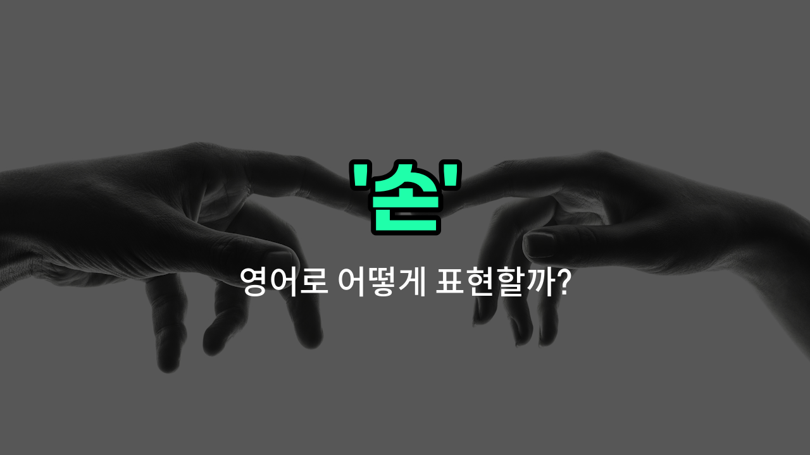

## 🌟 영어 표현 - hands

안녕하세요 👋 오늘은 우리가 일상에서 자주 쓰는 단어인 '**손**'을 영어로 어떻게 표현하는지 알아보려고 해요. 바로 '**hands**'라는 단어인데요~

'**hands**'는 사람이나 동물의 팔 끝에 달린 부분, 즉 '손'을 의미해요. 물건을 잡거나, 쓰다듬거나, 다양한 동작을 할 때 사용하는 신체 부위죠~

또한, '손길'이나 '손동작'처럼 손을 이용한 행동이나 움직임을 표현할 때도 '**hands**'라는 단어를 쓸 수 있어요. 예를 들어, 누군가의 도움이 필요할 때 "Can you give me a hand?"라고 말하면 '도와줄 수 있나요?'라는 뜻이 돼요~

## 📖 예문

1. "손을 깨끗이 씻으세요."

   "Please [wash](/blog/in-english/485.wash/) your hands thoroughly."

2. "그녀는 손재주가 좋아요."

   "She is good with her hands."

## 💬 연습해보기

<ul data-interactive-list>

  <li data-interactive-item>
    그는 깨지지 않게 조심스럽게 연약한 화병을 손에 들고 있었어요.
    He held the fragile vase carefully in his hands so it wouldn't break.
  </li>

  <li data-interactive-item>
    이 소파 옮기는 거 도와줄 수 있어? 지금 손이 바쁘거든.
    Can you give me a hand with moving this couch? My hands are full right now.
  </li>

  <li data-interactive-item>
    그녀는 발표 때문에 너무 긴장해서 손이 떨리고 있었어요.
    Her hands were shaking because she was so nervous about the speech.
  </li>

  <li data-interactive-item>
    저녁 먹기 전에 정원일 때문에 손이 정말 더러워서 손을 씻었어요.
    I washed my hands before dinner because they were really dirty from gardening.
  </li>

  <li data-interactive-item>
    겨울엔 손을 따뜻하게 유지하는 게 중요한데, 안 그러면 동상 걸릴 수 있어요.
    It's <a href="/blog/in-english/318.important/">important</a> to keep your hands warm in <a href="/blog/in-english/1421.winter/">winter</a> or you might get frostbite.
  </li>

  <li data-interactive-item>
    그는 모두의 주목을 끌기 위해 빨리 일어나서 손을 쿵쾅쿵쾅 쳤어요.
    He jumped up quickly and clapped his hands loudly to get everyone's attention.
  </li>

  <li data-interactive-item>
    그녀는 정말 손이 steady해서 작은 디테일 페인팅하기에 완벽해요.
    She has really steady hands, perfect for painting tiny details.
  </li>

  <li data-interactive-item>
    하루 종일 무거운 상자들 옮기느라 손이 아파요.
    My hands were sore after carrying all those heavy boxes all <a href="/blog/in-english/1067.day/">day</a>.
  </li>

  <li data-interactive-item>
    그가 대화 중에 손을 숨기지 않아서 그의 진실함이 느껴졌어요.
    I could tell he was honest because he didn't hide his hands during the conversation.
  </li>

  <li data-interactive-item>
    요리 시작하기 전에 손을 깨끗이 씻는 거 잊지 마세요, 그래야 위생적이에요.
    Make sure your hands are clean before you <a href="/blog/in-english/1127.start/">start</a> cooking to keep everything sanitary.
  </li>

</ul>

## 🤝 함께 알아두면 좋은 표현들

### give someone a hand

'give someone a hand'은 "누군가를 도와주다"라는 뜻이에요. 누군가가 무언가를 할 때 도움을 주거나 지원할 때 사용하는 표현이에요.

- "Can you give me a hand with moving this table?"
- "이 테이블 옮기는 거 좀 도와줄 수 있어요?"

### have a hand in

'have a hand in'은 "~에 관여하다" 또는 "~에 일조하다"라는 의미예요. 어떤 일이나 결과에 영향을 미쳤거나 참여했을 때 쓰는 표현이에요.

- "She had a hand in [organizing](/blog/in-english/355.organize/) the event."
- "그녀가 그 행사를 조직하는 데 일조했어요."

### keep one's hands off

'keep one's hands off'는 "손대지 않다" 또는 "간섭하지 않다"라는 뜻이에요. 어떤 것에 손대거나 간섭하지 말라는 의미로, 반대되는 표현이에요.

- "Please keep your hands off my [personal](/blog/in-english/1590.personal/) belongings."
- "제 개인 물건에 손대지 말아 주세요."

---

오늘은 '손', '손길', '손동작'이라는 뜻을 가진 영어 표현 '**hands**'에 대해 알아봤어요. 일상에서 손과 관련된 다양한 상황에 자연스럽게 활용해 보세요~ 😊

오늘 배운 표현과 예문들을 꼭 최소 3번씩 소리 내서 읽어보세요. 다음에도 더 재미있고 유익한 영어 표현으로 찾아올게요! 감사합니다!

