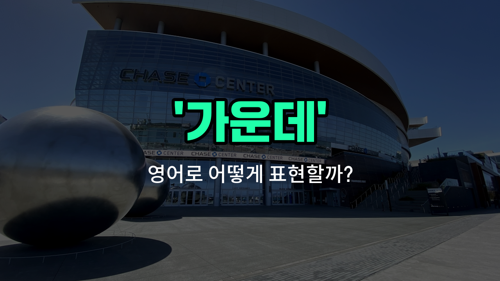

## 🌟 영어 표현 - middle

안녕하세요 👋 오늘은 우리가 자주 쓰는 단어인 '**가운데**'의 영어 표현 '**middle**'에 대해 알아보려고 해요.

'**middle**'은 어떤 것의 '가운데', '중간', 또는 '중심'을 의미해요. 예를 들어, 두 사람 사이의 위치, 시간의 중간, 또는 어떤 공간의 중심을 말할 때 사용할 수 있어요.

이 단어는 일상 대화뿐만 아니라 학교, 회사, 다양한 상황에서 정말 자주 쓰여요. 예를 들어, "나는 방의 가운데에 서 있어요."라고 말하고 싶을 때 "I am standing in the middle of the room."이라고 표현할 수 있어요.

또한, 시간적으로도 사용할 수 있는데요. 예를 들어, "우리는 6월 중간에 만날 거예요."는 "We will meet in the middle of June."이라고 할 수 있어요.

## 📖 예문

1. "책상 가운데에 꽃병이 있어요."

   "There is a vase in the middle of the desk."

2. "그는 길의 중간에서 멈췄어요."

   "He [stopped](/blog/in-english/1240.stop/) in the middle of the road."

## 💬 연습해보기

<ul data-interactive-list>

  <li data-interactive-item>
    우리 사진 중에 내가 딱 중앙에 서 있는 게 있어서, 나한테 시선이 모였어.
    There's a photo of us where I'm standing right in the middle, so I'm the center of attention.
  </li>

  <li data-interactive-item>
    테이블 중앙에 내 폰 두고 왔는데, 누가 좀 가져다 줄 수 있어?
    I left my phone in the middle of the table; can someone grab it for me?
  </li>

  <li data-interactive-item>
    회의 중에 그녀는 두 이사님 사이에서 중앙에 앉아 있었어.
    During the meeting, she sat in the middle between the two directors.
  </li>

  <li data-interactive-item>
    그가 케이크를 조리대 중앙에 놓아서 자르기 쉽게 만들었어.
    He placed the cake right in the middle of the counter to <a href="/blog/in-english/244.make-it/">make it</a> easier to cut.
  </li>

  <li data-interactive-item>
    아이들이 체육관 중앙에 줄 서서 학교 모임을 기다리고 있었어.
    The kids lined up in the middle of the <a href="/blog/in-english/431.gym/">gym</a> for the school assembly.
  </li>

  <li data-interactive-item>
    지도를 보면 공원이 도시 중앙에 있어.
    If you look at the map, the park is located in the middle of the city.
  </li>

  <li data-interactive-item>
    그녀가 책 중간에 북마크를 꽂아서 자리 잃지 않게 했어.
    She put a bookmark in the middle of the book so she wouldn't lose her place.
  </li>

  <li data-interactive-item>
    바닥 중앙에 내 열쇠가 놓여 있어서 이상했어.
    I <a href="/blog/in-english/1083.find/">found</a> my keys lying in the middle of the floor, which was <a href="/blog/in-english/983.strange/">strange</a>.
  </li>

  <li data-interactive-item>
    강이 계곡 중앙을 가로질러 흐르면서 아름다운 경치를 만들어.
    The river runs right through the middle of the valley, creating a beautiful view.
  </li>

  <li data-interactive-item>
    우리는 나머지 그룹을 기다리기 위해 길 중앙에서 만나기로 했어.
    We decided to meet in the middle of the <a href="/blog/in-english/1403.street/">street</a> to wait for the rest of the group.
  </li>

</ul>

## 🤝 함께 알아두면 좋은 표현들

### center

'center'는 '가운데' 또는 '중심'을 의미해요. 공간이나 물체의 정확한 중간 지점을 나타낼 때 주로 사용해요. 'middle'과 비슷하지만, 좀 더 공식적이고 수학적이거나 기하학적인 맥락에서 자주 쓰여요.

- "Please place the vase in the center of the table."
- "꽃병을 탁자 가운데에 놓아 주세요."

### edge

'edge'는 '가장자리' 또는 '끝부분'을 뜻해요. 'middle'의 반대 개념으로, 어떤 물체나 공간의 경계나 끝 부분을 나타낼 때 사용해요.

- "Be careful not to stand too close to the edge of the cliff."
- "절벽 가장자리 가까이에 너무 서지 않도록 조심하세요."

### midpoint

'midpoint'는 두 점 사이의 정확한 중간 지점을 의미해요. 특히 수학이나 지리적 위치를 설명할 때 많이 쓰이며, 'middle'과 유사하지만 좀 더 구체적이고 기술적인 표현이에요.

- "The midpoint between the two cities is a small [town](/blog/in-english/1517.town/) called Greenfield."
- "두 도시의 중간 지점은 그린필드라는 작은 마을이에요."

---

오늘은 '**가운데**', '**중간**', '**중심**'이라는 뜻을 가진 영어 표현 '**middle**'에 대해 알아봤어요. 앞으로 무언가의 중심이나 중간을 말할 때 이 표현을 떠올려 보세요 😊

오늘 배운 표현과 예문들을 꼭 소리 내서 여러 번 읽어보세요. 다음에도 더 유익한 영어 표현으로 찾아올게요! 감사합니다!

