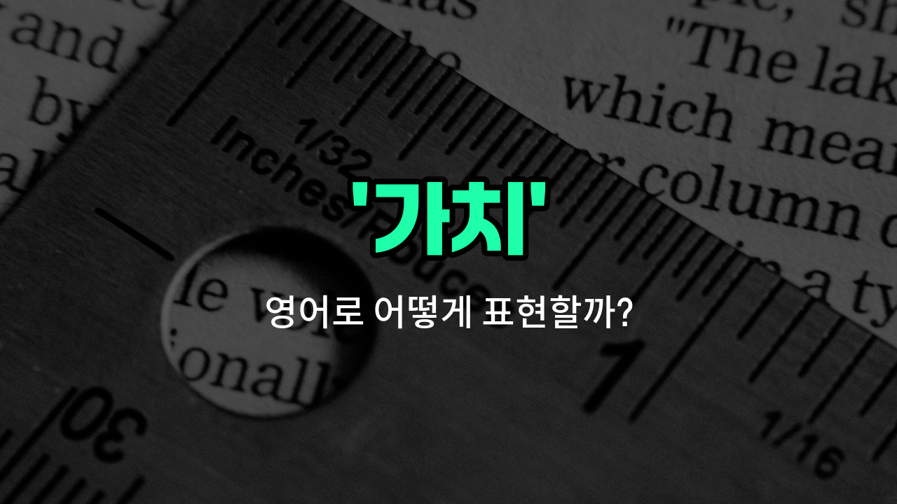

## 🌟 영어 표현 - worth

안녕하세요 👋 오늘은 우리가 자주 쓰는 단어인 '**가치**'를 영어로 어떻게 표현하는지 알아볼 거예요. 바로 '**worth**'라는 단어인데요. 이 단어는 어떤 것의 **값어치**나 **소중함**을 나타낼 때 사용해요.

'**worth**'는 주로 '~의 가치가 있다', '값어치가 있다'라는 의미로 쓰여요. 예를 들어, 어떤 물건이 돈을 주고 살 만큼 가치가 있을 때 "It's worth the money."라고 말할 수 있어요. 또는, 시간이나 노력이 들더라도 그만한 가치가 있다고 할 때도 쓸 수 있답니다!

또한, '**worth**'는 명사처럼 보이지만 실제로는 형용사로 쓰여요. 그래서 'be worth + 명사/동명사' 형태로 자주 사용돼요. 예를 들어, "This book is worth reading."이라고 하면 "이 책은 읽을 가치가 있어요."라는 뜻이에요.

## 📖 예문

1. "이 영화는 볼 가치가 있어요."

   "This movie is worth watching."

2. "그 경험은 정말 값어치 있었어요."

   "The experience was really worth it."

## 💬 연습해보기

<ul data-interactive-list>

  <li data-interactive-item>
    이 오래된 시계는 생각보다 훨씬 더 가치가 커. 희귀한 수집품이거든.
    This old watch is worth a lot more than you think because it's a rare collector's item.
  </li>

  <li data-interactive-item>
    내 생각에는 이 영화가 선전만큼 좋지 않았어. 좀 지루했거든.
    The movie wasn't worth the hype, in my <a href="/blog/in-english/527.opinion/">opinion</a> it was kind of <a href="/blog/vocab-1/040.boring/">boring</a>.
  </li>

  <li data-interactive-item>
    이 자켓에 돈을 많이 썼지만, 정말 튼튼해서 그만한 가치가 있는 것 같아.
    I spent a ton of money on this jacket, but I think it's worth it since it's so durable.
  </li>

  <li data-interactive-item>
    이 식당이 기다릴 만하긴 한가? 오늘 줄이 너무 길어.
    Is this restaurant really worth the wait? The line is super <a href="/blog/in-english/1077.long/">long</a> today.
  </li>

  <li data-interactive-item>
    그녀는 그 경험이 힘들었지만 매 순간이 소중했다고 말했어.
    She told me the experience was worth every minute, even though it was exhausting.
  </li>

  <li data-interactive-item>
    그 책은 미스터리 좋아하는 사람이라면 꼭 읽어볼 만해.
    That book is definitely worth reading if you like <a href="/blog/in-english/500.mystery/">mysteries</a>.
  </li>

  <li data-interactive-item>
    우리 결정을 내리기 전에 네 조언은 정말 고려해볼 가치가 있어.
    Your advice is really worth considering before we <a href="/blog/vocab-1/010.make-a-decision/">make a decision</a>.
  </li>

  <li data-interactive-item>
    그 새 카페는 꼭 가볼 만해. 커피가 정말 맛있거든.
    It's worth <a href="/blog/in-english/1358.check/">checking</a> out that new cafe downtown; they have amazing coffee.
  </li>

  <li data-interactive-item>
    그는 여행 비용이 그만한 가치가 있는지 확신이 없었지만, 사진은 정말 잘 나왔어.
    He wasn't sure if the trip was worth the cost, but the photos <a href="/blog/vocab-1/038.turn-out/">turned out</a> great.
  </li>

  <li data-interactive-item>
    이런 작은 일에 대해 다투는 건 별로 가치가 없다고 생각해.
    I don't think it's worth arguing about small things like this.
  </li>

</ul>

## 🤝 함께 알아두면 좋은 표현들

### valuable (가치 있는)

'valuable'은 "가치 있는" 또는 "소중한"이라는 뜻이에요. 어떤 것이 중요하거나 유용해서 높은 평가를 받을 때 사용해요. 물건뿐만 아니라 경험이나 정보에도 쓸 수 있어요.

- "This antique vase is very valuable because it is rare and well-preserved."
- "이 골동품 꽃병은 희귀하고 상태가 좋아서 매우 가치 있어요."

### worthless (가치 없는)

'worthless'는 "가치 없는" 또는 "쓸모없는"이라는 뜻이에요. 어떤 것이 중요하지 않거나 쓸모가 없어서 평가절하될 때 사용해요. 보통 부정적인 의미로 쓰여요.

- "After the damage, the old phone became completely worthless."
- "손상된 후에 그 오래된 휴대폰은 완전히 가치가 없어졌어요."

### priceless (값으로 매길 수 없는)

'priceless'는 "값으로 매길 수 없는" 또는 "매우 귀중한"이라는 뜻이에요. 돈으로 환산할 수 없을 만큼 소중하거나 특별한 것을 표현할 때 사용해요.

- "The memories we made during our trip are priceless to me."
- "여행 중에 만든 추억들은 나에게 값으로 매길 수 없을 만큼 소중해요."

---

오늘은 '**가치**', '**값어치**', '**소중함**'이라는 뜻을 가진 영어 표현 '**worth**'에 대해 알아봤어요. 앞으로 무언가의 가치를 말하고 싶을 때 이 표현을 꼭 활용해 보세요 😊

오늘 배운 표현과 예문들을 소리 내서 여러 번 읽어보면 더 기억에 남을 거예요. 다음에도 더 유익한 영어 표현으로 찾아올게요! 감사합니다!

