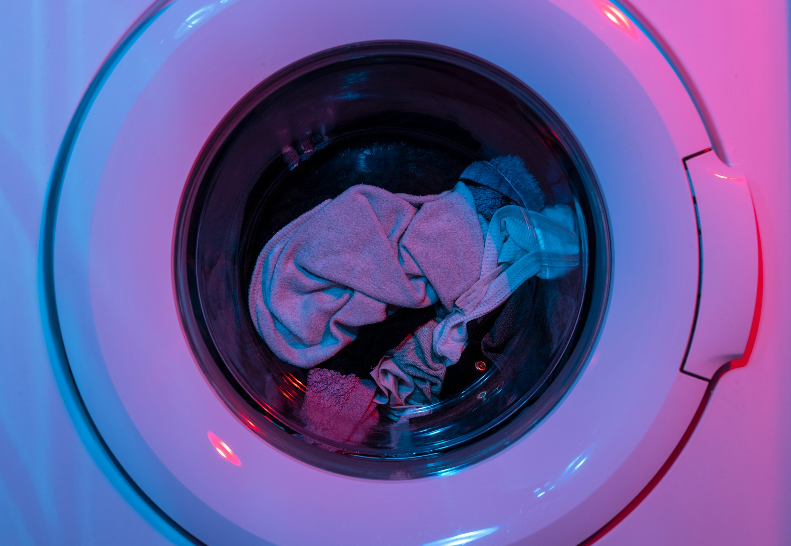

## 🌟 영어 표현 - do the laundry

안녕하세요! 👋 오늘은 일상생활에서 자주 사용되는 **'빨래하다'** 를 영어로 어떻게 표현하는지 알아볼게요. 바로 **"do the laundry"** 라고 말하면 됩니다!

"do the laundry"는 **'빨래를 하다'** 라는 의미로, 옷이나 침구류를 세탁하는 모든 과정을 포함하는 표현이에요. 세탁기에 돌리는 것부터 건조, 개기까지 모든 과정을 의미한답니다! 🧺

이 표현은 집안일을 이야기할 때 정말 자주 사용돼요. **일상적인 집안일을 설명하거나 집안일 분담을 이야기할 때** 특히 많이 쓰이죠. 👕

예를 들어, "I need to do the laundry today." (오늘 빨래를 해야 해요)처럼 사용할 수 있어요. 또는 "Who's going to do the laundry this weekend?" (이번 주말에는 누가 빨래를 할 거예요?)라고 물을 수도 있죠.

## 📖 예문

"빨래 좀 해야 할 것 같아요"

"I should do the laundry."

"빨래는 내일 할게요"

"I'll do the laundry tomorrow."

자, 이제 "do the laundry"를 사용한 다양한 예문을 살펴볼까요? 꼭 소리내어 말하면서 연습해보세요!

## 💬 연습해보기

<ul data-interactive-list>
  <li data-interactive-item>
    깨끗한 옷이 다 떨어지기 전에 빨래를 해야 해.
    I need to do the laundry before we <a href="/blog/in-english/340.run-out-of/">run out of</a> clean clothes.
  </li>
  <li data-interactive-item>
    일주일 내내 빨래를 미루고 있어.
    I've been putting off doing the laundry all week.
  </li>
  <li data-interactive-item>
    빨래 좀 해줄 수 있어? 운동복에서 냄새가 나기 시작했어.
    Could you please do the laundry? These <a href="/blog/in-english/431.gym/">gym</a> clothes are starting to smell.
  </li>
  <li data-interactive-item>
    나는 항상 일요일 아침에 빨래를 해.
    I always do the laundry on Sunday mornings.
  </li>
  <li data-interactive-item>
    마지막으로 언제 빨래했어?
    When was the last time you did the laundry?
  </li>
  <li data-interactive-item>
    세탁기가 고장 나서 지금 빨래를 못 해.
    The washing machine's broken, so I can't do the laundry <a href="/blog/in-english/525.right-now/">right now</a>.
  </li>
</ul>

## 🤝 함께 알아두면 좋은 표현들

### fold the clothes

'fold the clothes'은 **"옷을 개다"** 라는 뜻이에요. 세탁 후에 옷을 정리하는 과정을 나타내며, **정리정돈의 일환으로 보통 세탁과 함께 이루어지는 작업**이에요. 옷을 깔끔하게 정리하고 보관하기 위해 자주 사용해요.

- "After the laundry is done, I like to fold the clothes right away."
- "세탁이 끝난 후, 저는 바로 옷을 개는 것을 좋아합니다."

### air dry

'air dry'는 **"자연 건조하다"** 는 의미예요. 세탁 후에 건조기를 사용하지 않고 바람에 맡겨서 자연스럽게 마르는 과정을 나타내며, **환경 친화적인 선택이나 섬세한 옷을 다룰 때 자주 사용**해요.

- "I [prefer](/blog/in-english/191.prefer/) to air dry my delicate clothes to [avoid](/blog/in-english/924.avoid/) damage."
- "저는 섬세한 옷들이 손상되지 않도록 자연 건조하는 것을 선호합니다."

---

오늘은 **'빨래하다'** 를 의미하는 **'do the laundry'** 에 대해 배워봤어요. 정말 기본적이면서도 꼭 필요한 표현이죠? 일상생활에서 자주 사용되는 만큼, 꼭 기억해두세요! 😊

다음에 빨래할 때는 영어로 한번 표현해보는 건 어떨까요? 화이팅! 💪
