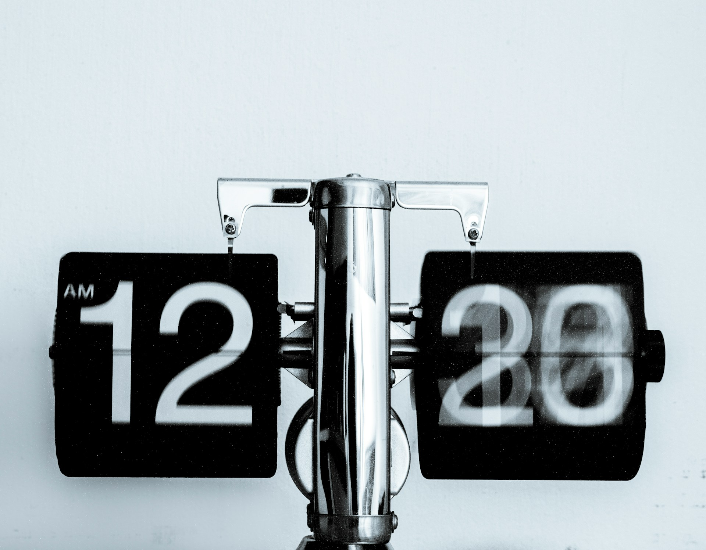

## 🌟 영어 표현 - over time

안녕하세요! 👋 오늘은 영어로 **'시간이 지나면서', '점차'** 라는 의미를 나타내는 **"over time"** 표현에 대해 알아볼게요.

"over time"은 일상생활에서 정말 자주 사용되는 표현이에요. **주로 점진적인 변화나 발전을 설명할 때 사용하죠. 이 표현은 특히 장기간에 걸쳐 일어나는 변화**를 설명할 때 매우 유용해요. ⏳

예를 들어, "Your English will improve over time." (시간이 지나면서 당신의 영어 실력이 향상될 거예요.) 이렇게 말할 수 있어요. 갑자기가 아닌, 천천히 일어나는 변화를 표현할 때 정말 자주 사용된답니다!

"over time"은 또 다른 맥락에서도 쓰여요. **자연스러운 과정이나 진행**을 설명할 때도 사용할 수 있죠. 🌱 예를 들면, "The situation will get better over time." (상황이 시간이 지나면서 나아질 거예요.)

<!-- engple-horizontal-ad -->

<ins class="adsbygoogle"
     style="display:block"
     data-ad-client="ca-pub-1465612013356152"
     data-ad-slot="2106896038"
     data-ad-format="auto"
     data-full-width-responsive="true"></ins>

## 📖 예문

"시간이 지나면서 모든 것이 나아질 거예요."

"Everything will get better over time."

"그 습관은 시간이 지나면서 자연스럽게 생겼어요."

"The habit developed naturally over time."

자, 이제 "over time"을 사용한 다양한 예문을 살펴볼까요? 꼭 소리내어 말하면서 연습해보세요! 🚀

## 💬 연습해보기

시간이 지나면 모든 게 나아질 거야, 그냥 참고 있어.

Things will get better over time, just <a href="/blog/in-english/067.hang-in-there/">hang in there</a>.

허리 통증이 시간이 지나면서 악화됐어요.

My back pain has gotten worse over time.

새 직장에 점차 익숙해질 거야.

You'll <a href="/blog/vocab-1/045.get-used-to/">get used to</a> your new job over time.

즉각적인 결과를 기대하지 마. 발전은 시간이 걸려.

Don't expect instant results. Progress happens over time.

그녀는 시간이 지나면서 더 자신감이 생겼어.

She's become more confident over time.

시간이 지나면 너에게 가장 잘 맞는 걸 알게 될 거야.

Over time, you'll <a href="/blog/in-english/170.figure-out/">figure out</a> what works best for you.

## 🤝 함께 알아두면 좋은 표현들

### gradually

'gradually'은 **"점차적으로"** 라는 뜻이에요. **어떤 변화가 서서히 일어나는 과정** 을 강조할 때 사용되며, 시간의 흐름에 따라 자연스럽게 변화하는 상황을 나타내요.

"The weather is gradually getting warmer as spring [approaches](/blog/in-english/267.approach/)."

"봄이 다가오면서 날씨가 점차 따뜻해지고 있습니다."

### in the long run

'[in the long run](/blog/in-english/179.in-the-long-run/)'은 **"결국에는" 또는 "장기적으로"** 라는 의미예요. **시간이 지나면서 최종적인 결과나 효과를 강조**하는 표현으로, 단기적인 결과와 대비되는 장기적인 관점을 나타내요.

"[Learning](/blog/in-english/245.learn/) a new language may be difficult [at first](/blog/in-english/184.at-first/), but it will [pay off](/blog/in-english/199.pay-off/) in the long run."

"처음에는 새로운 언어를 배우는 게 어려울 수 있지만, 결국에는 그만한 가치가 있을 거예요."

### over the years

'over the years'는 **"수년에 걸쳐"** 라는 뜻이에요. **오랜 시간 동안의 변화나 경험**을 강조할 때 사용되며, 시간이 지남에 따라 쌓인 경험이나 지식을 나타내요.

"Over the years, I've learned that true friendship is one of life's greatest gifts."

"수년간의 경험을 통해 진정한 우정이야말로 인생에서 가장 소중한 선물 중 하나라는 것을 깨달았어요."

---

오늘은 **'시간이 지나면서', '점차적으로'** 의 의미를 전달하는 **'over time'** 에 대해 배워봤어요. 정말 유용한 표현이죠? 일상 대화에서 자주 사용해보세요. **점진적인 변화나 발전을 설명**할 때 이 표현을 쓰면 여러분의 영어가 한층 더 자연스러워질 거예요! 😉

여러분도 오늘 배운 "over time"을 사용해서 문장을 만들어보는 건 어떨까요? 연습이 실력을 만든답니다! 화이팅! 💪
