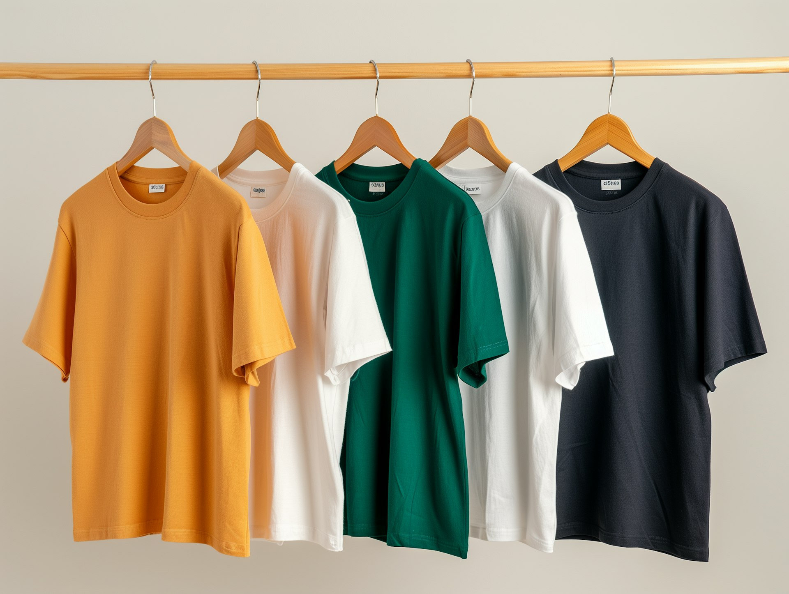

## 🌟 영어 표현 - in a row

안녕하세요! 👋 오늘은 영어로 **'연속으로', '잇달아'** 라는 의미를 나타내는 **"in a row"** 표현에 대해 알아볼게요.

"in a row"는 **어떤 일이나 상황이 중간에 끊기지 않고 연속해서 발생할 때** 사용하는 표현이에요. 마치 한 줄로 쭉 이어진 것처럼 말이죠! 📈

이 표현은 특히 **성과나 기록을 이야기할 때 자주 사용**돼요. 예를 들어, "She [won](/blog/in-english/456.win/) three games in a row." (그녀가 세 게임을 연속으로 이겼어요.) 처럼 말할 수 있죠. 스포츠, 게임, 시험 등 연속적인 성과를 강조하고 싶을 때 정말 유용해요! 🏆

## 📖 예문

"3일 연속으로 비가 왔어요."

"It rained for three days in a row."

"그는 5번 연속으로 시험에 합격했어요."

"He passed the test five times in a row."

자, 이제 "in a row"를 사용한 예문들을 살펴봤는데요, 직접 소리내어 연습해보세요! 🎯

## 💬 연습해보기

<ul data-interactive-list>
  <li data-interactive-item>
    믿을 수가 없어, 게임을 다섯 번이나 연달아 졌어.
    I can't believe I <a href="/blog/in-english/457.lose/">lost</a> five games in a row.
  </li>
  <li data-interactive-item>
    그녀가 이달의 직원상을 세 달 연속으로 받았대.
    She's won Employee of the Month three months in a row now.
  </li>
  <li data-interactive-item>
    오늘 출근하면서 신호등이 일곱 개나 연속으로 파란불이었어.
    I hit all green lights seven in a row on my way to work today.
  </li>
  <li data-interactive-item>
    그녀가 연락도 없이 회의를 두 번이나 연속으로 빠졌어.
    She's missed two meetings in a row without calling in.
  </li>
  <li data-interactive-item>
    그 팀이 12주 동안 한 번도 지지 않고 연승 중이야.
    The team hasn't lost a single game in twelve weeks in a row.
  </li>
  <li data-interactive-item>
    시즌 전체를 한 번에 다 봤어 - 열 편을 쉬지도 않고!
    I watched the entire season in one sitting - ten episodes in a row!
  </li>
</ul>

## 🤝 함께 알아두면 좋은 표현들

### one after another

'one after another'은 **"차례로" 또는 "연속적으로"** 라는 뜻이에요. 이 표현은 여러 사건이나 행동이 순차적으로 발생할 때 사용되며, **시간적인 연속성을 강조**합니다. 일상 대화에서 어떤 일이 계속해서 일어나는 상황을 설명할 때 자주 쓰입니다.

- "The guests [arrived](/blog/in-english/403.arrive/) one after another, filling the room with laughter and conversation."
- "손님들이 차례로 도착해 방이 웃음과 대화로 가득 찼습니다."

### back to back

'back to back'은 **"연속해서" 또는 "차례로"** 라는 의미예요. 이 표현은 두 개 이상의 사건이나 활동이 중간에 간격 없이 이어질 때 사용되며, **강조된 연속성을 나타냅니다**. 주로 일정이나 활동이 빽빽하게 차 있는 상황을 설명할 때 사용합니다.

- "She had back-to-back meetings all day, [leaving](/blog/in-english/402.leave/) her no time to relax."
- "그녀는 하루 종일 회의가 연속적으로 이어져서 쉴 시간이 없었습니다."

### consecutively

'consecutively'는 **"연속적으로"** 라는 뜻이에요. 이 표현은 사건이나 숫자가 끊김 없이 이어지는 상황을 설명할 때 사용되며, **정확한 순서를 강조**합니다. 주로 통계나 수치, 시간의 흐름을 설명할 때 자주 쓰입니다.

- "The team won the championship three times consecutively, setting a new record."
- "그 팀은 연속적으로 세 번 챔피언십에서 우승하여 새로운 기록을 세웠습니다."

---

오늘은 **'연속으로', '잇달아'** 의 의미를 전달하는 **'in a row'** 에 대해 배워봤어요. 정말 간단하면서도 유용한 표현이죠? 여러분의 연속적인 성과나 경험을 이야기할 때 꼭 써보세요! 😊

다음에 또 유용한 표현으로 찾아올게요. 열심히 연습해보세요! 화이팅! 💪
