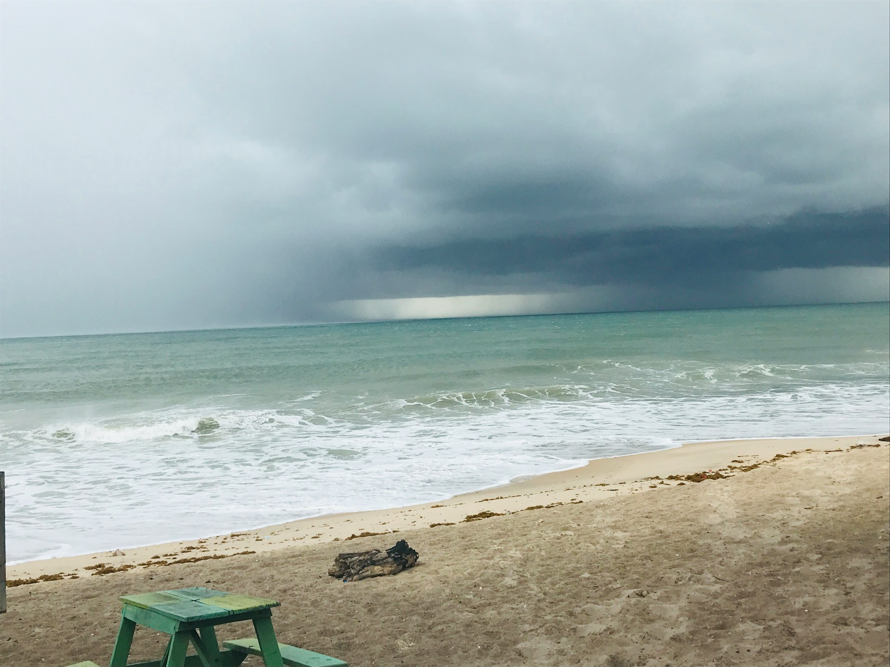

## 🌟 영어 표현 - likely to

안녕하세요 👋 '**~할 가능성이 높다**', '**~할 것 같다**'라는 의미를 가지는 영어 표현을 아시나요? 바로 '**likely to**'라는 표현이에요! 이 표현은 어떤 일이 일어날 가능성이 높다는 것을 의미해요. **확실하지는 않지만, 그 일의 발생 가능성이 크다는 뉘앙스를 가지고 있어요.** 그래서 긍정적인 의미로도 사용될 수 있고, 부정적인 상황에도 적용될 수 있답니다! 🌟

예를 들어, "It's likely to rain tomorrow." (내일 비가 올 가능성이 높아요.)라고 말할 수 있어요. 이렇게 말하면 상대방에게 내일 비가 올 가능성이 크다는 정보를 주는 거죠.

그럼 "**likely to**"를 사용한 예문들을 조금 더 살펴볼게요. 여러분도 상황을 떠올리면서 한 번 소리 내어 읽어보세요!

## 📖 예문

"그는 시험에 합격할 가능성이 높아요."

"He's likely to pass the exam."

"그 사람 또 늦을 것 같아."

"He's likely to be late again."

## 💬 연습해보기

<ul data-interactive-list>
  <li data-interactive-item>
    이 영화 오스카 탈 가능성이 높아.
    This movie is likely to win an Oscar.
  </li>
  <li data-interactive-item>
    오늘 밤 파티에 못 갈 가능성이 높아.
    I'm not likely to <a href="/blog/in-english/244.make-it/">make it</a> to the party tonight
  </li>
  <li data-interactive-item>
    주택 시장이 곧 무너질 것 같아.
    The housing market is likely to crash soon.
  </li>
  <li data-interactive-item>
    이 신발은 몇 달 이상 못 갈 것 같아.
    These shoes aren't likely to last more than a few months.
  </li>
  <li data-interactive-item>
    날씨는 내일 오후쯤 맑아질 것 같아.
    The weather's likely to clear up by tomorrow afternoon.
  </li>
  <li data-interactive-item>
    폭풍우 때문에 비행기가 지연될 것 같아.
    The flight's likely to be delayed because of the storm.
  </li>
  <li data-interactive-item>
    그녀는 그가 한 일 때문에 용서하지 않을 것 같아.
    She's not likely to forgive him after what he did.
  </li>
  <li data-interactive-item>
    소포는 다음 주쯤 도착할 가능성이 높아.
    The package is likely to <a href="/blog/in-english/403.arrive/">arrive</a> sometime next week.
  </li>
  <li data-interactive-item>
    올해 크리스마스에 부모님이 방문하실 가능성이 높아.
    My parents are likely to visit for Christmas this year.
  </li>
  <li data-interactive-item>
    그 스타트업은 전략을 바꾸지 않으면 실패할 것 같아.
    That startup is likely to fail if they don't change their strategy.
  </li>
</ul>

## 🤝 함께 알아두면 좋은 표현들

### bound to

'[bound to](/blog/in-english/212.bound-to/)'는 "**~할 가능성이 높은**" 또는 "**~할 운명인**"이라는 의미예요. 어떤 일이 반드시 일어날 것이라는 강한 확신을 나타내는 표현으로, 긍정적인 상황에서 자주 사용돼요.

- "With her talent and hard work, she is bound to succeed in her career."
- "그녀의 재능과 노력으로 봤을 때, 커리어에서 무조건 성공할거에요"

### unlikely to

'[unlikely to](/blog/가능성이-거의-없어-영어표현/)'는 "**~할 가능성이 낮은**"이라는 의미예요. 어떤 일이 일어날 가능성이 적다는 것을 나타내며, 주로 부정적인 결과나 상황에 대해 이야기할 때 많이 사용돼요.

- "It is unlikely to rain tomorrow according to the weather forecast."
- "일기예보에 따르면 내일 비가 올 가능성이 낮아요."

### inclined to

'inclined to'는 "**~하는 경향이 있다**"라는 뜻이에요. 어떤 특정한 행동이나 생각을 할 가능성이 높다는 의미로, 주로 개인의 성향이나 기호를 이야기할 때 사용돼요.

- "She is inclined to take risks when it comes to her career [choices](/blog/in-english/399.choice/)."
- "그녀는 커리어 선택에 있어서 위험을 감수하는 경향이 있어요."

---

오늘은 '**~할 가능성이 높다**'라는 의미를 전달하는 '**likely to**'에 대해 배워봤어요. 다음번에 누군가 어떤 일의 가능성에 대해 이야기할 때, 이 표현을 한번 활용해 보세요. 😊

오늘 배운 표현과 예문들, 최소 3번씩 소리 내어 읽어보세요. 다음에도 더 재밌고 유익한 표현으로 찾아올게요!
