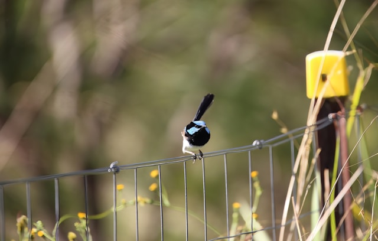

## 🌟 영어 표현 - on the fence

안녕하세요 👋 '**망설이다**', '**어떤 입장도 취하지 않다**'라는 의미를 가진 영어 표현을 아시나요? 바로 '**on the fence**'라는 표현이에요! 이 표현은 **어떤 문제나 상황에 대해 확실한 의견이나 결정을 내리지 않고 중립적인 입장을 유지하는 것**을 의미해요. 대체로 상황이 불확실할 때 느끼는 망설임이나 주저함을 나타내는 뉘앙스를 가지고 있어요! 🚦

예를 들어, "I’m [still](/blog/in-english/254.still/) on the fence about which college to attend." (어느 대학에 가야 할지 아직 결정을 못 했어요.)라고 말할 수 있어요. 이렇게 말하면, 결정을 내리기 위해 고민하고 있다는 느낌을 전할 수 있죠.

### 💡 이미지 그려보기

울타리 위에 앉아 있는 모습을 상상해 볼까요? 🪴 "fence"는 말 그대로 "울타리"를 의미해요. 울타리 위에 앉아 이쪽도, 저쪽도 아닌 중간에 머무는 이미지를 떠올리면 더 쉽게 이해할 수 있을 거예요!

그럼 "**on the fence**"를 사용한 예문들을 조금 더 살펴볼게요. 여러분도 상황을 떠올리면서 한 번 소리 내어 읽어보세요!

## 📖 예문

"새로운 직장 제안에 대해서는 생각 중이에요."

"I'm on the fence about the new job offer."

"어떤 영화를 볼지 아직 결정을 못 했어요."

"I'm still on the fence about which movie to watch."

## 💬 연습해보기

내년에 대학원 가는 거 아직 고민 중이에요.

I'm still on the fence about going to grad school next year.

사라는 이번 주 내내 시애틀에서 온 그 일자리 제안을 받아들일지 고민하고 있어요.

Sarah's been on the fence all week about whether to accept that job offer in Seattle.

고민하지 말고 그냥 그녀에게 데이트 신청해봐요!

Stop being on the fence and just ask her out already!

리뷰를 보고 나서야 결정을 내렸어요 - 이제 정말 사고 싶어요.

I was on the fence until I saw the <a href="/blog/in-english/251.review/">reviews</a> - now I definitely want to buy it.

아직 파티에 올지 고민 중이에요?

Are you still on the fence about coming to the party?

너무 오래 고민하지 마세요 - 이 티켓은 금방 매진될 거예요.

Don't <a href="/blog/in-english/119.stay/">stay</a> on the fence too long - these tickets will sell out fast.

그녀는 빨간색과 파란색 사이에서 고민 중이에요.

She's on the fence between the red one and the blue one.

부모님이 은퇴 후 플로리다로 이사할지 고민 중이에요.

My parents are on the fence about moving to Florida when they retire.

처음에는 고민했지만, 지금은 이 직장을 선택해서 정말 다행이에요.

I was on the fence at first, but now <a href="/blog/다행이야-영어표현/">I'm really glad</a> I took this job.

영원히 고민할 수는 없어요. 금요일까지 답이 필요해요.

You can't be on the fence forever. We need an answer by Friday.

## 🤝 함께 알아두면 좋은 표현들

### make up one's mind

'make up one's mind'는 "**결심하다**" 또는 "**마음을 정하다**"라는 뜻이에요. 이 표현은 어떤 선택이나 결정을 내리기로 마음을 굳히는 과정을 강조해요. 주로 여러 가지 옵션 중에서 하나를 확실히 선택할 때 사용해요.

"After weeks of thinking, he [finally](/blog/in-english/182.finally/) [made up his mind](/blog/in-english/083.make-up-one's-mind/) to move to another city."

"몇 주 동안 고민한 끝에 그는 결국 다른 도시로 이사하기로 결심했어요."

### take a stand

'take a stand'는 "**입장을 취하다**" 또는 "**주장을 하다**"라는 의미예요. 이 표현은 특정한 의견이나 주장을 분명히 하고, 그에 대한 책임을 지겠다는 결단을 나타내요. 자신이 믿는 바를 강하게 주장할 때 많이 사용해요.

"She [decided to](/blog/in-english/062.decide-to/) take a stand on climate change and advocate for more sustainable practices."

"그녀는 기후 변화에 대해 입장을 취하고 더 지속 가능한 관행을 지지하기로 했어요."

### commit to

'commit to'는 "**~에 전념하다**" 또는 "**~에 헌신하다**"라는 뜻이에요. 이 표현은 어떤 목표나 계획에 대해 확고한 의지를 가지고 행동하겠다는 결정을 내리는 것을 강조해요. 주로 장기적인 약속이나 결정을 내릴 때 사용해요.

"They have committed to a year-long project to improve community services."

"그들은 지역 사회 서비스를 개선하기 위한 1년 프로젝트에 전념했어요."

---

오늘은 '**결정을 내리지 못하다**'라는 의미를 전달하는 '**on the fence**'에 대해 배워봤어요. 다음번에 누군가 중립적인 입장을 취하고 있다면, 이 표현을 한 번 활용해 보세요. 😊

오늘 배운 표현과 예문들, 최소 3번씩 소리 내어 읽어보세요. 다음에도 더 재밌고 유익한 표현으로 찾아올게요!
