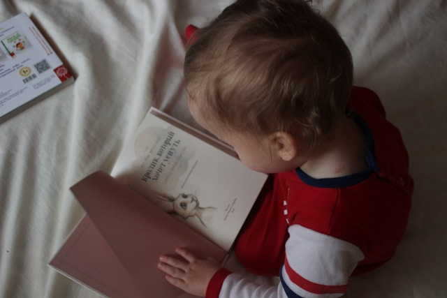

## 🌟 영어 표현 - take one's time

안녕하세요 👋 '**천천히 하다**', '**급하게 서두르지 않다**'라는 의미를 가지는 영어 표현을 아시나요? 바로 '**take one's time**'라는 표현이에요! 이 표현은 **어떤 일을 할 때 서두르지 않고 충분한 시간을 가지고 여유롭게 진행하는 것**을 의미해요. 대개 긍정적인 뉘앙스를 가지고 있어, 자신만의 속도로 일을 처리하면서 스트레스를 줄이는 느낌이 있어요! 🌼

예를 들어, "Take your time, there's no rush!" (천천히 해도 돼, 서두를 필요 없어!)라고 말할 수 있어요. 이렇게 말하면 상대방에게 여유를 가지라고 격려하는 거죠.

### 💡 이미지 그려보기

여유롭게 한 걸음 한 걸음 걷는 모습을 상상해 볼까요? 🚶‍♂️ "take your time"은 마치 즐겁게 산책하는 것처럼 편안한 이미지를 그릴 수 있어요. 목표에 도달하는 길이 있지만, 그 길을 걷는 과정이 더 중요하다는 메시지를 담고 있답니다!

그럼 "**take one's time**"을 사용한 예문들을 조금 더 살펴볼게요. 여러분도 상황을 떠올리면서 한 번 소리 내어 읽어보세요!

## 📖 예문

"수업 자료를 준비하는 데 시간을 충분히 썼어요."

"I took my time preparing the class materials."

"시험 천천히 봐도 돼. 아직 30분 남았어."

"Take your time with the test. You <a href="/blog/in-english/254.still/">still</a> have 30 minutes left."

## 💬 연습해보기

<ul data-interactive-list>
  <li data-interactive-item>
    여유 있게 천천히 해도 돼.
    Just relax and take your time.
  </li>
  <li data-interactive-item>
    마감일 신경 쓰지 마 - 천천히 해도 되니까 제대로 하자.
    Don't <a href="/blog/in-english/209.worry-about/">worry about</a> the deadline - take your time and do it right.
  </li>
  <li data-interactive-item>
    우리 애기가 이제 걸음마 배우는 중이야. 천천히 배울 수 있게 기다려주고 있어.
    The baby's just <a href="/blog/in-english/245.learn/">learning</a> to walk. We're letting her take her time with it.
  </li>
  <li data-interactive-item>
    이 디저트 천천히 음미하면서 먹을 거야. 급하게 먹기는 아까워.
    I'm gonna take my time enjoying this dessert. It's too good to rush.
  </li>
  <li data-interactive-item>
    왜 그렇게 급해? 천천히 설명서 좀 제대로 읽어봐.
    Why are you rushing? Take your time and read the instructions carefully.
  </li>
  <li data-interactive-item>
    박물관 구경 천천히 해.
    Take your time looking around the museum.
  </li>
  <li data-interactive-item>
    엄마가 맨날 음식 제대로 씹어서 천천히 먹으라고 잔소리해.
    Mom always tells me to take my time chewing my food properly.
  </li>
  <li data-interactive-item>
    난 아침에 여유롭게 시작하는 게 좋아. 급하게 시작하면 하루 망하잖아.
    I like to take my time in the morning. Nothing worse than starting the day rushed.
  </li>
  <li data-interactive-item>
    너 샤워 진짜 오래 하네! 다른 사람들도 화장실 써야 된다고!
    You're taking your sweet time with that shower! Other people need to use the bathroom too!
  </li>
  <li data-interactive-item>
    대학 고르는 건 천천히 해도 돼. 인생이 걸린 선택이니까.
    Take your time choosing a college. It's a big decision.
  </li>
</ul>

## 🤝 함께 알아두면 좋은 표현들

### rush

'rush'는 "**서두르다**"라는 뜻이에요. 이 표현은 어떤 일을 급하게 하거나 시간을 충분히 두지 않고 빠르게 진행하는 상황을 나타내요. 보통 시간이 부족하거나 긴급한 상황에서 많이 사용해요.

- "We can't rush this project. We need to ensure it's done properly."
- "우리는 이 프로젝트를 서두를 수 없어요; 제대로 진행되어야 해요."

### move at your own pace

'move at your own pace'는 "**자신의 속도로 진행하다**"라는 의미예요. 다른 사람의 속도에 상관없이 자신이 편한 속도로 일을 하거나 상황을 처리하는 것을 강조할 때 사용해요.

- "Don't feel pressured. Just move at your own pace."
- "압박감을 느끼지 마, 그냥 네 속도로 진행해."

### in a hurry

'in a hurry'는 "**서두르다**" 또는 "**급하다**"라는 뜻이에요. 어떤 일을 빨리 마쳐야 하는 상황을 나타내며, 시간에 쫓기는 느낌을 전달해요.

- "I'm [in a hurry](/blog/in-english/174.in-a-hurry/) to finish this report before the deadline."
- "마감 전에 이 보고서를 서둘러 끝내야해요."

---

오늘은 '**천천히 하다**'라는 의미를 전달하는 '**take one's time**'에 대해 배워봤어요. 다음번에 누군가 너무 서두르려는 모습을 보인다면, 이 표현을 한번 활용해 보세요. 그리고 혹시 여러분 자신이 너무 급한게 아닌지 점검해보면 좋을거 같아요. 😊

오늘 배운 표현과 예문들, 최소 3번씩 소리 내어 읽어보세요. 다음에도 더 재밌고 유익한 표현으로 찾아올게요!
