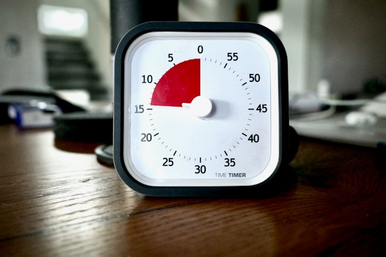

## 🌟 영어 표현 - at the last minute

안녕하세요 👋 '**막판에**', '**마지막 순간**'이라는 의미를 가지는 영어 표현을 아시나요? 바로 '**at the last minute**'라는 표현이에요! 이 표현은 **어떤 일을 시작하기 직전의 가장 마지막 순간에, 긴급하게 또는 즉흥적으로 행동하는 것**을 의미해요. 보통은 준비가 부족하거나 시간적 여유가 없다는 뉘앙스를 가지고 있어요! ⏰

예를 들어, "He changed his plans at the last minute." (그는 막판에 계획을 변경했어요.)라고 말할 수 있어요. 이렇게 말하면 그가 미리 준비하지 않고 갑자기 계획을 바꾼 상황을 표현하는 거죠.

그럼 "**at the last minute**"를 사용한 예문들을 조금 더 살펴볼게요. 여러분도 상황을 떠올리면서 한 번 소리 내어 읽어보세요!

## 📖 예문

"걔는 진짜 미루기의 왕이라니까요. 과제 매번 데드라인 직전에 겨우 내요"

"He's such a procrastinator, always submitting his assignments at the last minute."

"그는 급하게 중요한 결정을 내려야 했어요."

"He had to <a href="/blog/vocab-1/010.make-a-decision/">make an important decision</a> at the last minute."

## 💬 연습해보기

<ul data-interactive-list>
  <li data-interactive-item>
    사라가 저녁 약속 직전에 갑자기 취소한다고 연락했어요.
    Sarah called me at the last minute to cancel our dinner plans.
  </li>
  <li data-interactive-item>
    막판에 주차 자리 하나 찾았어요.
    We found a parking spot at the last minute.
  </li>
  <li data-interactive-item>
    걱정 마, 항상 그랬듯이 마지막에 뭔가 해결될 거야.
    Don't worry, I'm sure something will work out at the last minute. It always does.
  </li>
  <li data-interactive-item>
    사람들이 막판에 계획 바꾸는 거 진짜 싫어요.
    I <a href="/blog/in-english/392.hate/">hate</a> when people change plans at the last minute.
  </li>
  <li data-interactive-item>
    경기가 동점이었는데, 마지막에 우리가 득점했어요. 진짜 소름 돋았어요!
    The game was tied until we scored at the last minute. What a rush!
  </li>
  <li data-interactive-item>
    여동생이 갑자기 애기 못 본다고 해서, 저도 어쩔 수 없이 회사에 병가 냈어요.
    My sister backed out of babysitting at the last minute, so I had to <a href="/blog/vocab-1/032.call-in-sick/">call in sick</a>.
  </li>
  <li data-interactive-item>
    비가 와서 급하게 장소를 바꿨어요.
    They changed the venue at the last minute due to rain.
  </li>
</ul>

## 🤝 함께 알아두면 좋은 표현들

### last-minute change

'last-minute change'는 "**막판 변경**"이라는 뜻이에요. 계획이나 일정이 거의 완료된 상태에서 마지막 순간에 이루어진 변경을 의미해요. 불가피한 상황이나 새로운 정보로 인해 결정이 바뀔 때 자주 사용해요.

- "The team had to make a last-minute change to the presentation after receiving new data."
- "팀은 새로운 데이터를 받고 프레젠테이션을 막판에 변경해야 했어요."

### procrastinate

'[procrastinate](/blog/in-english/264.procrastinate/)'는 "**미루다**" 또는 "**연기하다**"라는 의미예요. 해야 할 일을 의도적으로 지연시키는 행동을 나타내며, 종종 마지막 순간에 급하게 처리하게 되는 상황을 초래해요. 주로 부정적인 뉘앙스를 가지고 있어요.

- "She tends to procrastinate on her assignments until the [deadline](/blog/in-english/830.deadline/) is [almost](/blog/in-english/854.almost/) here."
- "그녀는 마감일이 거의 다가올 때까지 과제를 미루는 경향이 있어요."

### plan ahead

'plan ahead'는 "**미리 계획하다**"라는 뜻이에요. 미래의 상황이나 필요를 고려하여 사전에 준비하는 행동을 나타내요. 시간적 여유를 두고 준비함으로써 더 나은 결과를 얻을 수 있도록 하는 것을 강조해요.

- "It's always better to plan ahead for your projects to [avoid](/blog/in-english/924.avoid/) last-minute stress."
- "막판 스트레스를 피하려면 프로젝트를 미리 계획하는 게 항상 더 좋아요."

---

오늘은 '**막판에**'라는 의미를 전달하는 '**at the last minute**'에 대해 배워봤어요. 다음번에 누군가 급하게 행동하는 모습을 보인다면, 이 표현을 한번 활용해 보세요. 그리고 혹시 여러분 자신이 마지막 순간에 서두르고 있는 건 아닌지 점검하는 기회로 삼아도 좋겠죠? 😊

오늘 배운 표현과 예문들, 최소 3번씩 소리 내어 읽어보세요. 다음에도 더 재밌고 유익한 표현으로 찾아올게요!
