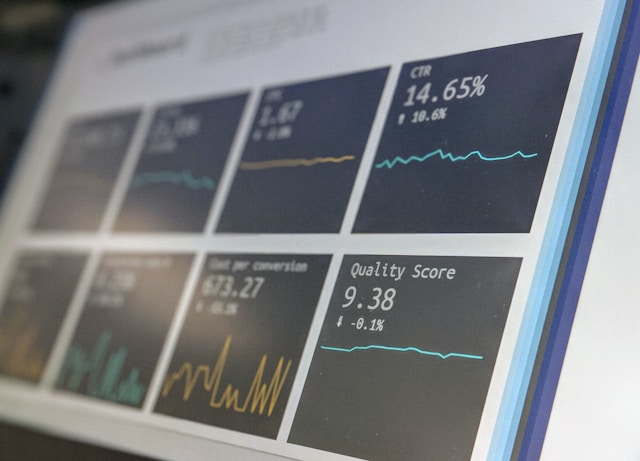

## 🌟 영어 표현 - at face value

안녕하세요 👋 '**그대로**', '**겉보기에는**'라는 의미를 가지는 영어 표현을 아시나요? 바로 '**at face value**'라는 표현이에요! 이 표현은 **어떤 것의 겉모습이나 처음 보이는 모습만으로 진실을 판단하거나 이해하는 것**을 의미해요. 대개는 그 의미가 더 깊고 복잡할 수 있는데, 그런 것을 무시하고 단순히 겉만 보고 결론을 내리는 뉘앙스가 있어요! 🎭

예를 들어, "You shouldn't take his words at face value; he might be joking." (그의 말을 그대로 받아들이지 마세요; 그는 농담일 수도 있어요.)라고 말할 수 있어요. 이렇게 말하면 상대방에게 깊이 생각해보라는 메시지를 전달하는 거죠.

### 💡 이미지 그려보기

얼굴을 보고 판단하는 모습을 상상해 볼까요? 👤 "face"는 말 그대로 "얼굴"을 의미하죠. 무언가를 겉모습만 보고 신뢰하는 이미지로 그려보면 더 쉽게 기억할 수 있을 거예요! 🌟

그럼 '**at face value**'를 사용한 예문들을 조금 더 살펴볼게요. 여러분도 상황을 떠올리면서 한 번 소리 내어 읽어보세요!

## 📖 예문

"그가 하는 말을 그대로 믿지 마"

"Don't take everything he says at face value"

"그 이야기는 별로 믿기지 않아요."

"I don't really believe that story at face value."

## 💬 연습해보기

<ul data-interactive-list>
  <li data-interactive-item>
    지난번 끔찍한 경험 덕분에 직무 설명서를 그대로 믿지 않게 됐어.
    I <a href="/blog/in-english/245.learn/">learned</a> not to take job descriptions at face value after my last terrible <a href="/blog/in-english/415.experience/">experience</a>.
  </li>
  <li data-interactive-item>
    그녀는 그의 사과를 그대로 받아들이고 또 한 번 기회를 주기로 했어.
    She took his apology at face value and <a href="/blog/in-english/062.decide-to/">decided to</a> give him another chance.
  </li>
  <li data-interactive-item>
    이 보고서의 숫자가 좀 이상해. 그대로 믿지 않는 게 좋을 것 같아.
    The numbers in this report seem odd. I wouldn't take them at face value.
  </li>
  <li data-interactive-item>
    요즘은 소셜 미디어 게시물을 그냥 믿으면 안 돼.
    You can't just take social media posts at face value <a href="/blog/in-english/417.these-days/">these days</a>.
  </li>
  <li data-interactive-item>
    그 리뷰는 그냥 믿지 않는 게 좋을 것 같아 - 아마도 돈 받고 쓴 내용일 거야.
    I wouldn't take that <a href="/blog/in-english/251.review/">review</a> at face value - it's probably paid content.
  </li>
  <li data-interactive-item>
    요즘은 뉴스 헤드라인을 그대로 믿을 수가 없어.
    These days, you can't even take news headlines at face value anymore.
  </li>
  <li data-interactive-item>
    똑똑한 투자자들은 회사의 수익 보고서를 절대 그대로 믿지 않아.
    Smart investors never take company earnings reports at face value.
  </li>
</ul>

## 🤝 함께 알아두면 좋은 표현들

### read between the lines

'[read](/blog/in-english/436.read/) between the lines'는 "**행간을 읽다**"라는 의미예요. 이 표현은 **표면적으로 드러나지 않는 숨은 의미나 진짜 의도를 파악하는 것**을 강조해요. 보통 겉으로는 명확하지 않은 감정이나 상황을 이해할 때 사용해요.

- "You need to read between the lines to understand what she's really saying."
- "그녀가 진짜로 말하고 있는 것을 이해하려면 행간을 읽어야 해요."

### look deeper

'look deeper'는 "**더 깊이 들여다보다**"라는 뜻이에요. 이 표현은 **표면적인 것만 보고 판단하지 않고, 더 많은 정보를 찾아보거나 분석해야 한다는 의미**를 담고 있어요. 상황이나 문제를 좀 더 철저히 이해하려고 할 때 사용해요.

- "We should look deeper into the data before [making our final decision](/blog/vocab-1/010.make-a-decision/)."
- "우리는 최종 결정을 내리기 전에 데이터를 더 깊이 들여다봐야 해요."

### scratch the surface

'scratch the surface'는 "**표면만 긁다**"라는 의미예요. 이 표현은 **어떤 주제나 문제를 아주 얕게 다루거나 충분히 탐구하지 않았다는 것을 나타내요.** 주제를 깊이 있게 이해하지 못했을 때 사용해요.

- "We've only scratched the surface of this complex issue."
- "우리는 이 복잡한 문제를 겉핡기만 했을 뿐이에요."

---

오늘은 '**겉보기대로**'라는 의미를 전달하는 '**at face value**'에 대해 배워봤어요. 다음번에 누군가의 말을 겉모습만 보고 판단하는 모습을 보인다면, 이 표현을 한번 활용해 보세요. 그리고 혹시 여러분 자신이 단순히 겉으로만 보는 건 아닌지 점검하는 기회로 삼아도 좋겠죠? 😊

오늘 배운 표현과 예문들, 최소 3번씩 소리 내어 읽어보세요. 다음에도 더 재밌고 유익한 표현으로 찾아올게요!
