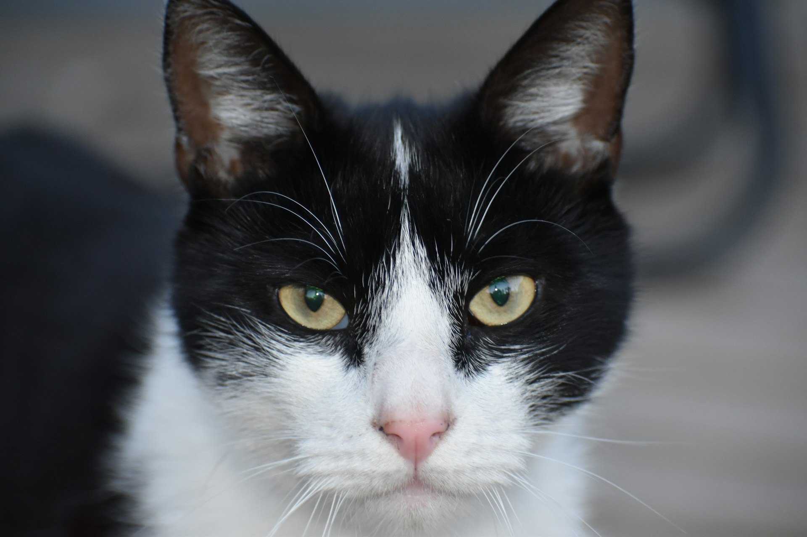

## 🌟 영어 표현 - keep an eye on

안녕하세요 👋 '**지켜보다**', '**주시하다**'라는 의미를 가지는 영어 표현을 아시나요? 바로 '**keep an eye on**'이라는 표현이에요! 이 표현은 **어떤 것에 주의를 기울이거나, 관심을 가지고 지켜보는 것**을 의미해요. 긍정적인 뉘앙스가 있고, 누군가 혹은 어떤 상황에서 눈을 떼지 않고 살펴보려는 느낌이 있어요! 👀

예를 들어, "Please keep an eye on my bag while I step out." (내가 나가는 동안 가방 좀 지켜봐 주세요!)라고 말할 수 있어요. 이렇게 말하면 상대방에게 가방을 안전하게 지켜달라는 요청을 하는 거죠.

### 💡 이미지 그려보기

눈을 크게 뜨고 어떤 상황을 주의 깊게 바라보는 모습을 상상해 볼까요? "keep"는 유지하다라는 뜻으로, "eye"는 눈을 의미하죠. 누군가 소중한 것을 지키기 위해 주의 깊게 바라보는 이미지를 그리면 더 쉽게 기억할 수 있을 거에요! 🌟

그럼 "**keep an eye on**"을 사용한 예문들을 조금 더 살펴볼게요. 여러분도 상황을 떠올리면서 한 번 소리 내어 읽어보세요!

## 📖 예문

"화장실 가있는 동안 내 가방 좀 봐줄래?"

"Hey, could you keep an eye on my bag while I use the restroom?"

"오븐에 있는 쿠키들 좀 잘 봐야 해, 안 그러면 탈 거야.

"I need to keep an eye on these cookies in the oven, or they'll burn."

## 💬 연습해보기

엄마는 쇼핑 갈 때 항상 내 동생 좀 봐달라고 해.

My mom always asks me to keep an eye on my little brother when she goes shopping.

이번 달 지출 좀 조심해.

Just keep an eye on your spending this month.

사장님이 새 인턴이 일에 익숙해질 때까지 잘 봐달라고 하셨어.

The boss told me to keep an eye on the new intern until she <a href="/blog/in-english/020.get-the-hang-of-it/">gets the hang of</a> things.

내 핸드폰 좀 지켜봐줄 수 있어?

Can you keep an eye on my phone?

의사 선생님이 그 발진 좀 잘 살펴보라고 하셨고, 더 나빠지면 다시 오라고 하셨어.

The doctor said to keep an eye on that rash and come back if it gets worse.

시간 잘 챙겨. 영화에 늦으면 안 돼.

<a href="/blog/in-english/232.make-sure/">Make sure</a> to keep an eye on the time. We can't be late for the movie.

요즘 내 콜레스테롤 수치 좀 잘 체크하고 있어.

I'm trying to keep an eye on my cholesterol levels these days.

야, 도로 잘 봐! 다른 차선으로 넘어가고 있어.

Hey, keep an eye on the road! You're drifting into the other lane.

걱정 마, 네가 전화하는 동안 내가 그릴 잘 지켜볼게.

Don't worry, I'll keep an eye on the grill while you take that call.

## 🤝 함께 알아두면 좋은 표현들

### monitor

'monitor'는 "**지켜보다**" 또는 "**모니터링하다**" 라는 뜻이에요. 주의 깊게 상황이나 행동을 관찰하는 과정을 나타내며, 주로 어떤 변화나 문제를 발견하기 위해 지속적으로 살펴보는 경우에 사용해요.

- "The teacher will monitor the students' progress throughout the semester."
- "선생님이 학기 내내 학생들의 진행 상황을 잘 살펴보실 거예요."

### look out for

'look out for'는 "**주의하다**" 또는 "**조심하다**" 라는 뜻이에요. 위험이나 문제를 피하기 위해 주의 깊게 살펴보는 것을 의미하며, 누군가의 안전이나 복지를 위해 신경 쓰는 상황에서 자주 쓰여요.

- "Always look out for cars when you're crossing the street."
- "길을 건널 때는 항상 차를 조심해야 해요."

---

오늘은 '**지켜보다**'라는 의미를 전달하는 '**keep an eye on**'에 대해 배워봤어요. 다음번에 누군가의 행동을 지켜보는 상황이 있다면, 이 표현을 한번 활용해 보세요. 그리고 혹시 여러분 자신이 소중한 것을 잘 지키고 있는지 점검하는 기회로 삼아도 좋겠죠? 😊

오늘 배운 표현과 예문들, 최소 3번씩 소리 내어 읽어보세요. 다음에도 더 재밌고 유익한 표현으로 찾아올게요!
