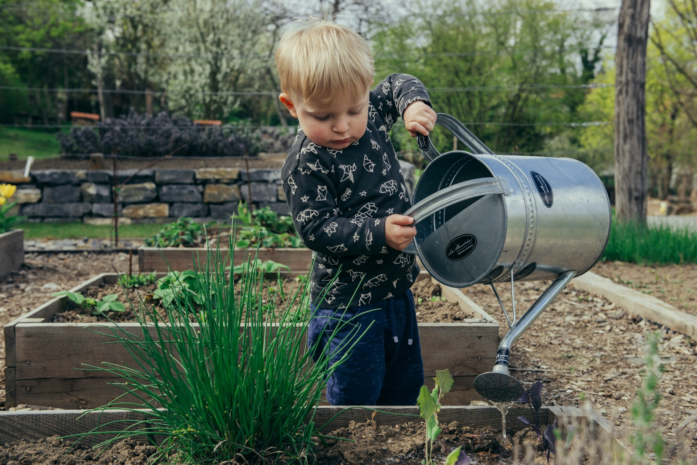

## 🌟 영어 표현 - step by step

안녕하세요 👋 '**단계적으로 진행하다**'를 의미하는 영어 표현을 아시나요? 바로 '**step by step**'이라는 표현이에요! 이 표현은 **어떤 일을 한 번에 다 끝내지 않고, 여러 단계로 나누어 차근차근 진행하는 것**을 의미해요. 대개 긍정적인 뉘앙스를 가지고 있어, 쉽게 접근할 수 있도록 도움을 주는 느낌이 있어요!

예를 들어, "Let's take it step by step so we don't get overwhelmed!" (우리가 압도되지 않도록 단계적으로 진행해 봅시다!)라고 말할 수 있어요. 이렇게 말하면 상대방에게 서두르지 말고 천천히 진행하자고 제안하는 거죠.

<ins class="adsbygoogle"
     style="display:block"
     data-ad-client="ca-pub-1465612013356152"
     data-ad-slot="2106896038"
     data-ad-format="auto"
     data-full-width-responsive="true"></ins>

### 💡 이미지 그려보기

계단을 하나하나 올라가는 모습을 상상해 볼까요? 🏔️ "step"는 "단계"라는 뜻이죠. 여러 개의 계단이 있고, 한 걸음씩 올라가는 이미지를 떠올리면 더 쉽게 기억할 수 있을 거예요! 🌟

그럼 "**step by step**"를 사용한 예문들을 조금 더 살펴볼게요. 여러분도 상황을 떠올리면서 한 번 소리 내어 읽어보세요!

## 📖 예문

"이번 프로젝트를 단계별로 진행할 계획이에요."

"I'm planning to work on this project step by step."

"내가 하나씩 차근차근 설명해줄게"

"Let me walk you through this step by step"

## 💬 연습해보기

하나씩 천천히 하면 잘 할 수 있어.

Take it step by step and you'll get there.

매뉴얼이 조립 과정을 하나씩 나눠서 설명해줘서 진짜 쉽게 할 수 있어.

The manual breaks down the assembly step by step, which makes it super easy.

내 지시를 하나씩 따라오면 금방 내 집에 도착할 거야.

Just follow my directions step by step, and you'll be at my house <a href="/blog/in-english/236.in-no-time/">in no time</a>.

내가 그 매듭 묶는 법을 하나씩 보여줄게. 잘 봐.

I'll show you step by step how to tie that knot. Watch carefully.

하나씩 진행하는 건 지루하지만, 이걸 제대로 배우는 유일한 방법이야.

Going step by step is boring, but <a href="/blog/in-english/025.that-is-the-only-way/">it's the only way</a> to <a href="/blog/in-english/245.learn/">learn</a> this properly.

우리는 집을 하나씩 리모델링하고 있어 - 먼저 주방, 그 다음 욕실.

We're renovating the house step by step - kitchen first, then bathrooms.

결론을 서두르지 말고 하나씩 해결해보자.

Let's <a href="/blog/in-english/170.figure-out/">figure this out</a> step by step instead of <a href="/blog/in-english/203.jump-to-conclusions/">jumping to conclusions</a>.

## 🤝 함께 알아두면 좋은 표현들

### little by little

'little by little'은 "**조금씩**"이라는 뜻이에요. 이 표현은 **천천히, 점진적으로 어떤 것을 이루거나 변화시키는 과정**을 강조해요. 특히 시간이 걸리더라도 꾸준히 진행되는 상황에서 많이 사용해요.

"She improved her skills little by little through consistent practice."

"그녀는 꾸준한 연습을 통해 조금씩 실력을 향상시켰어요."

### gradually

'gradually'는 "**점진적으로**"라는 의미예요. 이 표현은 **어떤 변화가 서서히 일어나는 것**을 나타내며, 급작스럽지 않게 천천히 진행되는 상황에서 주로 사용해요.

"The pain gradually faded away as he rested more."

"그는 더 많이 쉬면서 통증이 점진적으로 사라졌어요."

### all at once

'all at once'는 "**한 번에**"라는 의미예요. 이 표현은 **모든 것을 동시에 하려는 시도**를 나타내며, 종종 비효율적이거나 과중한 부담을 줄 때 사용해요. 여러 가지 일을 동시에 처리하는 것이 힘들 때 자주 쓰여요.

"Trying to do everything all at once can [lead to](/blog/vocab-1/004.lead-to/) mistakes."

"모든 것을 한 번에 하려는 것은 실수로 이어질 수 있어요."

---

오늘은 '**단계적으로 진행하다**'라는 의미를 전달하는 '**step by step**'에 대해 배워봤어요. 다음번에 누군가 한꺼번에 모든 것을 하려는 모습을 보인다면, 이 표현을 한번 활용해 보세요. 여러분들도 어려운 일이 있으면 차근차근 해결해보시면 좋을거 같아요! 😊

오늘 배운 표현과 예문들, 최소 3번씩 소리 내어 읽어보세요. 다음에도 더 재밌고 유익한 표현으로 찾아올게요!
