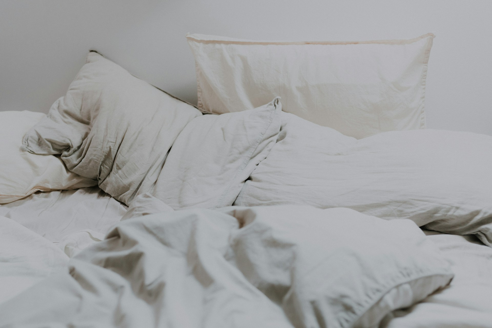

## 🌟 영어 표현 - toss and turn

안녕하세요 👋 '**뒤척이다**', '**잠을 이루지 못하고 벗어나기 힘든 상태**'라는 의미를 가진 영어 표현을 아시나요? 바로 '**toss and turn**'라는 표현이에요! 이 표현은 **잠을 잘 이루지 못하고 침대에서 계속 자세를 바꾸며 뒤척이는 것**을 의미해요. 대개는 수면 부족이나 불안, 스트레스 같은 상황에서 사용되며, 즉각적인 안정을 찾지 못한 느낌을 줘요! 😴

예를 들어, "I couldn't sleep last night; I kept tossing and turning." (나는 어젯밤 잠을 잘 수 없었어; 계속 뒤척였어.)라고 말할 수 있어요. 이렇게 말하면 상대방에게 잠을 자지 못하고 힘들었다는 것을 표현하는 거죠.

<ins class="adsbygoogle"
     style="display:block"
     data-ad-client="ca-pub-1465612013356152"
     data-ad-slot="2106896038"
     data-ad-format="auto"
     data-full-width-responsive="true"></ins>

그럼 "**toss and turn**"를 사용한 예문들을 조금 더 살펴볼게요. 여러분도 상황을 떠올리면서 한 번 소리 내어 읽어보세요!

## 📖 예문

"어제 밤에 너무 긴장해서 계속 뒤척였어요."

"I kept tossing and turning all night because I was so nervous."

면접 생각하느라 밤새 뒤척였어요.

I tossed and turned all night thinking about the job interview.

## 💬 연습해보기

아기가 몇 시간째 뒤척이고 있어요.

The baby's been tossing and turning for hours.

제발 뒤척이지 마! 침대가 다 흔들려.

Stop tossing and turning! You're shaking the whole bed.

나쁜 소식 듣고 나서부터 매일 밤 뒤척이고 있어요.

She's been tossing and turning every night since we got the bad news.

이 새로운 약 때문에 미친 듯이 뒤척이고 있어요.

These new pills are making me toss and turn like crazy.

어제 밤에 한 5시간은 뒤척인 것 같아요.

I must've tossed and turned for like five hours last night.

이별한 이후로 매일 밤 뒤척이고 있어요.

Ever since the breakup, I've been tossing and turning every night.

남편이 스트레스 받는 걸 알겠어요 - 밤새 뒤척이거든요.

I can tell when my husband's stressed - he tosses and turns all night.

## 🤝 함께 알아두면 좋은 표현들

### stay awake

'[stay awake](/blog/in-english/119.stay/)'는 "**잠을 자지 않다**" 또는 "**깨있다**"라는 의미예요. 주로 피곤함에도 불구하고 의도적으로 잠을 자지 않거나 어떤 일을 하기 위해 깨어 있는 상태를 나타내요. 긴장감이나 집중력 때문에 잠이 오지 않는 상황에서 자주 사용돼요.

"I had to stay awake all night to finish the project before the deadline."

"마감일 전에 프로젝트를 끝내기 위해 밤새도록 깨어 있어야 했어요."

### sleep like a baby

'sleep like a baby'는 "**아기처럼 깊이 자다**"라는 의미예요. 매우 편안하고 걱정 없이 깊은 잠을 자는 상태를 나타내요. 주로 스트레스나 불안이 없을 때의 편안한 수면을 강조할 때 많이 사용해요.

"After a long day, I slept like a baby and woke up refreshed."

"긴 하루를 보낸 후에 아기처럼 깊이 자고 상쾌하게 일어났어요."

---

오늘은 '**뒤척이다**'라는 의미를 전달하는 '**toss and turn**'에 대해 배워봤어요. 다음번에 누군가 잠을 잘 이루지 못하는 모습을 보인다면, 이 표현을 한번 활용해 보세요. 여러분들이 매일 밤 쉽게 잠드셨으면 좋겠어요. 😊

오늘 배운 표현과 예문들, 최소 3번씩 소리 내어 읽어보세요. 다음에도 더 재밌고 유익한 표현으로 찾아올게요!
