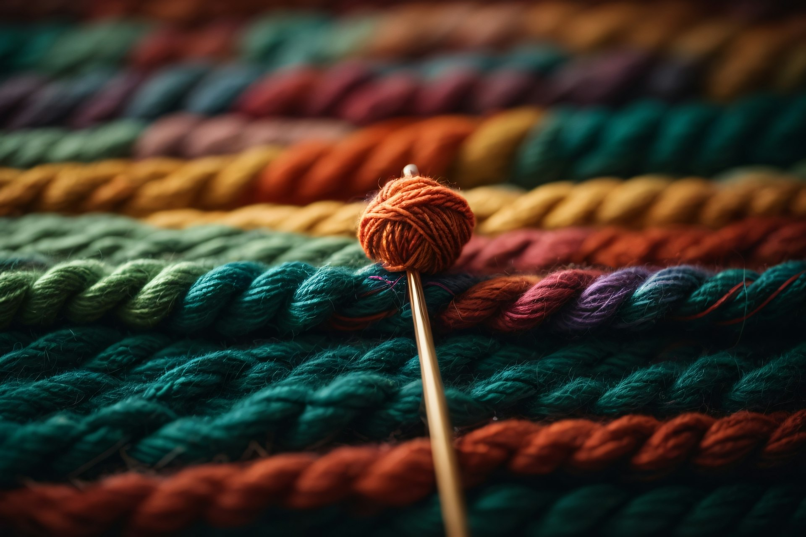

## 🌟 영어 표현 - wrap up

안녕하세요 👋 '**마무리하다**', '**종료하다**'라는 뜻을 가진 영어 표현을 아시나요? 바로 '**wrap up**'이라는 표현이에요! 이 표현은 **어떤 일을 마무리하거나 종료하는 과정**을 의미해요. 대개 긍정적인 뉘앙스를 가지고 있어, 일을 잘 마무리짓거나 정리하는 느낌이 있죠! 🎉

예를 들어, "Let's wrap up the meeting now." (이제 회의를 마무리합시다.)라고 말할 수 있어요. 이렇게 말하면 상대방에게 회의를 끝내자는 제안을 하는 거죠.

그럼 "**wrap up**"을 사용한 예문들을 조금 더 살펴볼게요. 여러분도 상황을 떠올리면서 한 번 소리 내어 읽어보세요!

## 📖 예문

"이 프로젝트는 이번 주에 마무리할 예정이에요."

"I'm planning to wrap up this project by the end of this week."

"네가 준비한 발표가 끝나면, 우리는 시상식을 마무리할 거야."

"Once your presentation is done, we'll wrap up the award ceremony."

## 💬 연습해보기

<ul data-interactive-list>
  <li data-interactive-item>
    연휴 전에 프로젝트 마무리해야 해.
    We need to wrap up the project before the holidays.
  </li>
  <li data-interactive-item>
    이 회의 마무리하자 - 나 5분 후에 다른 전화 있어.
    Let's wrap up this meeting - I've got another call in five minutes.
  </li>
  <li data-interactive-item>
    마지막 이메일 몇 개만 정리하고 집에 갈게.
    I'm just gonna wrap up these last few emails and head home.
  </li>
  <li data-interactive-item>
    연습 마무리할 시간이에요, 여러분. 오늘 수고 많았어요!
    Time to wrap up practice, guys. Great work today!
  </li>
  <li data-interactive-item>
    이 대화는 여기서 마무리하는 게 좋을 것 같아 - 늦어지고 있어.
    We should <a href="/blog/in-english/281.probably/">probably</a> wrap up this conversation - it's getting late.
  </li>
  <li data-interactive-item>
    마지막 그룹 프로젝트로 학기를 마무리할 거에요.
    We're wrapping up the semester with a final group project.
  </li>
  <li data-interactive-item>
    상사가 돌아오기 전에 이 보고서 마무리해야 해.
    I need to wrap up this report before my boss gets back.
  </li>
</ul>

## 🤝 함께 알아두면 좋은 표현들

### call it a day

'[call it a day](/blog/vocab-1/037.call-it-a-day/)'는 "**오늘은 여기까지 하다**"라는 의미예요. 하루의 일을 마치고 더 이상 진행하지 않겠다는 결정을 내릴 때 사용해요. 주로 일상적인 대화에서 자주 쓰여요.

- "I think it's time to call it a day."
- "이제 오늘은 여기까지 하기로 할게요."

### drag on

'drag on'은 "**질질 끌다**" 또는 "**지연되다**"라는 의미예요. 'wrap up'과는 반대로, 일이나 상황이 필요 이상으로 오래 걸리거나 지체되는 것을 표현할 때 사용해요.

- "The meeting was dragging on."
- "회의가 질질 끌리고 있었어요."

---

오늘은 '**마무리하다**'라는 의미를 전달하는 '**wrap up**'에 대해 배워봤어요. 다음번에 누군가 일을 잘 마무리하려는 모습을 보인다면, 이 표현을 한번 활용해 보세요. 😊

오늘 배운 표현과 예문들, 최소 3번씩 소리 내어 읽어보세요. 다음에도 더 재밌고 유익한 표현으로 찾아올게요!
