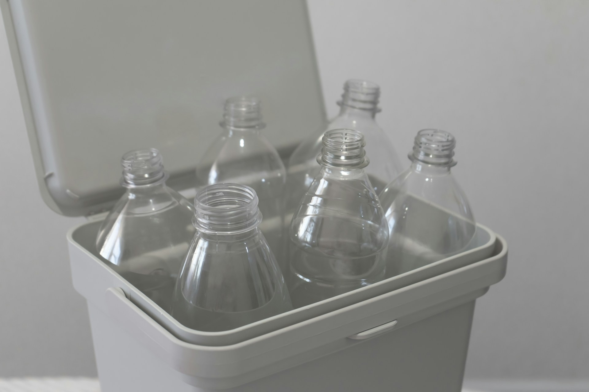

## 🌟 영어 표현 - waste

안녕하세요 👋 '**낭비하다**', '**함부로 쓰다**'라는 의미를 가지는 영어 표현을 아시나요? 바로 '**waste**'라는 표현이에요! 이 표현은 **자원이나 시간, 노력을 함부로 쓰거나 소모하는 것**을 의미해요. 대개 부정적인 뉘앙스를 가지고 있어서, 무엇인가를 효과적으로 사용하지 못하거나 잘못된 방법으로 쓰는 경우에 쓰이곤 해요!

예를 들어, "Don't waste your time on things that don't matter!" (중요하지 않은 것에 시간을 낭비하지 마세요!)라고 말할 수 있어요. 이렇게 말하면 상대방에게 시간과 자원을 아끼라는 조언을 주는 거죠.

<!-- engple-horizontal-ad -->

<ins class="adsbygoogle"
     style="display:block"
     data-ad-client="ca-pub-1465612013356152"
     data-ad-slot="2106896038"
     data-ad-format="auto"
     data-full-width-responsive="true"></ins>

### 💡 명사로도 사용되는 waste

'Waste'는 동사로도 쓰이지만, 명사로도 자주 사용돼요. 명사로 쓰일 때는 '**쓰레기**', '**폐기물**', '**낭비**' 등의 의미를 가져요. 예를 들어, "food waste"(음식물 쓰레기), "nuclear waste"(핵폐기물), "a waste of time"(시간 낭비) 등으로 사용할 수 있죠.

그럼 "**waste**"를 사용한 예문들을 조금 더 살펴볼게요. 여러분도 상황을 떠올리면서 한 번 소리 내어 읽어보세요!

## 📖 예문

1. "마음에 드는 영화를 못 보고 시간 낭비한 게 너무 속상해요."

   "I'm really [disappointed](/blog/in-english/302.disappoint/) that I wasted my time not watching a movie I liked."

2. "불필요한 소비를 줄여서 돈을 낭비하지 않으려 해요."

   "I'm [trying to](/blog/in-english/117.try-to/) avoid wasting money by cutting down on unnecessary spending."

## 💬 연습해보기

그 남자한테 시간 낭비하지 마. 그 사람은 그럴 가치가 없어.

Don't waste your time on that guy. He's not worth it.

넷플릭스 보느라 토요일 완전 낭비했어.

I totally wasted my Saturday <a href="/blog/in-english/071.binge-watch/">binge-watching</a> Netflix.

이걸로 너랑 논쟁하면서 시간 낭비 안 할 거야.

I'm not gonna waste my breath arguing with you about this.

진짜 그 회의는 모두의 시간 낭비였어.

Man, that meeting was a complete waste of everyone's time.

지나간 기회에 울어봤자 소용없어. 앞으로 나아가자.

No point crying over wasted opportunities. Let's move forward.

통제할 수 없는 일 걱정하면서 에너지 낭비하지 마.

Don't waste your energy <a href="/blog/in-english/209.worry-about/">worrying about</a> things you can't control.

그건 정말 재능 낭비야. 그녀는 브로드웨이에 있어야 해.

That's such a waste of talent. She should be on Broadway.

변명으로 내 시간 낭비하지 말고 그냥 해!

Stop wasting my time with excuses and just get it done.

이렇게 좋은 날을 집에만 있으면서 낭비할 생각 없어.

I'm not gonna waste a beautiful day like this just staying inside.

## 🤝 함께 알아두면 좋은 표현들

### throw away

'throw away'는 "**버리다**"라는 뜻이에요. 사용하지 않거나 필요 없는 것을 처리하는 행위를 나타내며, **물건의 가치를 잃고 더 이상 소유하지 않겠다는 의미**를 가지고 있어요.

"I [decided to](/blog/in-english/062.decide-to/) throw away the old clothes that I never wear anymore."

"나는 더 이상 입지 않는 헌 옷을 버리기로 했어요."

### utilize

'utilize'는 "**활용하다**"라는 의미예요. 자원이나 기회를 **효과적으로 사용하여 최대한의 이익을 얻는 행위**를 나타내요. 보통 특정 자원이나 기술을 잘 활용할 때 사용해요.

"The team plans to utilize the latest technology to improve their workflow."

"팀은 작업 흐름을 개선하기 위해 최신 기술을 활용할 계획이에요."

### recycle

'recycle'은 "**재활용하다**"라는 뜻이에요. 사용된 자원을 **다시 사용할 수 있도록 처리하는 과정**을 나타내며, 환경 보호와 자원 절약을 강조할 때 많이 사용해요.

"It's [important](/blog/in-english/318.important/) to recycle plastic bottles to reduce waste and protect the environment."

"플라스틱 병을 재활용하는 것은 낭비를 줄이고 환경을 보호하는 데 중요해요."

---

오늘은 '**낭비하다**'라는 의미를 전달하는 '**waste**'에 대해 배워봤어요. 다음번에 누군가 자원을 헛되이 사용하고 있는 모습을 보인다면, 이 표현을 한번 활용해 보세요. 그리고 혹시 여러분 자신이 소중한 시간을 낭비하고 있는 건 아닌지 점검해보는 것도 좋을 거 같아요! 😊

오늘 배운 표현과 예문들, 최소 3번씩 소리 내어 읽어보세요. 다음에도 더 재밌고 유익한 표현으로 찾아올게요!
