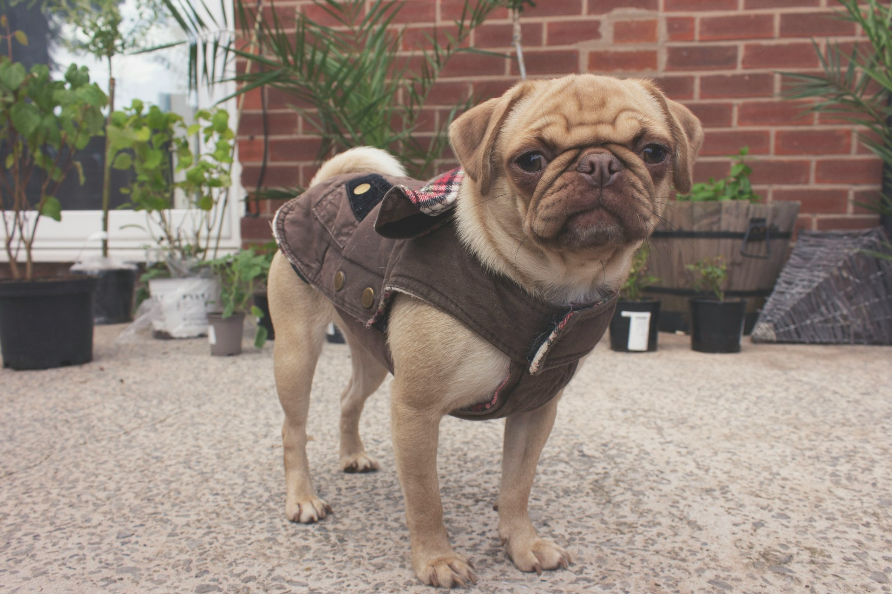

## 🌟 영어 표현 - put on

안녕하세요 👋 '**입다**'라는 의미로 사용되는 영어 표현을 아시나요? 바로 '**put on**'이라는 표현이에요! 이 표현은 **옷, 신발 등을 착용하는 행위**를 의미해요. 주로 일상적인 상황에서 사용되며, 특별한 뉘앙스 없이 간단하게 사용할 수 있어요! 👗

예를 들어, "I will put on my jacket before going out." (나가기에 앞서 재킷을 입을 거예요.)라고 말할 수 있어요. 이렇게 사용하면 착용할 준비를 하고 있다는 느낌을 주는 거죠.

### 🤔 wear과의 차이점

'put on'은 옷을 입는 동작이나 행위 자체를 강조하는 표현이에요. 반면에 'wear'는 옷을 입고 있는 상태를 나타내는 표현이죠.

그럼 '**put on**'을 사용한 예문들을 조금 더 살펴볼게요. 여러분도 상황을 떠올리면서 한 번 소리 내어 읽어보세요!

## 📖 예문

1. "오늘 저녁 파티에 가장 좋은 옷을 입고 갈거에요"

   "I’m going to put on my best outfit for the party tonight."

2. "비가 오니까 우비를 입어야겠어요."

   "I need to put on my raincoat because it's raining."

## 💬 연습해보기

잠깐만, 나 나가기 전에 신발 좀 신어야 해.

Hold on, I need to put on my shoes before we leave.

그녀는 가짜 미소를 지으며 모든 게 괜찮은 척했어.

She put on a fake smile and pretended everything was fine.

나 너무 추워! 따뜻한 자켓을 입었어야 했는데.

I'm freezing! I <a href="/blog/in-english/257.should've/">should've</a> put on a warmer jacket.

메뉴를 잘 보려면 안경 좀 써야겠다.

Let me put on my glasses so I can read this menu better.

그 사람, 내가 마지막으로 봤을 때보다 많이 쪘어.

He's put on quite a bit of weight since I last saw him.

해변 가기 전에 선크림 바르는 거 잊지 마!

Don't <a href="/blog/in-english/023.forget/">forget</a> to put on sunscreen before going to the beach.

그녀는 나가기 전에 화장 좀 빨리 했어.

She put on some makeup real quick before heading out.

그냥 편한 거 입어.

Just put on whatever's comfortable.

비가 더 심해지고 있어 - 후드 좀 써야겠다.

The rain's getting worse - better put on your hood.

## 🤝 함께 알아두면 좋은 표현들

### take off

'take off'는 "**벗다**" 또는 "**제거하다**" 라는 의미예요. 옷이나 액세서리를 몸에서 떼어내는 행동을 나타내며, **상대적으로 'put on'의 반대 개념**으로 사용돼요. 주로 편안한 상태로 돌아가고 싶을 때 자주 사용해요.

"I just want to take off my shoes and relax."

"그냥 신발을 벗고 편안하게 쉬고 싶어요."

### wear out

'wear out'은 "**닳아 없어지다**" 또는 "**해지다**" 라는 의미예요. 주로 자주 사용하거나 오래 사용해서 물건이 더 이상 쓸 수 없게 되는 상황을 나타내요. **시간이 지나면서 소모되는 느낌**을 주는 표현이에요.

"My favorite jeans are starting to wear out after years of use."

"내가 제일 좋아하는 청바지가 몇 년 사용하니까 닳아 없어지고 있어요."

### throw on

'throw on'은 "**대충 입다**" 또는 "**급하게 걸치다**" 라는 뜻이에요. 특별한 준비 없이 빠르게 옷을 입는 상황을 나타내며, **편리하고 간편한 느낌**을 줘요. 보통 외출할 때 급하게 옷을 입을 때 많이 사용해요.

"I just threw on a jacket before heading out to the store."

"가게에 나가려고 서둘러서 재킷을 대충 입었어요."

---

오늘은 '**입다**'라는 의미를 전달하는 '**put on**'에 대해 배워봤어요. 다음 번에 누군가 착용하는 모습을 보거나 자신이 옷을 입고 있을 때, 이 표현을 한번 활용해 보세요. 😊

오늘 배운 표현과 예문들, 최소 3번씩 소리 내어 읽어보세요. 다음에도 더 재밌고 유익한 표현으로 찾아올게요!
