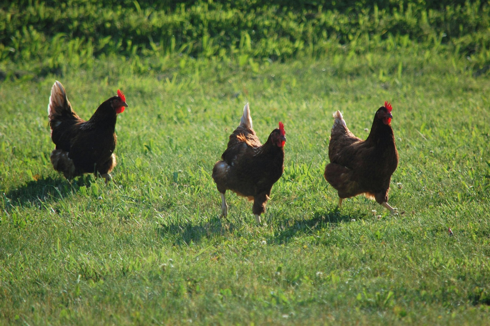

## 🌟 영어 표현 - chicken out

안녕하세요 👋 '**겁을 먹고 포기하다**'라는 의미를 가지는 영어 표현을 아시나요? 바로 '**chicken out**'이라는 표현이에요! 이 표현은 **무서움이나 두려움 때문에 계획한 일을 하지 않기로 결정하는 것**을 의미해요.

예를 들어, "I wanted to go skydiving, but I chickened out [at the last minute](/blog/in-english/221.at-the-last-minute/)!" (나는 스카이다이빙을 가고 싶었는데, 막판에 겁을 먹고 포기했어!)라고 말할 수 있어요. 이렇게 말하면, 원래 시도하려 했던 일을 두려움으로 인해 하지 못했다는 의미가 전달되는 거죠.

### 💡 이미지 그려보기

치킨이 도망가는 모습을 상상해 볼까요? 🐔 "chicken"은 말 그대로 "닭"이라는 뜻이죠. 겁이 나서 도망가는 치킨의 이미지를 그려보면 더 쉽게 기억할 수 있을거에요!

그럼 "**chicken out**"을 사용한 예문들을 조금 더 살펴볼게요. 여러분도 상황을 떠올리면서 한 번 소리 내어 읽어보세요!

## 📖 예문

1. "지금 겁먹지 마!"

   "Don't chicken out now"

2. "무대에서 노래 부르려고 했는데 겁먹고 포기했어요."

   "I was going to sing on stage but I chickened out."

## 💬 연습해보기

<ul data-interactive-list>
  <li data-interactive-item>
    그녀에게 데이트 신청하려고 했는데, 막판에 겁먹었어.
    I was going to ask her out, but I chickened out at the last minute.
  </li>
  <li data-interactive-item>
    그 친구가 우리랑 스카이다이빙 가기로 했는데, 완전히 겁먹었어.
    He was supposed to go skydiving with us, but he totally chickened out.
  </li>
  <li data-interactive-item>
    타투를 하려고 할 때마다 결국 겁먹고 말아.
    Every time <a href="/blog/in-english/117.try-to/">I try t</a>o get a tattoo, I <a href="/blog/vocab-1/039.end-up/">end up</a> chickening out.
  </li>
  <li data-interactive-item>
    남자답게 행동해! 매번 힘든 상황에서 겁먹지 마.
    Man up! Stop chickening out of every challenging situation.
  </li>
  <li data-interactive-item>
    이번에도 그 임금 인상 요청 쫄아서 못했어?
    Did you chicken out of asking for that raise again?
  </li>
  <li data-interactive-item>
    그냥 해! 지난번처럼 겁먹지 마.
    Just do it! Don't chicken out like you did last time.
  </li>
</ul>

## 🤝 함께 알아두면 좋은 표현들

### back out

'back out'은 "**약속이나 계획을 취소하다**"라는 뜻이에요. 어떤 일에 대해 처음에는 동의했지만, 나중에 그 약속을 지키지 않기로 결정하는 상황에서 자주 사용해요.

- "She agreed to join the project but [decided to](/blog/in-english/062.decide-to/) back out at the last minute."
- "그녀는 프로젝트에 참여하기로 했지만 마지막 순간에 약속을 취소하기로 했어요."

### bail out

'bail out'은 "**어떤 상황에서 빠져나오다**"라는 의미예요. 주로 불편한 상황이나 압박감이 큰 상황에서 벗어나고 싶을 때 사용해요. 때로는 책임을 회피하는 느낌도 줄 수 있어요.

- "When the meeting got too intense, he decided to bail out and [take a break](/blog/in-english/202.take-a-break/)."
- "회의가 너무 심각해지자 그는 빠져나가서 잠깐 쉬기로 했어요."

### face the music

'face the music'은 "**결과를 받아들이다**"라는 뜻이에요. 자신의 행동이나 결정에 대한 책임을 지고, 그에 따른 결과를 마주하는 상황에서 사용해요.

- "After missing the deadline, she had to face the music and explain to her boss."
- "기한을 놓친 후 그녀는 결과를 마주하고 상사에게 설명해야 했어요."

---

오늘은 '**겁을 먹고 포기하다**'라는 의미를 전달하는 '**chicken out**'에 대해 배워봤어요. 다음번에 누군가 두려움 때문에 포기하는 모습을 보인다면, 이 표현을 한번 활용해 보세요. 그리고 혹시 여러분 자신이 겁을 먹고 포기하려고 하고 있는 건 아닌지 점검해보는 것도 좋을 것 같아요! 😊

오늘 배운 표현과 예문들, 최소 3번씩 소리 내어 읽어보세요. 다음에도 더 재밌고 유익한 표현으로 찾아올게요!
