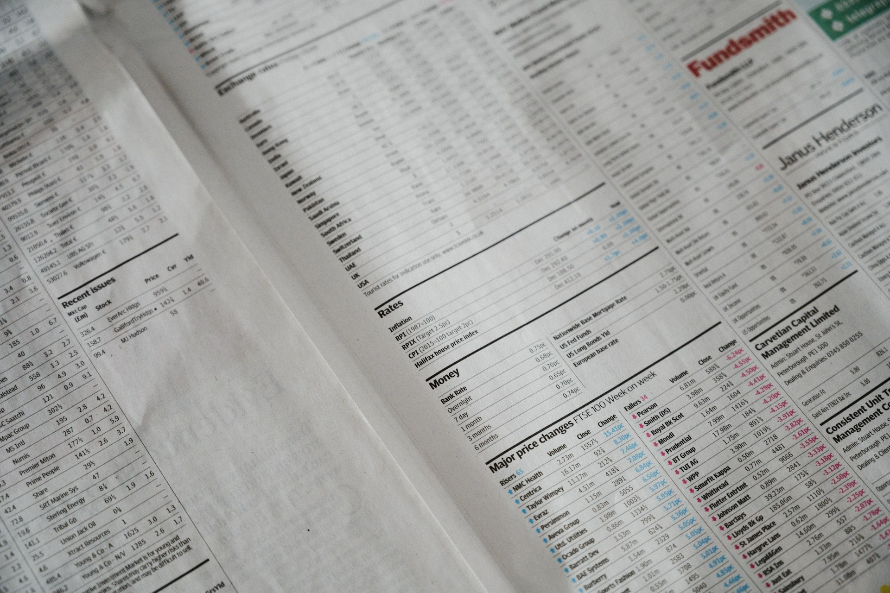

## 🌟 영어 표현 - objective

안녕하세요 👋 '**객관적인**' 이라는 의미를 가진 영어 표현을 아시나요? 바로 '**objective**'라는 표현이에요! 이 표현은 **어떤 사안이나 상황을 개인의 편견이나 감정 없이 사실에 기반해 판단하거나 설명하는 것**을 의미해요. 일반적으로는 긍정적인 뉘앙스를 갖고 있죠! ⚖️

예를 들어, "We need to [look at](/blog/in-english/319.look-at/) this issue objectively." (우리는 이 문제를 객관적으로 살펴봐야 해요.)라고 말할 수 있어요. 이렇게 말하면 감정적인 편견 없이 사실에 근거해 문제를 해결해 나가고자 하는 의지를 표현하는 거예요.

'objective'는 형용사로 사용될 때 "객관적인"이라는 의미를 가지지만, 명사로도 자주 사용돼요. 명사로 사용될 때는 "**목표**"라는 의미를 가져요. 예를 들어, "Our main objective is to increase sales by 20%." (우리의 주요 목표는 매출을 20% 늘리는 거예요.)라고 말할 수 있어요. 이렇게 말하면 달성하고자 하는 구체적인 목표를 나타내는 거죠. 또는 "What are your career objectives?" (당신의 경력 목표는 무엇인가요?)와 같이 말할 수 있어요. 이는 누군가의 직업적인 목표나 포부를 물어보는 의미예요.

그럼 "**objective**"를 사용한 예문들을 조금 더 살펴볼게요. 여러분도 상황을 떠올리면서 한 번 소리 내어 읽어보세요!

## 📖 예문

1. "이번 논문을 작성할 때는 객관적인 데이터를 바탕으로 쓸 거예요."

   "I will write this paper based on objective data."

2. "감정이 아닌 객관적인 사실을 보려고 해요."

   "I [try to](/blog/in-english/117.try-to/) look at the objective facts [instead of](/blog/in-english/169.instead-of/) emotions."

## 💬 연습해보기

<ul data-interactive-list>
  <li data-interactive-item>
    이 상황을 객관적으로 보려고 해봐요 - 감정이 판단을 흐릴 수 있어요.
    Let's try to look at this situation objectively - your emotions might be clouding your judgment.
  </li>
  <li data-interactive-item>
    누군가 내 작업을 객관적으로 검토해줬으면 좋겠어요.
    I need someone to <a href="/blog/in-english/251.review/">review</a> my work objectively.
  </li>
  <li data-interactive-item>
    자녀가 분쟁에 관련되면 객관성을 유지하기가 힘들어요.
    It's hard to stay objective when your own kids are involved in the dispute.
  </li>
  <li data-interactive-item>
    객관적으로 보면, 새로운 정책이 직원들의 사기에 정말 좋았어요.
    From an objective standpoint, the new <a href="/blog/in-english/623.policy/">policy</a> has been great for <a href="/blog/in-english/700.employee/">employee</a> morale.
  </li>
  <li data-interactive-item>
    내 주된 목표는 내년 봄에 졸업하는 거예요.
    My main objective is to graduate by next spring.
  </li>
  <li data-interactive-item>
    여기서 너의 목표가 뭐야?
    What's your objective here?
  </li>
  <li data-interactive-item>
    이 숫자들을 객관적으로 볼 수 있는 사람이 필요해요.
    I need someone with an objective perspective to look at these numbers.
  </li>
  <li data-interactive-item>
    데이터가 우리 마케팅 전략이 효과가 없다는 걸 객관적으로 보여줘요.
    The data objectively shows that our marketing strategy isn't working.
  </li>
  <li data-interactive-item>
    힘든 건 알지만, 잠깐만이라도 객관적으로 보려고 해봐.
    I know it's hard, but try to look at this objectively for a minute.
  </li>
</ul>

## 🤝 함께 알아두면 좋은 표현들

### biased

'biased'는 "**편향된**" 또는 "**불공정한**" 이라는 의미예요. 어떤 의견이나 선택이 특정한 방향으로 치우쳐져 있음을 나타내며, **객관성이 결여된 상태**를 표현할 때 사용해요.

- "The article was criticized for being biased towards one political party."
- "그 기사는 한 정당에 편향되어 있다는 비판을 받았어요."

### subjective

'subjective'는 "**주관적인**"이라는 뜻이에요. 개인의 감정이나 경험에 따라 다르게 느껴지거나 판단되는 것을 나타내며, **객관성과는 반대되는 개념**으로 사용돼요.

- "Her review of the movie was very subjective, [based on](/blog/in-english/272.based-on/) her personal taste."
- "그녀의 영화 리뷰는 개인적인 취향에 따라 매우 주관적이었어요."

### fair-minded

'fair-minded'는 "**공정한 마음을 가진**"이라는 뜻이에요. 다른 사람의 의견과 입장을 존중하며 **균형 잡힌 시각을 유지하는 것**을 강조할 때 사용해요.

- "Being fair-minded helps in resolving conflicts between team members."
- "공정한 마음을 가지는 것은 팀원 간의 갈등을 해결하는 데 도움이 돼요."

---

오늘은 '**객관적인**'이라는 의미를 전달하는 '**objective/objectively**'에 대해 배워봤어요. 다음번에 누군가 주관적인 시각을 보인다면, 이 표현을 한번 활용해 보세요. 😊

오늘 배운 표현과 예문들, 최소 3번씩 소리 내어 읽어보세요. 다음에도 더 재밌고 유익한 표현으로 찾아올게요!
