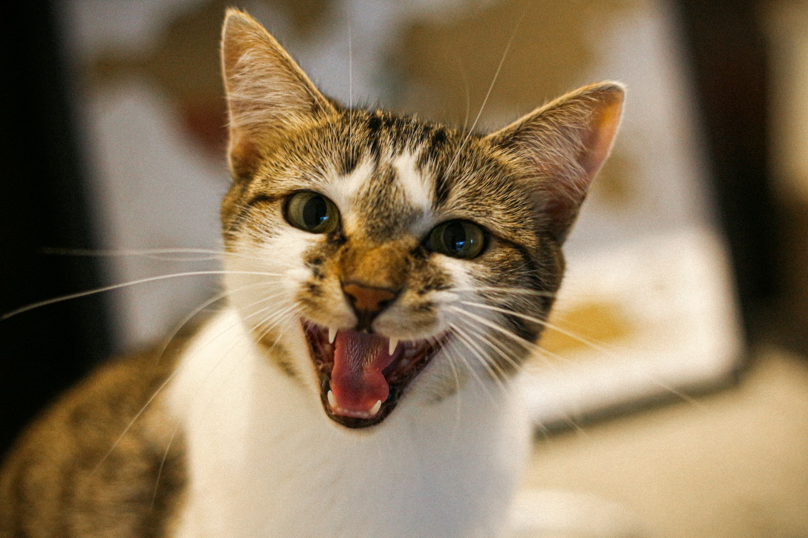

안녕하세요 👋 '**비꼬는**', '**빈정거리는**' 의미를 가진 영어 표현을 아시나요? 바로 '**sarcastic**'이라는 표현이에요! 이 표현은 **상대방이나 상황에 대해 겉으로는 긍정적인 말을 하면서도 실제로는 부정적인 감정을 드러내는 방식**을 의미해요. 대개 유머러스하지만 때론 상처를 줄 수도 있는 뉘앙스를 가지고 있어요! 😏

예를 들어, "That's a sarcastic comment!" (저건 비꼬는 말이에요!)라고 말할 수 있어요. 이렇게 'sarcastic'이라는 단어를 직접 사용해서 누군가의 비꼬는 태도나 말을 표현할 수 있어요.

그럼 "**sarcastic**"을 사용한 예문들을 조금 더 살펴볼게요. 여러분도 상황을 떠올리면서 한 번 소리 내어 읽어보세요!

## 📖 예문

1. "그만 빈정거려"

   "Stop being so sarcastic"

2. "그녀가 썩소를 날렸는데. 진짜 싫어."

   "She gave me that sarcastic smile I [hate](/blog/in-english/392.hate/) so much."

## 💬 연습해보기

<ul data-interactive-list>
  <li data-interactive-item>
    그의 비꼬는 말투는 모두를 불편하게 했어요
    His sarcastic tone made everyone <a href="/blog/in-english/887.uncomfortable/">uncomfortable</a>
  </li>
  <li data-interactive-item>
    회의 중에 그의 비꼬는 댓글은 아무도 좋아하지 않았어요.
    His sarcastic comments during the meeting weren't appreciated by anyone.
  </li>
  <li data-interactive-item>
    "오, 정말 잘했어!" 톰이 가장 비꼬는 목소리로 말했어요.
    "Oh, great job!" Tom said in his most sarcastic voice.
  </li>
  <li data-interactive-item>
    지금 네가 비꼬는 건지 진심인지 모르겠어.
    I can't tell if you're being sarcastic or <a href="/blog/in-english/902.genuine/">genuine</a> <a href="/blog/in-english/525.right-now/">right now</a>.
  </li>
  <li data-interactive-item>
    그의 빈정거리는 태도가 점점 나를 짜증나게 하고 있어.
    His sarcastic attitude is really starting to <a href="/blog/in-english/557.get-on/">get on</a> my nerves.
  </li>
  <li data-interactive-item>
    너 항상 이렇게 비꼬는 거야, 아니면 나만 특별한 거야?
    Are you always this sarcastic, or am I special?
  </li>
  <li data-interactive-item>
    "정말 좋은 날씨네," 그녀가 밖에 비가 쏟아지는데 비꼬는 톤으로 말했어요.
    "Nice weather we're having," she said in a sarcastic tone as it <a href="/blog/in-english/497.pour/">poured</a> outside.
  </li>
</ul>

## 🤝 함께 알아두면 좋은 표현들

### sincere

'sincere'는 "**진실한**"이라는 뜻이에요. 어떤 감정이나 태도가 진정하고 거짓이 없음을 나타내며, **상대방에게 진정한 마음을 전하는 경우**에 사용해요. 긍정적인 의미로 반대되는 표현이에요.

- "Her sincere apology made it easier for him to [forgive](/blog/in-english/468.forgive/) her."
- "그녀의 진실한 사과 덕분에 그는 그녀를 쉽게 용서했어요."

### genuine

'genuine'은 "**진짜의**" 또는 "**진정한**"이라는 의미예요. 어떤 것의 진실성과 진정성을 강조하며, **속이지 않거나 위선이 없는 상태**를 나타내요. 긍정적인 맥락에서 사용되는 반대 표현이에요.

- "I appreciate your genuine interest in my work; it means a lot to me."
- "내 일에 대한 당신의 진정한 관심에 감사해요; 그건 나에게 큰 의미가 있어요."

---

오늘은 '**비꼬는**'이라는 의미를 전달하는 '**sarcastic**'에 대해 배워봤어요. 다음번에 누군가의 말 속에서 비꼬는 표현을 발견한다면, 이 표현을 한번 활용해 보세요. 😊

오늘 배운 표현과 예문들, 최소 3번씩 소리 내어 읽어보세요. 다음에도 더 재밌고 유익한 표현으로 찾아올게요!
