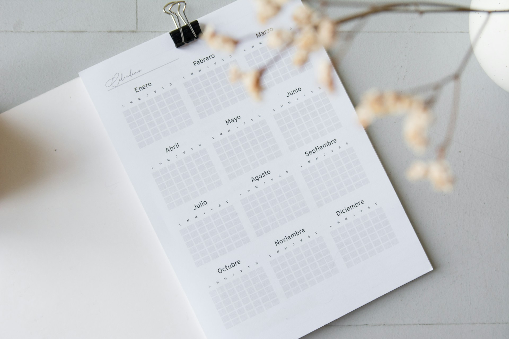

## 🌟 영어 표현 - stay on top of

안녕하세요 👋 '**잘 챙기다**'라는 의미를 가진 영어 표현을 아시나요? 바로 '**stay on top of**'라는 표현이에요! 이 표현은 **무언가를 잘 관리하거나 통제하면서 그 상태를 유지하는 것**을 의미해요. 주로 중요한 사항이나 정보에 대한 주의를 기울여야 할 때 사용되며, 긍정적인 뉘앙스를 지니고 있어요! 🌟

예를 들어, "I try to stay on top of my assignments to avoid last-minute stress!" (마감 스트레스를 피하기 위해 숙제를 잘 관리하려고 해요!)라고 말할 수 있어요. 이 문장은 일이 밀리지 않도록 잘 챙기겠다는 의지를 나타내요.

### 💡 이미지 그려보기

높은 곳에서 넓은 풍경을 바라보는 모습을 상상해 볼까요? 🏞️ "stay on top"은 말 그대로 '위에 있다'는 의미로, 여러분이 정보를 놓치지 않고 잘 챙기고 있다는 이미지를 그릴 수 있어요! 🎈

그럼 '**stay on top of**'을 사용한 예문들을 좀 더 살펴볼게요. 여러분도 상황을 떠올리면서 한 번 소리 내어 읽어보세요!

## 📖 예문

1. "나는 매일 뉴스를 읽으면서 최신 소식을 잘챙겨요."

   "I [read](/blog/in-english/436.read/) the [news](/blog/in-english/536.news/) every day to stay on top of current events."

2. "일정을 잘 챙겨야 중요한 기회를 놓치지 않아요."

   "I have to stay on top of my schedule to not miss [important](/blog/in-english/318.important/) opportunities."

## 💬 연습해보기

<ul data-interactive-list>
  <li data-interactive-item>
    그녀는 항상 기술 산업의 트렌드를 잘 파악하고 있어.
    She's always been good at staying on top of industry trends in tech.
  </li>
  <li data-interactive-item>
    세 아이가 학교에 다니니까, 숙제랑 활동을 챙기는 게 정말 힘들어.
    With three kids in school, it's challenging to stay on top of all their homework and <a href="/blog/in-english/546.activity/">activities</a>.
  </li>
  <li data-interactive-item>
    나는 마감일을 잘 챙기기 위해 플래너를 사용하는 걸 좋아해.
    I love using my planner to stay on top of deadlines.
  </li>
  <li data-interactive-item>
    코치가 우리 훈련 일정을 잘 챙기게 해줘.
    The coach <a href="/blog/in-english/232.make-sure/">makes sure</a> we stay on top of our training schedule.
  </li>
  <li data-interactive-item>
    이 새로운 앱 덕분에 일상 업무를 잘 챙기기 쉬워졌어.
    With this new app, it's easier to stay on top of my daily tasks.
  </li>
  <li data-interactive-item>
    좋은 대학에 가고 싶으면 성적을 잘 챙겨야 해.
    You need to stay on top of your grades if you want to get into a good college.
  </li>
  <li data-interactive-item>
    약 복용을 잘 챙기기 위해 핸드폰에 알림을 설정해.
    I use reminders on my phone to stay on top of taking my medications.
  </li>
</ul>

## 🤝 함께 알아두면 좋은 표현들

### keep track of

'keep track of'는 "**~을 기록하다**" 또는 "**~의 상태를 잘 파악하다**"라는 의미예요. 어떤 정보나 상황을 주의 깊게 관찰하고 관리하는 것을 강조할 때 많이 사용해요. 일상적인 업무나 프로젝트 진행 상황을 체크할 때 유용해요.

- "I always keep track of my expenses to stay within my budget."
- "나는 예산 내에서 지출을 관리하기 위해 항상 내 경비를 기록해요."

### manage

'manage'는 "**r관리하다**" 또는 "**운영하다**"라는 뜻이에요. 어떤 일을 효과적으로 다루거나 조정하는 능력을 강조하며, 주로 어려운 상황에서 이를 잘 해내는 것을 나타내요.

- "She manages her time efficiently to meet all her deadlines."
- "그녀는 모든 마감일을 맞추기 위해 시간을 효율적으로 관리해요."

### fall behind

'[fall behind](/blog/in-english/031.fall-behind/)'는 "**뒤처지다**"라는 의미예요. 어떤 일이나 목표에서 뒤떨어지는 상태를 나타내며, 주로 시간이나 경쟁에서 뒤처질 때 사용돼요.

- "If you don't keep up with your studies, you might fall behind in class."
- "공부를 따라가지 않으면, 수업에서 뒤처질 수 있어요."

---

오늘은 '**최신 정보나 상황을 계속 파악하다**'라는 의미를 전달하는 '**stay on top of**'에 대해 배워봤어요. 다음번에 누군가 무언가를 잘 관리하고 있거나, 정보를 잘 챙기고 있는 모습을 보인다면, 이 표현을 한 번 활용해 보세요. 그리고 혹시 여러분 스스로도 중요한 일들을 놓치고 있지 않은지 체크해보는 것도 좋을 것 같아요! 😊

오늘 배운 표현과 예문들, 최소 3번씩 소리 내어 읽어보세요. 다음에도 더 재밌고 유익한 표현으로 찾아올게요!
