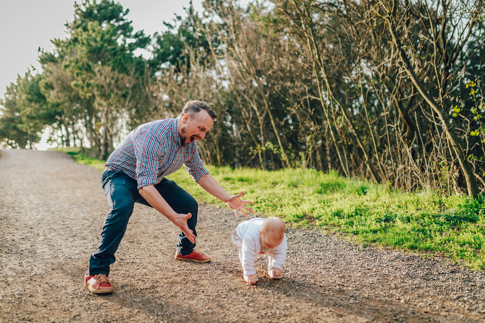

## 🌟 영어 표현 - motivation

안녕하세요 👋 '**동기부여**', '**자극**'라는 의미를 가진 영어 표현이 있어요. 바로 '**motivation**'이라는 표현이에요! 이 표현은 **우리가 어떤 일을 하도록 이끄는 내적 혹은 외적 요인**을 의미해요. 긍정적인 뉘앙스를 가지고 있어서, 사람들에게 목표를 이루도록 돕는 힘으로 여겨질 수 있어요! 🚀

예를 들어, "Find your motivation to achieve your dreams!" (당신의 꿈을 이루기 위한 동기를 찾아보세요!)라고 말할 수 있어요. 이렇게 말씀하시면 상대방에게 목표를 향해 나아가도록 격려하는 느낌을 줄 수 있죠.

자, 그럼 "**motivation**"을 사용한 예문들을 조금 더 살펴볼게요. 여러분도 상황을 떠올리면서 한 번 소리 내어 읽어보세요!

## 📖 예문

1. "오늘 헬스장 가려면 좀 더 자극이 필요해요."

   "I need some motivation to hit the gym today."

2. "운동을 할 수 있는 동기를 찾는 게 너무 중요해요."

   "Finding motivation to exercise is really important."

## 💬 연습해보기

<ul data-interactive-list>
  <li data-interactive-item>
    그는 공부하고 싶은 마음을 키우기 위한 방법에 대해 조언을 구했어요.
    He <a href="/blog/in-english/125.ask-for/">asked for</a> advice on how to boost his motivation to study.
  </li>
  <li data-interactive-item>
    그녀는 프로젝트 중간에 동기부여를 잃었어요.
    She lost her motivation halfway through the project.
  </li>
  <li data-interactive-item>
    그의 연설 덕분에 내 사업을 시작할 의욕이 생겼어요.
    His speech gave me the motivation I needed to start my own business.
  </li>
  <li data-interactive-item>
    가끔 좋은 플레이리스트만 있으면 운동할 힘이 생겨요.
    Sometimes a good playlist is all the motivation I need to get through a workout.
  </li>
  <li data-interactive-item>
    새로운 언어를 배우는 이유는 뭐예요?
    What's your motivation for learning a new language?
  </li>
  <li data-interactive-item>
    그녀는 항상 끝없는 열정을 가진 것 같아요. 어떻게 그런지 궁금해요.
    She always seems to have endless motivation. I wonder how she does it.
  </li>
  <li data-interactive-item>
    힘든 시기에 열정을 유지하기 위한 팁이 있을까요?
    Do you have any tips for staying motivated during tough times?
  </li>
  <li data-interactive-item>
    요즘 열정이 부족한 느낌이 들어요.
    I've been feeling a lack of motivation lately.
  </li>
</ul>

## 🤝 함께 알아두면 좋은 표현들

### inspiration

'inspiration'은 "**영감**"이라는 의미예요. **어떤 아이디어나 창의력을 불러일으키는 것**을 나타내며, 사람들에게 새로운 목표를 세우게 하거나 도전하게 만들 때 주로 사용해요.

- "The book served as an inspiration for many young artists."
- "그 책은 많은 젊은 예술가들에게 영감을 주었어요."

### encouragement

'encouragement'는 "**격려**"라는 뜻이에요. 다른 사람의 자신감이나 동기를 높여주는 행동이나 말을 의미해요. 보통 힘든 상황에서 누군가를 지지할 때 사용해요.

- "His words of encouragement helped her overcome her fears."
- "그의 격려의 말이 그녀가 두려움을 극복하는 데 도움이 되었어요."

### disinterest

'disinterest'는 "**흥미 없음**", "**무관심**"이라는 의미예요. 어떤 일이나 주제에 대해 관심이 없거나 참여하고 싶지 않은 상태를 나타내요. 주로 부정적인 상황에서 사용돼요.

- "Her disinterest in the project was evident during the meeting."
- "회의 중에 그녀가 프로젝트에 무관심하다는 것이 분명히 드러났어요."

---

오늘은 '**동기**', '**자극**'이라는 의미를 전달하는 '**motivation**'에 대해 배워봤어요. 다음번에 누군가 목표를 세우거나 도전하는 모습을 보인다면, 이 표현을 한번 활용해 보세요. 그리고 여러분 자신의 동기를 점검해보는 것도 좋을 것 같아요! 😊

오늘 배운 표현과 예문들, 최소 3번씩 소리 내어 읽어보세요. 다음에도 더 재밌고 유익한 표현으로 찾아올게요!
