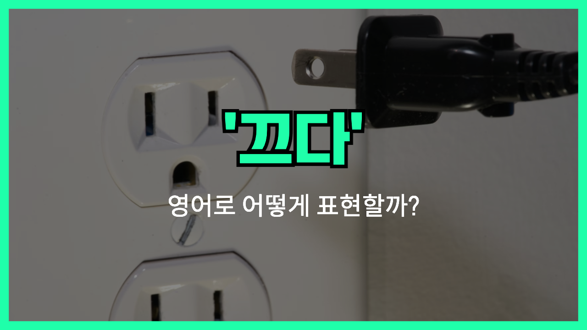

## 🌟 영어 표현 - turn off

안녕하세요 👋 '**끄다**', '**전원을 차단하다**'라는 의미를 가진 영어 표현이 있어요! 바로 '**turn off**'라는 표현이에요! 이 표현은 **기계나 장치의 전원을 끄거나 어떤 활동을 중단하는 것**을 의미해요. 보통은 일상적인 상황에서 많이 사용되며, 부정적인 맥락에서도 사용될 수 있어요. 🔌

예를 들어, "Please turn off the lights when you leave the room!" (방을 나가기 전에 불을 꺼주세요!)라고 말할 수 있어요. 이렇게 말하면 다른 사람에게 전기를 절약하라고 요청하는 느낌을 줄 수 있죠.

### 💡 이미지 그려보기

스위치를 끄는 모습을 상상해 볼까요? 🕹️ "turn"은 돌리다라는 뜻이죠. 스위치를 돌려서 꺼지는 순간을 그려보면 더 쉽게 기억할 수 있을 거예요!

그럼 "**turn off**"를 사용한 예문들을 조금 더 살펴볼게요. 여러분도 상황을 떠올리면서 한 번 소리 내어 읽어보세요!

## 📖 예문

1. "저는 매일 밤 11시에 TV를 꺼요."

   "I turn off the TV at 11 PM every night."

2. "이 게임은 너무 지루해서 껐어요."

   "I turned off the game because it was too [boring](/blog/vocab-1/040.boring/)."

## 💬 연습해보기

<ul data-interactive-list>
  <li data-interactive-item>
    집 나가기 전에 불 끄는 거 잊지 마세요.
    Don't <a href="/blog/in-english/023.forget/">forget</a> to turn off the lights before you leave the house.
  </li>
  <li data-interactive-item>
    회의 중에 실수로 핸드폰을 껐어요.
    I accidentally turned off my phone during the meeting.
  </li>
  <li data-interactive-item>
    케이크 다 구워지면 오븐 꺼야 해요.
    You should turn off the oven once the cake is done baking.
  </li>
  <li data-interactive-item>
    통화 중이니까 음악 좀 꺼줄 수 있어?
    Could you turn off the music while I'm on the call?
  </li>
  <li data-interactive-item>
    핸드폰 알림이 너무 방해가 돼서 껐어요.
    I had to turn off the notifications on my phone. They were too distracting.
  </li>
  <li data-interactive-item>
    에어컨 끄고 창문 열기로 했어요.
    We <a href="/blog/in-english/062.decide-to/">decided to</a> turn off the air conditioner and open the windows instead.
  </li>
</ul>

## 🤝 함께 알아두면 좋은 표현들

### switch off

'switch off'는 "**전원을 끄다**"라는 의미로, 전자기기나 조명의 전원을 끄는 행위를 나타내요. 이 표현은 좀 더 일상적으로 사용되며, 전기를 끈다는 느낌을 줘요.

- "Please remember to switch off the lights when you leave the room."
- "방을 나갈 때 불을 끄는 거 잊지 마세요."

### disconnect

'disconnect'는 "**연결을 끊다**"라는 의미로, 전기나 네트워크와 같은 연결을 끊는 상황을 나타내요. 주로 기기 간의 연결을 끊을 때 사용해요.

- "You need to disconnect the device from the network to reset it."
- "기기를 재설정하려면 네트워크에서 연결을 끊어야 해요."

### turn on

'[turn on](/blog/in-english/310.turn-on/)'은 "**켜다**"라는 의미로, 전자기기나 조명의 전원을 켜는 행위를 나타내요. 이 표현은 'turn off'와 반대되는 의미를 가지고 있어요.

- "Can you turn on the TV? I want to watch the news."
- "TV 좀 켜줄래? 뉴스 보고 싶어."

---

오늘은 '**끄다**'라는 의미를 전달하는 '**turn off**'에 대해 배워봤어요. 다음번에 누군가 불필요한 것을 끄려고 할 때, 이 표현을 한번 활용해보세요. 😊

오늘 배운 표현과 예문들, 최소 3번씩 소리 내어 읽어보세요. 다음에도 더 재밌고 유익한 표현으로 찾아올게요!
