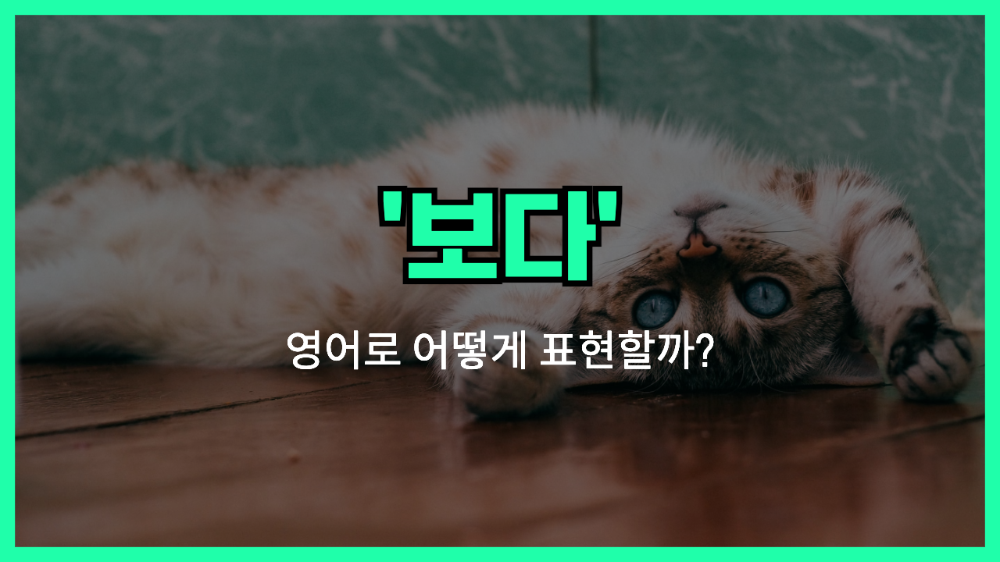

## 🌟 영어 표현 - look at

안녕하세요 👋 '**보다**'라는 의미를 가진 영어 표현이 있어요! 바로 '**look at**'라는 표현이에요! 이 표현은 **어떤 것에 시선을 두거나 관심을 기울이는 것**을 의미해요. 보통 특정한 대상을 주의 깊게 바라보거나 분석할 때 사용하죠. 📷

예를 들어, "Can you look at this document before I send it?" (이 문서를 보내기 전에 한번 봐줄 수 있어요?)라고 말할 수 있어요. 이렇게 말하면 상대방에게 어떤 것에 대한 주의를 기울여 달라는 요청을 하는 거예요.

그럼 "**look at**"을 사용한 예문들을 조금 더 살펴볼게요. 여러분도 상황을 떠올리면서 한 번 소리 내어 읽어보세요!

## 📖 예문

1. "시간 봐! 늦겠어."

   "Look at the time! We're going to be late."

2. "가족 사진을 보여줄게. 잘 봐봐!"

   "I’ll show you the family photo. Look at it closely!"

## 💬 연습해보기

<ul data-interactive-list>
  <li data-interactive-item>
    이 사진 볼 때마다 추억이 많이 떠올라.
    Every time I look at this photo, it brings back so many memories.
  </li>
  <li data-interactive-item>
    긍정적으로 보려고 했는데, 지금은 힘들어.
    I <a href="/blog/in-english/117.try-to/">tried to</a> look at the bright side, but it's tough right now.
  </li>
  <li data-interactive-item>
    잠깐 이거 좀 봐줄래? 내가 뭘 잘못하고 있는지 모르겠어.
    Can you look at this for a second? I'm not sure what I'm doing <a href="/blog/in-english/316.wrong/">wrong</a>.
  </li>
  <li data-interactive-item>
    그녀는 항상 다른 시각으로 사물을 바라보는 편이야.
    She <a href="/blog/in-english/259.tend-to/">tends to</a> look at things from a different perspective.
  </li>
  <li data-interactive-item>
    내가 이야기할 때 나를 좀 봐줬으면 좋겠어.
    I wish you'd look at me when I'm talking to you.
  </li>
  <li data-interactive-item>
    이 엉망진창 좀 봐! 청소할 게 많아.
    Look at this mess! We've got a lot of cleaning up to do.
  </li>
  <li data-interactive-item>
    가끔은 한 발 물러서서 큰 그림을 보는 게 좋아.
    Sometimes it's good to step back and look at the bigger picture.
  </li>
  <li data-interactive-item>
    중고 가게에서 이거 찾았어!
    Look at what I found at the thrift store!
  </li>
  <li data-interactive-item>
    이 계약서 좀 봐줄 수 있어? 모든 게 제대로 되어 있는지 확인해줘.
    Could you look at this contract and make sure everything's in order?
  </li>
</ul>

## 🤝 함께 알아두면 좋은 표현들

### take a look

'take a look'은 "**한번 보다**" 또는 "**잠깐 살펴보다**"라는 뜻이에요. 이 표현은 보통 어떤 것을 자세히 보거나 확인할 때 사용되며, 간단하고 캐주얼한 느낌을 줘요.

- "Could you take a look at this document before I send it out?"
- "이 문서를 보내기 전에 잠깐 살펴봐 줄 수 있어요?"

### glance at

'glance at'은 "**흘끗 보다**"라는 의미로, 빠르게 또는 대충 보는 것을 나타내요. 주로 중요하지 않거나 짧은 시간 동안 보는 상황에서 많이 사용해요.

- "She just glanced at her phone to check the time."
- "그녀는 시간을 확인하기 위해 휴대폰을 흘끗 봤어요."

### stare at

'[stare at](/blog/in-english/087.stare-at/)'은 "**응시하다**"라는 뜻으로, 무언가를 오래도록 집중해서 바라보는 행동을 나타내요. 보통 놀라움이나 호기심을 표현할 때 사용해요.

- "He couldn't help but stare at the beautiful painting."
- "그는 아름다운 그림을 응시하지 않을 수 없었어요."

---

오늘은 '**보다**'라는 의미를 전달하는 '**look at**'에 대해 배워봤어요. 다음번에 누군가에게 무엇인가를 주의 깊게 보라고 할 때, 이 표현을 활용해 보세요. 😊

오늘 배운 표현과 예문들, 최소 3번씩 소리 내어 읽어보세요. 다음에도 더 재밌고 유익한 표현으로 찾아올게요!
