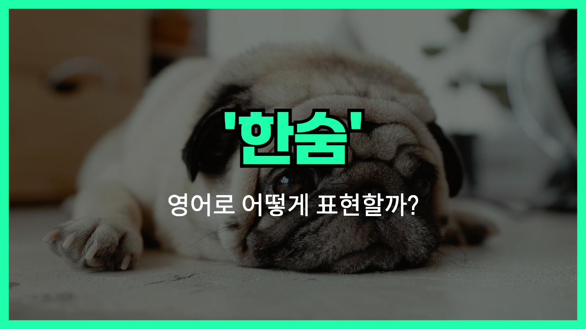

## 🌟 영어 표현 - sigh

안녕하세요 👋 '**한숨 쉬다**'라는 의미를 가진 영어 표현을 아시나요? 바로 '**sigh**'라는 표현이에요! 이 표현은 **어떤 감정이나 상황에 대한 피로감, 실망감, 또는 안도감을 드러내기 위해 내쉬는 소리**를 의미해요. 대개 무언가에 대한 이완이나 아쉬움을 표현할 때 사용되며, 감정이 담긴 뉘앙스가 있어요! 😌

예를 들어, "She let out a sigh of relief after finishing her exams." (시험을 끝낸 후 그녀는 안도의 한숨을 내쉬었다.)라고 말할 수 있어요. 이렇게 말하면 어떤 일을 마치고 나서 느끼는 편안함이나 안도의 감정을 전할 수 있는 거예요.

### 💡 명사로도 사용되는 sigh

"Sigh"는 동사로도 사용되고 명사로도 사용될 수 있어요. 동사로 사용될 때는 "한숨을 쉬다"라는 의미이고, 명사로 사용될 때는 "한숨" 자체를 의미합니다.

- 안도의 한숨: "a sigh of relief"
- 실망의 한숨: "a disappointed sigh"

그럼 "**sigh**"를 사용한 예문들을 조금 더 살펴볼게요. 여러분도 상황을 떠올리면서 한 번 소리 내어 읽어보세요!

## 📖 예문

1. "뉴스를 읽고 그녀는 긴 한숨을 쉬었어요."

   "After reading the news, she let out a long sigh."

2. "내가 원하는 대로 일이 진행되지 않아서 한숨이 나왔어요."

   "I sighed because things weren’t going the way I wanted."

## 💬 연습해보기

<ul data-interactive-list>
  <li data-interactive-item>
    그는 드디어 열쇠를 찾아서 안도의 한숨을 쉬었어요.
    He sighed with relief when he <a href="/blog/in-english/182.finally/">finally</a> found his keys.
  </li>
  <li data-interactive-item>
    "내일 다시 시도해야 할 것 같아," 그녀가 한숨을 쉬며 말했어요.
    "I guess we'll have to try again tomorrow," she sighed.
  </li>
  <li data-interactive-item>
    회의가 다시 잡히자 그는 짜증 섞인 한숨을 쉬었어요.
    When the meeting got rescheduled, he sighed in frustration.
  </li>
  <li data-interactive-item>
    그녀는 깊게 한숨을 쉬고 눈을 감으며 편안해지려고 했어요.
    She sighed deeply and closed her eyes, trying to relax.
  </li>
  <li data-interactive-item>
    또다시 싸운 후 그는 한숨을 쉬며 진정하려고 자리를 떠났어요.
    After another argument, he sighed and walked away to cool off.
  </li>
  <li data-interactive-item>
    긴 하루를 보낸 후 그는 피곤한 한숨을 쉬며 안락의자에 몸을 맡겼어요.
    After a long day, he sighed with exhaustion and sank into the armchair.
  </li>
</ul>

## 🤝 함께 알아두면 좋은 표현들

### let out a sigh

'let out a sigh'는 "**한숨을 내쉬다**"라는 뜻이에요. 주로 스트레스나 불만을 표현할 때 사용되며, 감정의 해소를 나타내는 행동이에요.

- "After a long day at work, she let out a sigh of relief as she finally sat down."
- "긴 하루를 마치고, 그녀는 드디어 앉자마자 안도의 한숨을 내쉬었어요."

### cheer up

'cheer up'는 "**기운 내다**"라는 뜻이에요. 슬프거나 우울한 사람에게 긍정적인 기운을 주고 싶을 때 사용해요.

- "I told my friend to cheer up after she received some bad news."
- "나쁜 소식을 들은 친구에게 기운을 내라고 말했어요."

### give up

'[give up](/blog/vocab-1/046.give-up/)'는 "**포기하다**"라는 뜻이에요. 어떤 일을 더 이상 하지 않기로 결정할 때 사용되며, 주로 실망이나 좌절감과 관련이 있어요.

- "After trying for hours, he [decided to](/blog/in-english/062.decide-to/) give up on fixing the old car."
- "몇 시간 동안 노력한 후, 그는 그 오래된 차를 고치는 것을 포기하기로 결정했어요."

---

오늘은 '**한숨 쉬다**'라는 의미를 전달하는 '**sigh**'에 대해 배워봤어요. 다음번에 누군가 감정을 표현하기 위해 한숨을 쉬는 모습을 보인다면, 이 표현을 한번 활용해 보세요. 😊

오늘 배운 표현과 예문들, 최소 3번씩 소리 내어 읽어보세요. 다음에도 더 재밌고 유익한 표현으로 찾아올게요!
