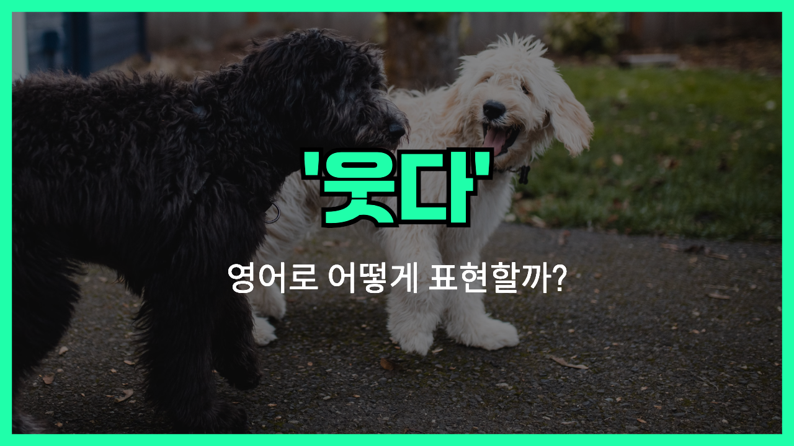

## 🌟 영어 표현 - laugh

안녕하세요 👋 '**웃다**' 라는 의미를 가지는 영어 표현을 아시나요? 바로 '**laugh**'라는 표현이에요! 이 표현은 **유머, 즐거움, 또는 기쁨을 느낄 때 소리 내어 기분을 표현하는 것**을 의미해요. 대개 긍정적인 뉘앙스를 가지고 있어, 사람들 사이의 친밀한 관계를 형성하는데 중요한 역할을 해요! 😂

예를 들어, "I [can't help but](/blog/어쩔-수-없이-할-수-밖에-없어-영어표현/) laugh at that hilarious joke!" (그 정말 웃긴 농담에 웃음을 참을 수가 없어!)라고 말할 수 있어요. 이렇게 말하면 웃음이 자연스럽게 나오는 상황을 설명해 주는 거에요.

그럼 "**laugh**"를 사용한 예문들을 조금 더 살펴볼게요. 여러분도 상황을 떠올리면서 한 번 소리 내어 읽어보세요!

## 📖 예문

1. "오늘 친구와 함께 한 영화가 너무 재밌어서 많이 웃었어요."

   "I laughed a lot at the movie I watched with my friend today."

2. "그의 유머감각 덕분에 언제나 즐겁게 웃을 수 있어요."

   "I can always laugh happily thanks to his sense of humor."

## 💬 연습해보기

<ul data-interactive-list>
  <li data-interactive-item>
    그 농담 진짜 웃겼어. 나 완전 배꼽 빠지게 웃었어.
    That joke was hilarious; it made me laugh so much.
  </li>
  <li data-interactive-item>
    힘든 하루를 보낸 후에 좋은 웃음이 필요했어.
    I needed a good laugh after such a long day at work.
  </li>
  <li data-interactive-item>
    그의 웃음 소리가 너무 커서 방 건너편에서도 들려.
    His laugh is so <a href="/blog/in-english/311.loud/">loud</a>, you can hear it from across the room.
  </li>
  <li data-interactive-item>
    우리가 모일 때마다 대학 시절의 바보 같은 일들로 웃곤 해.
    Every time we get together, we laugh at the stupid things we did in college.
  </li>
  <li data-interactive-item>
    그 재미있는 표정을 지을 때는 웃지 않을 수가 없어.
    <a href="/blog/in-english/111.hard-to/">It's hard to</a> not to laugh when he pulls those funny faces.
  </li>
  <li data-interactive-item>
    그 영화를 보면서 너무 웃어서 거의 울 뻔했어.
    I laughed so hard I almost <a href="/blog/in-english/434.cry/">cried</a> watching that movie.
  </li>
  <li data-interactive-item>
    그는 네가 아무리 우울해도 웃게 만드는 그런 사람이야.
    He's the kind of guy who can make me laugh no matter how down I feel.
  </li>
  <li data-interactive-item>
    그 이야기를 전에 들었는데도 웃게 되더라.
    I found myself laughing at the story even though I'd heard it before.
  </li>
</ul>

## 🤝 함께 알아두면 좋은 표현들

### chuckle

'chuckle'은 "**피식 웃다**"라는 뜻이에요. 가볍고 소소한 유머에 반응할 때 주로 사용되며, 크게 웃지 않고 소리 없이 미소 짓는 느낌을 줘요.

- "She couldn't help but chuckle at the funny joke he told."
- "그녀는 그가 한 재미있는 농담에 피식할 수밖에 없었어요."

### frown

'frown'은 "**찡그리다**"라는 뜻이에요. 주로 불만이나 걱정, 불쾌함을 나타낼 때 얼굴의 표정을 변화시키는 것을 의미해요.

- "She frowned when she [realized](/blog/in-english/166.realize/) she had forgotten her keys."
- "그녀는 열쇠를 두고왔다 것을 깨닫고, 인상을 찌푸렸어요."

---

오늘은 '**웃다**'라는 의미를 전달하는 '**laugh**'에 대해 배워봤어요. 다음번에 누군가 재미있는 이야기를 할 때, 이 표현을 한번 활용해 보세요. 😊

오늘 배운 표현과 예문들, 최소 3번씩 소리 내어 읽어보세요. 다음에도 더 재밌고 유익한 표현으로 찾아올게요!
