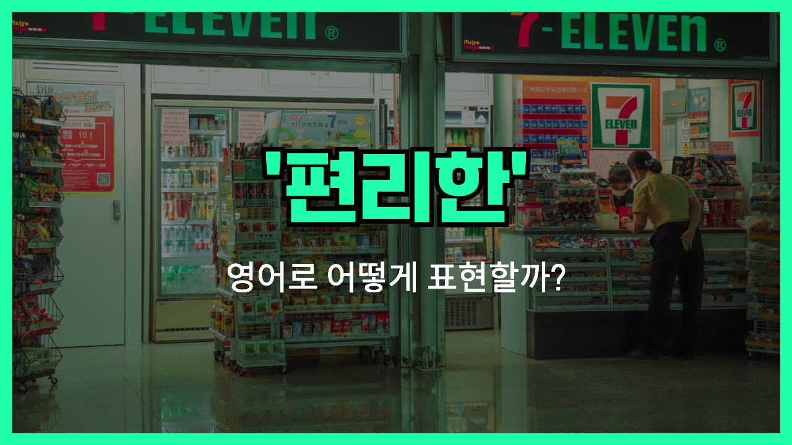

## 🌟 영어 표현 - convenient

안녕하세요 👋 '**편리한**', '**이용하기 쉬운**'이라는 의미를 지닌 영어 표현을 아시나요? 바로 '**convenient**'라는 표현이에요! 이 단어는 **무엇인가를 사용하는 것이 쉽고, 시간을 절약할 수 있어서 매우 유용하다는 느낌**을 전달해요. 보통 긍정적인 뉘앙스를 가지고 있어서, 생활을 보다 효율적으로 만들어주는 것에 대한 칭찬으로 많이 쓰이죠! 🌟

<!-- engple-horizontal-ad -->

<ins class="adsbygoogle"
     style="display:block"
     data-ad-client="ca-pub-1465612013356152"
     data-ad-slot="2106896038"
     data-ad-format="auto"
     data-full-width-responsive="true"></ins>

예를 들어, "The new cafe is very convenient because it's close to my house!" (새로운 카페는 집과 가까워서 매우 편리해요!)라고 말할 수 있어요. 이렇게 말하면 그 카페가 생활 속에서 얼마나 유용한지를 강조하는 거에요.

그럼 "**convenient**"를 사용한 예문들을 조금 더 살펴볼게요. 여러분도 상황을 떠올리면서 한 번 소리 내어 읽어보세요!

## 📖 예문

1. "이 어플은 정말 편리해서 자주 사용해요."

   "This app is really convenient, so I use it [often](/blog/in-english/326.often/)."

2. "우리 집 근처에 편리한 마트가 생겼어요."

   "A convenient supermarket has opened near my house."

## 💬 연습해보기

이 새로운 앱은 온라인으로 장을 보는 데 진짜 편리해요.

This new app is really convenient for ordering groceries online.

집에서 가까운 곳에 주유소가 있어서 정말 편해요.

It's convenient that the gas station is just around the corner from my house.

야, 커피숍에서 만나자. 우리 둘 다 νΈν•  것 같아.

Hey, let's meet at the coffee shop. It's convenient for both of us.

재택근무하는 거 편해요?

Do you find it convenient to work from home?

근처에 24시간 약국이 있어서 응급 상황에 진짜 편리해요.

The 24-hour pharmacy nearby is super convenient <a href="/blog/in-english/253.in-case/">in case</a> of emergencies.

차에 충전 포트가 있으면 장거리 여행할 때 진짜 편리해요.

Having a charging port in your car is really convenient during long trips.

새로운 쇼핑센터가 너무 좋아요. 거기서는 모든 게 편리해요.

I love the new shopping center; everything is so convenient there.

오후 3시에 내가 너를 데리러 가면 괜찮을까?

Would it be convenient for you if I picked you up around 3 pm?

이 앱의 인터페이스는 편리하고 사용하기 쉬워요.

The app's interface is convenient and easy to navigate.

이 백팩은 캠퍼스에서 노트북과 책을 들고 다니기에 편리해요.

This backpack is convenient for carrying my laptop and books around campus.

## 🤝 함께 알아두면 좋은 표현들

### user-friendly

'user-friendly'는 "**사용하기 쉬운**"이라는 뜻이에요. 주로 소프트웨어나 기기가 직관적이고 쉽게 사용할 수 있을 때 표현해요.

- "The new app is very user-friendly and easy to navigate."
- "새로운 앱은 사용하기 쉽고 탐색하기 간편해요."

### inconvenient

'inconvenient'는 "**불편한**"이라는 뜻이에요. 어떤 상황이 원활하게 진행되지 않거나 불편함을 느끼게 할 때 사용해요.

- "It's inconvenient to have the meeting at such a late hour."
- "그렇게 늦은 시간에 회의를 하는 것은 불편해요."

### awkward

'[awkward](/blog/in-english/124.awkward/)'는 "**어색한**" 또는 "**불편한**"이라는 뜻이에요. 상황이나 환경이 자연스럽지 않거나 불편하게 느껴질 때 사용해요.

- "I felt really awkward when I <a href="/blog/in-english/166.realize/">realized</a> I was the only one not dressed up for the party."
- "파티에 차려입지 않은 나 혼자라는 걸 깨달았을 때 정말 어색했어요."

---

오늘은 '**편리하다**'라는 의미를 전달하는 '**convenient**'에 대해 배워봤어요. 다음에 누군가 편리하다는 말을 할 때, 이 표현을 한 번 활용해 보세요. 😊

오늘 배운 표현과 예문들, 최소 3번씩 소리 내어 읽어보세요. 다음에도 더 재밌고 유익한 표현으로 찾아올게요!
