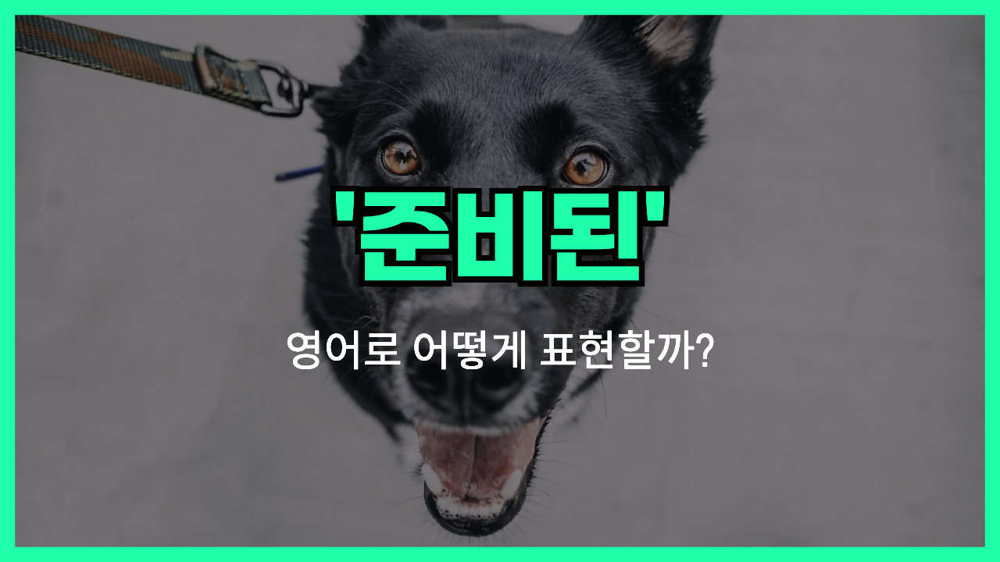

이
안녕하세요 👋 '**준비된**'이라는 의미를 가지는 영어 표현을 아시나요? 바로 '**ready**'라는 표현이에요! 이 표현은 **어떤 일을 시작하거나 수행할 준비가 되었음을 나타내는 상태**를 의미해요. 긍정적인 뉘앙스를 가지고 있어서, 누군가가 어떤 일을 할 수 있는 상태에 있을 때 자주 사용해요! 🚀

예를 들어, "I'm ready to start the project!" (나는 그 프로젝트를 시작할 준비가 되었어요!)라고 말할 수 있어요. 이렇게 말하면 상대방에게 일을 시작할 준비가 모두 되었음을 확신하게 해주는 거예요.

그럼 "**ready**"를 사용한 예문들을 조금 더 살펴볼게요. 여러분도 상황을 떠올리면서 한 번 소리 내어 읽어보세요!

## 📖 예문

1. "내일 시험 준비는 다 끝났어요."

   "I'm all ready for the exam tomorrow."

2. "이제 여행 가는 걸 준비했어요!"

   "I'm ready for our trip now!"

## 💬 연습해보기

<ul data-interactive-list>
  <li data-interactive-item>
    나가려면 준비됐어, 아니면 아직 좀 더 필요해?
    Are you ready to leave, or do you still need a minute?
  </li>
  <li data-interactive-item>
    오늘 밤 파티 준비해야 하는데, 뭘 입어야 할지 전혀 모르겠어.
    I need to get ready for the party tonight; I <a href="/blog/in-english/187.have-no-idea/">have no idea</a> what to wear.
  </li>
  <li data-interactive-item>
    주문할 준비가 되면 알려줘.
    <a href="/blog/in-english/241.let-someone-know/">Let me know</a> when you're ready to order.
  </li>
  <li data-interactive-item>
    아직 결정할 준비가 안 됐어. 좀 더 생각할 시간이 필요해.
    I'm not ready to <a href="/blog/vocab-1/010.make-a-decision/">make a decision</a> yet. I need more time to think.
  </li>
  <li data-interactive-item>
    그는 열심히 훈련했으니까 마라톤 준비는 완벽해.
    He's been training hard, so he's definitely ready for the marathon.
  </li>
  <li data-interactive-item>
    저녁 거의 다 됐으니까, 테이블 좀 차려줄래?
    Dinner's almost ready, so could you set the table?
  </li>
  <li data-interactive-item>
    애들 잠잘 준비가 됐는지 확인해. 시간이 늦어지고 있어.
    <a href="/blog/in-english/232.make-sure/">Make sure</a> the kids are ready for bed; it's getting late.
  </li>
</ul>

## 🤝 함께 알아두면 좋은 표현들

### prepared

'prepared'는 "**준비된**"이라는 뜻이에요. 어떤 일을 할 준비가 되어 있음을 강조할 때 사용되며, 종종 계획이나 사전 조치를 취한 상태를 나타내요.

- "She felt prepared for the exam after studying for weeks."
- "그녀는 몇 주 동안 공부한 덕분에 시험 준비가 잘 되어 있다고 느꼈어요."

### unprepared

'unprepared'는 "**준비가 되지 않은**"이라는 뜻이에요. 예상치 못한 상황에 대비하지 못한 상태를 나타내며, 주로 부정적인 상황에서 사용돼요.

- "He felt unprepared for the sudden presentation."
- "그는 갑작스러운 발표에 대해 준비가 되지 않았다고 느꼈어요."

### caught off guard

'caught off guard'는 "**당황하다**"라는 뜻으로, 예상치 못한 상황에 직면했을 때의 당혹스러움을 표현해요.

- "She was caught off guard by the unexpected news."
- "그녀는 예상치 못한 소식에 당황했어요."

---

오늘은 '**준비가 되다**'라는 의미를 전달하는 '**ready**'에 대해 배워봤어요. 다음번에 누군가가 준비가 되었다고 말하면, 이 표현을 한번 활용해 보세요. 😊

오늘 배운 표현과 예문들, 최소 3번씩 소리 내어 읽어보세요. 다음에도 더 재밌고 유익한 표현으로 찾아올게요!
