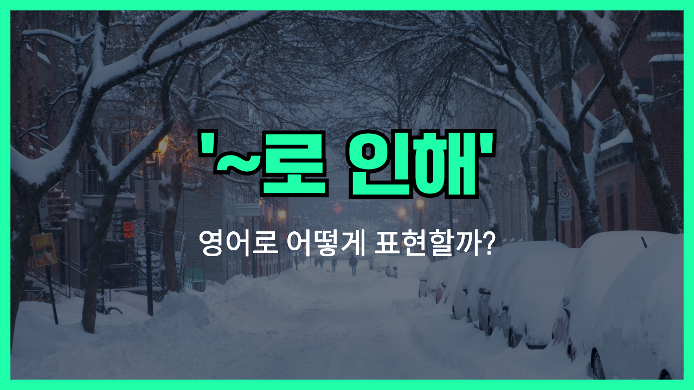

## 🌟 영어 표현 - due to

안녕하세요 👋 '**due to**'라는 표현, 들어본 적 있나요? 이 표현은 '**~때문에, ~로 인하여**'라는 의미를 가진 영어 표현이에요! 주로 어떤 일이 발생한 원인이나 이유를 설명할 때 쓰여요. 딱딱하지 않고 문장 속에서 자연스럽게 원인을 연결해 주는 느낌이에요.

예를 들어, "The flight was [delayed](/blog/in-english/338.delay/) due to bad weather." (비가 안 좋아서 비행기가 지연되었어요.)처럼 사용할 수 있어요. 여기서 'due to'가 '지연된 이유는 날씨 때문'이라는 뜻을 명확하게 알려주죠!

## 📖 예문

1. "Classes were canceled due to the snowstorm."

   "눈보라 때문에 수업이 취소되었어요."

2. "The concert was postponed due to technical problems."

   "기술 문제 때문에 콘서트가 연기되었어요."

3. "She missed the meeting due to a traffic jam."

   "교통 체증 때문에 그녀는 회의에 늦었어요."

## 💬 연습해보기

날씨가 안 좋아서 비행기가 지연됐어요.

Our flight got delayed due to bad weather.

죄송한데, 오늘 정전 때문에 가게가 문을 닫았어요.

Sorry, the store is closed today due to a power outage.

비가 와서 소풍을 취소해야 했어요.

We had to cancel our picnic due to the rain.

수요가 너무 많아서 티켓이 금방 다 팔렸어요.

Due to high demand, the tickets sold out super fast.

독감 때문에 아픈 사람이 많아서 결근한 사람이 많았어요.

A lot of people <a href="/blog/vocab-1/032.call-in-sick/">called in sick</a> due to the flu going around.

기술 문제 때문에 줌 연결이 안 됐어요.

Due to technical difficulties, we couldn't connect to the Zoom call.

교통 체증 때문에 약속에 못 갔어요.

He missed his appointment due to heavy traffic.

## 🤝 함께 알아두면 좋은 표현들

### because of

'because of'는 'due to'와 비슷하게 어떤 일이 발생한 원인이나 이유를 나타내는 표현이에요. 일상 대화나 글쓰기에서 자주 쓰이며, 뒤에 명사구가 옵니다.

- "The flight was delayed because of bad weather."
- "비가 많이 와서 비행기가 지연됐어요."

### despite

'despite'는 'due to'와 반대 의미로, 어떤 상황이 있음에도 불구하고 결과가 다르게 나타났음을 표현할 때 사용해요. 뒤에 명사구가 옵니다.

- "Despite the rain, the match continued as planned."
- "비가 왔는데도 경기는 계획대로 진행됐어요."

---

오늘은 '**~때문에**'라는 뜻의 '**due to**'를 배워봤어요. 다음번에 누군가 이유를 설명할 때, 자연스럽게 이 표현을 써 보세요! 😊

오늘 배운 표현과 예문들, 최소 3번씩 소리 내어 읽으면서 익혀 보길 바라요. 다음에 더 재미있고 유용한 표현으로 돌아올게요!
