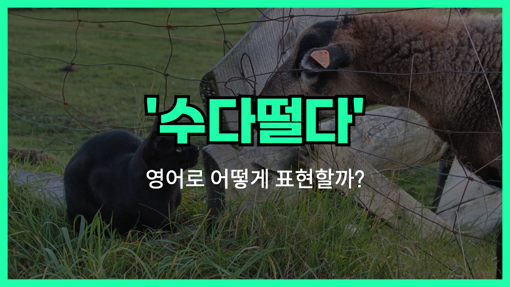

## 🌟 영어 표현 - have a chat

안녕하세요 👋 오늘은 '수다 떨다' 혹은 '이야기하다'라는 뜻을 가진 영어 표현을 알려드릴게요! 바로 '**have a chat**'인데요, 이 표현은 친구나 가족과 가볍고 편안하게 대화를 나누는 상황을 말해요. 그냥 딱딱한 회의나 중요한 토론이 아니라, 소소하고 자연스럽게 이야기를 주고받는 느낌이에요.

<!-- engple-horizontal-ad -->

<ins class="adsbygoogle"
     style="display:block"
     data-ad-client="ca-pub-1465612013356152"
     data-ad-slot="2106896038"
     data-ad-format="auto"
     data-full-width-responsive="true"></ins>

예를 들어, "Let's have a chat later."라고 하면 "나중에 수다 좀 떨자." 혹은 "나중에 이야기 좀 하자." 라는 뜻이 돼요. 그래서 친근하고 편한 분위기에서 대화를 할 때 자주 쓰이는 표현이에요.

또한, 'have a chat'은 꼭 오프라인뿐만 아니라 전화나 온라인 대화에도 사용할 수 있어서 정말 편리해요!

## 📖 예문

1. "Can we have a chat after work?"

   "퇴근 후에 이야기 좀 할 수 있을까?"

2. "She wanted to have a chat about the project."

   "그녀는 프로젝트에 대해 이야기하고 싶어했어요."

## 💬 연습해보기

잠깐 시간 있어요? 주말 계획 얘기 좀 하려고요.

Do you have a minute? I wanted to have a chat about your weekend plans.

커피 한 잔 하면서 얘기해요.

Let's grab some coffee and have a chat.

가게에서 사라랑 우연히 만나서 잠깐 얘기했어요.

I bumped into Sarah at the store and we had a quick chat.

오늘 오후에 사장님이 사무실에서 얘기 좀 하자고 하셨어요.

My boss asked if we could have a chat in her office this afternoon.

엄마한테 그냥 안부도 물을 겸 전화했어요.

I called my mom just to have a chat and <a href="/blog/in-english/021.catch-up-on/">catch up</a>.

앉아서 요즘 고민되는 거 얘기해요.

Let's sit down and have a chat about what's been bothering you.

출근하기 전에 잠깐 얘기할 수 있을까요?

Can we have a chat before you leave for work?

크리스가 새 프로젝트 때문에 제 책상에 와서 얘기했어요.

Chris stopped by my desk to have a chat about the new project.

언제 시간 되면 얘기하자고 알려줘요.

<a href="/blog/in-english/241.let-someone-know/">Let me know</a> when you're free to have a chat.

## 🤝 함께 알아두면 좋은 표현들

### catch up

"catch up"은 **오랜만에 만나서 근황을 나누거나 이야기를 주고받는 것**을 의미해요. 친구들 사이에서 자주 쓰이는 표현이에요.

"We should catch up sometime this week and share what’s new."

"이번 주 중에 만나서 근황 나눠요."

### keep silent

"keep silent"은 **대화를 하지 않고 조용히 있는 상태**를 뜻해요. "have a chat"의 반대말로, 말하지 않고 침묵을 지키는 상황에서 사용돼요.

"During the meeting, he [decided to](/blog/in-english/062.decide-to/) keep silent and listen carefully."

"회의 중에 그는 조용히 듣기만 했어요."

### avoid conversation

"avoid conversation"은 **대화를 피하거나 회피하는 것**을 의미해요. 누군가와 말을 섞고 싶지 않을 때 쓰는 표현이에요.

"She [tends to](/blog/in-english/259.tend-to/) avoid conversation when she's feeling upset."

"그녀는 기분이 안 좋을 때 대화를 피하는 편이에요."

---

오늘은 '수다 떨다', '이야기하다' 뜻을 가진 '**have a chat**'에 대해 알아봤어요. 가벼운 대화나 편안한 소통을 할 때 이 표현을 떠올려 보세요! 😊

오늘 배운 표현과 예문들을 소리 내서 여러 번 읽어보면 금방 익힐 수 있을 거예요. 다음에도 더 재미있고 유익한 영어 표현으로 찾아올게요! 감사합니다!
