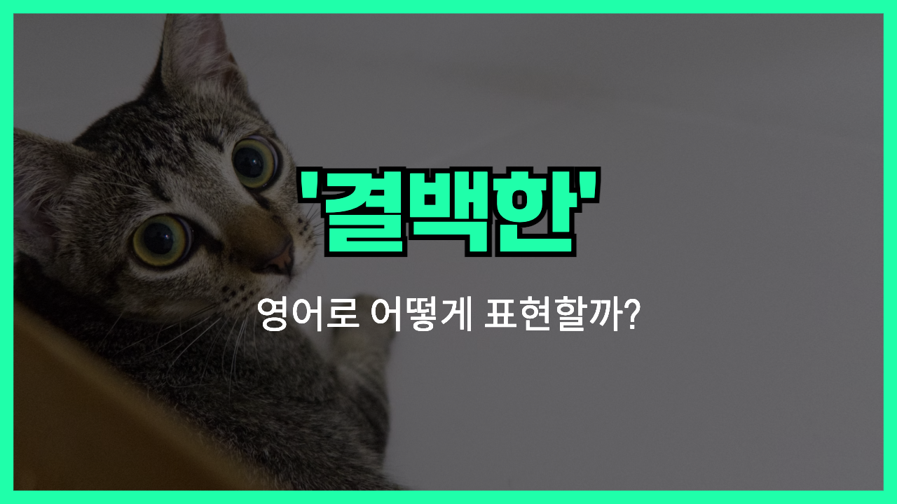

## 🌟 영어 표현 - innocent

안녕하세요 👋 오늘은 '**innocent**'라는 영어 단어에 대해 이야기해볼게요. '**innocent**'는 기본적으로 '**순수한**', '**무죄인**', 또는 '**결백한**'이라는 뜻을 가지고 있어요. 이 단어는 상황에 따라 조금씩 다르게 쓰이는데, 대체로 죄가 없거나 해를 끼치지 않은 상태를 나타낼 때 많이 사용된답니다.

예를 들어, 누군가가 어떤 사건에 관련되어 있지만 진짜 죄가 없을 때 "He is innocent."라고 말하죠. 이 말은 '그는 무죄야'라는 뜻이에요. 또, 아이들이나 동물들이 해를 끼치지 않고 순수한 마음을 가졌을 때도 "She has an innocent smile."처럼 순수하고 해맑은 모습을 표현할 수 있어요.

"innocent"는 법적인 상황뿐만 아니라, 감정이나 태도에 대해서도 자주 쓰이는 단어라서 꼭 알고 있으면 좋아요!

## 📖 예문

1. "그는 아무 잘못도 하지 않았어."

   "He is completely innocent."

2. "그 아이는 정말 순수한 마음을 가지고 있어요."

   "That child has an innocent heart."

## 💬 연습해보기

솔직히 나 완전 무죄야 — 난 아무 관련 없어.

<a href="blog/in-english/336.honestly/">Honestly</a>, I swear I'm innocent — I had nothing to do with it.

그 꼬마가 우리한테 웃을 때 진짜 순수해 보였어.

The little kid looked so innocent when he smiled at us.

좀 수상하게 들리겠지만, 나 잘못한 거 없어.

I know it sounds suspicious, but I'm completely innocent here.

걔가 나한테 순진한 표정 지었는데, 내 감자튀김 훔친 게 분명해.

He gave me this innocent look, but I’m pretty sure he took my fries.

나중에 알고 보니 그 사람 진짜 무죄였대.

They found out later that the guy was actually innocent.

저 강아지 눈 진짜 순수해 보여서 깜짝 놀랐어.

That puppy has the most innocent eyes I've ever seen.

에이, 너 그렇게 순진한 척 하지 마.

Come on, you’re not as innocent as you pretend to be.

우리 고양이가 꽃병 깨고 나서 완전 순진한 척 하더라.

Our cat <a href="/blog/in-english/117.try-to/">tried to</a> act all innocent after breaking the vase.

그 순진한 표정 그만 지어, 네가 한 거 다 알아.

Stop giving me that innocent face; I know you did it.

## 🤝 함께 알아두면 좋은 표현들

### naive

'naive'는 '**순진한**', '**세상 물정을 잘 모르는**'이라는 뜻으로, 'innocent'와 비슷하게 순수하고 경험이 적은 상태를 나타내요. 다만 때때로 조금 어리석거나 경험 부족을 암시할 때도 있어요.

- "She was so naive that she believed everyone would always tell the truth."
- "그녀는 너무 순진해서 모두가 항상 진실만 말할 거라고 믿었어요."

### pure-hearted

'pure-hearted'는 '**마음이 순수한**'이라는 뜻으로, 악의나 나쁜 의도가 전혀 없는 깨끗한 마음 상태를 말해요. 'innocent'와 비슷하게 긍정적인 의미로 많이 사용돼요.

- "His pure-hearted nature made him loved by everyone around."
- "그의 마음이 너무 순수해서 주변 모두에게 사랑받았어요."

### guilty

'[guilty](/blog/in-english/294.guilty/)'는 '**죄가 있는**', '**유죄인**'이라는 뜻으로, 'innocent'의 반대말이에요. 어떤 잘못이나 범죄에 대해 책임이 있을 때 사용해요.

- "The jury found him guilty of the crime after reviewing all the evidence."
- "배심원단은 모든 증거를 검토한 후 그가 유죄라고 판단했어요."

---

오늘은 '**순수한**', '**무죄인**', '**결백한**'이라는 뜻을 가진 영어 단어 '**innocent**'에 대해 알아봤어요. 누군가의 결백함을 말하거나 순수한 마음을 표현할 때 꼭 떠올려 보세요 😊

오늘 배운 표현과 예문들을 소리 내어 3번씩 읽어보고, 자연스럽게 활용해보는 거 잊지 마세요! 다음에 더 재미있고 유익한 영어 표현으로 다시 만나요! 감사합니다!
