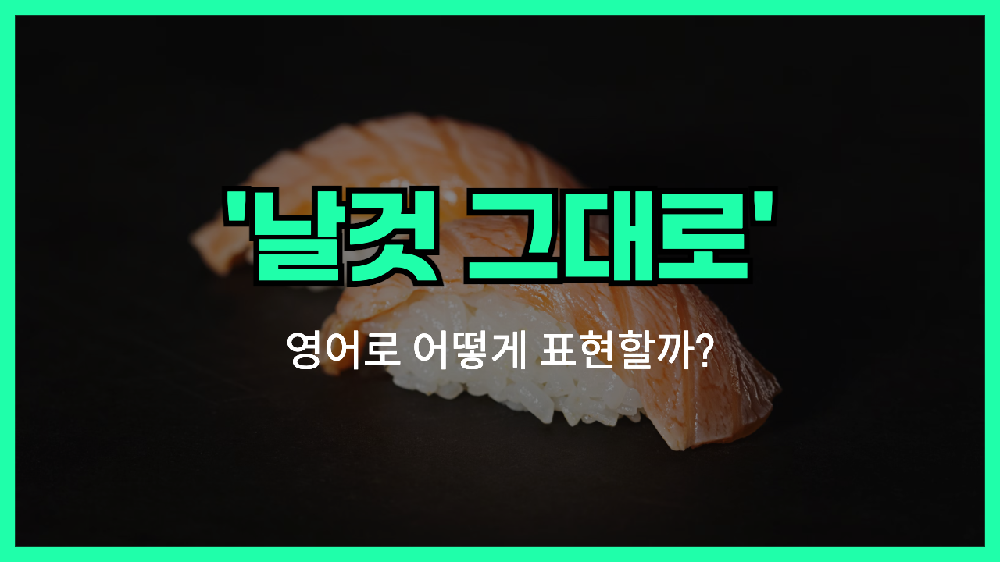

## 🌟 영어 표현 - raw

안녕하세요! 오늘은 '한국어로 '**날것 그대로**', '**가공하지 않은**', '**자연스러운**'이라는 의미를 가지고 있는 단어에 대해 알아볼거에요. 바로 'raw'라는 단어입니다! 어떤 재료나 상태가 아무런 처리나 조리 없이 자연 그대로인 상황을 나타낼 때 쓰이는 단어예요.

예를 들어, 'raw meat'는 '날고기'를 의미하고, 'raw emotions'는 꾸밈없고 진솔한 감정을 말해요. 'raw'는**음식부터 사람의 감정, 데이터, 재료 등 다양한 상황**에서 사용할 수 있어서 정말 활용도가 높답니다.

조금 더 친숙한 예시를 들어볼게요. "I like to eat raw vegetables." 라고 하면 "나는 날채소를 먹는 걸 좋아해요."라는 뜻이에요. 또, "She showed raw talent in the competition." 라고 하면, "그녀는 대회에서 순수한 재능을 보여줬어요."라는 의미로, 아직 가공되거나 다듬어지지 않은 순수한 상태를 표현해요.

## 📖 예문

1. "Raw data needs to be processed before analysis."

   "분석 전에 원시 데이터는 가공되어야 해요."

2. "He shared his raw feelings [honestly](/blog/in-english/336.honestly/)."

   "그는 자신의 꾸밈없는 감정을 솔직하게 나눴어요."

## 💬 연습해보기

<ul data-interactive-list>
  <li data-interactive-item>
    저는 간 것보다 생 아몬드를 간식으로 더 좋아해요.
    I <a href="/blog/in-english/191.prefer/">prefer</a> raw almonds over roasted ones for snacking.
  </li>
  <li data-interactive-item>
    그의 노래 목소리에 뭔가 거칠고 진짜 같은 매력이 있어요.
    <a href="/blog/뭔가-특별한-게-있어-영어표현/">There's something</a> raw about his singing voice that I love.
  </li>
  <li data-interactive-item>
    이 스테이크는 좀 덜 익었는데, 조금만 더 익혀줄래요?
    This steak is a little too raw for me, can you cook it a bit more?
  </li>
  <li data-interactive-item>
    걔 반응이 진짜 솔직했어요, 숨기는 게 하나도 없었어요.
    His reaction was pretty raw — he didn't hold back at all.
  </li>
  <li data-interactive-item>
    이 채소는 익히지 않고 생으로 먹는 게 더 맛있어요.
    These veggies are better raw than cooked.
  </li>
  <li data-interactive-item>
    그 영화는 중독을 있는 그대로 진짜 리얼하게 보여줬어요.
    The movie gave a raw portrayal of addiction.
  </li>
  <li data-interactive-item>
    그 코미디언 유머가 좀 날 것이긴 한데, 저는 진짜 웃겨요.
    That comedian's humor is a little raw, but I think she's hilarious.
  </li>
  <li data-interactive-item>
    그녀는 무대에서 거침없고 진짜 에너지를 보여줬어요.
    She brought a raw, unfiltered energy to the stage.
  </li>
  <li data-interactive-item>
    고기가 아직 속이 덜 익었으니까 좀 더 익혀야 해요.
    The meat needs to be cooked longer; it's still raw in the middle.
  </li>
  <li data-interactive-item>
    너무 많이 걸어서 발이 다 까졌어요.
    I walked so much my feet are raw now.
  </li>
</ul>

## 🤝 함께 알아두면 좋은 표현들

### unprocessed

'unprocessed'는 "**가공되지 않은**" 또는 "**처리되지 않**은"이라는 뜻으로, 'raw'와 매우 유사한 의미를 가지고 있어요. 원재료나 데이터 등이 아직 손대지 않은 상태를 나타낼 때 쓰여요.

- "The factory uses only unprocessed materials to [ensure](/blog/in-english/356.ensure/) natural quality."
- "공장은 자연스러운 품질을 위해 가공되지 않은 재료만 사용해요."

### natural

'natural'은 "**자연 그대로의**"라는 뜻으로, 인위적인 가공이나 변화가 없는 상태를 뜻해요. 'raw'와 비슷하게 본래의 상태를 강조할 때 사용돼요.

- "She prefers natural fabrics over synthetic ones."
- "그녀는 합성 섬유보다 자연 섬유를 더 좋아해요."

### processed

'processed'는 "**가공된**"이라는 뜻으로, 'raw'의 반대 개념이에요. 원재료나 데이터를 인위적으로 손대어 변형하거나 처리한 상태를 의미해요.

- "Processed foods [often](/blog/in-english/326.often/) contain additives and preservatives."
- "가공식품에는 보통 첨가물과 방부제가 들어가 있어요."

---

오늘은 '**날것 그대로**', '**가공하지 않은**', '**자연스러운**'이라는 뜻의 영어 단어 'raw'에 대해 알아봤어요. 다음에 음식이나 감정, 재료를 이야기할 때 이 단어가 생각날 거예요! 😊 오늘 배운 표현과 예문들을 꼭 여러 번 소리 내서 읽어보세요. 다음에도 더 재미있고 유익한 영어 표현으로 찾아올게요! 감사합니다!
