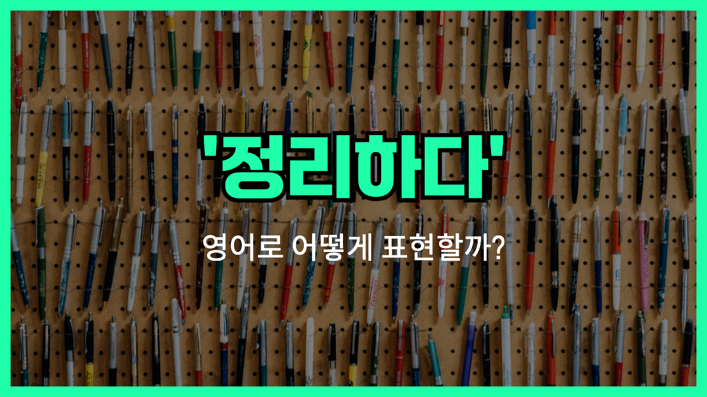

## 🌟 영어 표현 - organize

안녕하세요 👋 오늘은 '**organize**'라는 영어 표현에 대해 이야기해볼게요. '**organize**'는 한국어로 '**정리하다**', '**배열하다**', 또는 '**구성하다**'라는 뜻을 가지고 있어요. 이 단어는 주로 물건, 생각, 사람, 일정 등을 체계적이고 효율적으로 배치하거나 준비하는 상황에서 쓰여요.

즉, 무언가를 헝클어져 있거나 무질서한 상태에서 깔끔하고 이해하기 쉽게 만드는 걸 말해요. 예를 들어, 방을 정리할 때, 회의를 준비할 때, 혹은 이벤트를 계획할 때도 '**organize**'라는 단어가 자주 등장해요.

예를 들어, "I need to organize my desk." 라고 하면 "책상을 정리해야 해." 라는 뜻이고, "She organized a meeting for tomorrow."는 "그녀가 내일 회의를 준비했어." 라는 뜻이에요.

## 📖 예문

1. "방을 정리했어요."

   "I organized my room."

2. "행사를 체계적으로 준비했어요."

   "They organized the event systematically."

## 💬 연습해보기

<ul data-interactive-list>
  <li data-interactive-item>
    이 파일들 정리하는 거 좀 도와줄래요? 어디서부터 시작해야 할지 모르겠어요.
    Can you help me organize these files? I <a href="/blog/in-english/187.have-no-idea/">have no idea</a> where to start.
  </li>
  <li data-interactive-item>
    기말고사 준비하느라 오후 내내 노트 정리했어요.
    I <a href="/blog/in-english/258.spend/">spent</a> all afternoon organizing my notes for the final.
  </li>
  <li data-interactive-item>
    걔는 행사 준비 진짜 잘해요. 걔가 맡으면 항상 다 잘 돌아가요.
    She’s so good at organizing events. Everything always runs smoothly when she’s <a href="/blog/in-english/044.in-charge/">in charge</a>.
  </li>
  <li data-interactive-item>
    이번 주말에 옷장 정리 꼭 해야겠어요, 지금 완전 엉망이에요.
    I really need to organize my closet this weekend—it’s a mess right now.
  </li>
  <li data-interactive-item>
    노트북에 사진 정리하는 데 몇 시간 보냈어요.
    I spent a couple hours organizing my photos on my laptop.
  </li>
  <li data-interactive-item>
    이번 달에 동물 보호소를 위한 모금 행사 준비 중이에요.
    They’re organizing a fundraiser for the animal shelter this month.
  </li>
  <li data-interactive-item>
    돈 더 모으려고 지출 정리 중이에요.
    I’m <a href="/blog/in-english/117.try-to/">trying to</a> organize my expenses so I can save more money.
  </li>
</ul>

## 🤝 함께 알아두면 좋은 표현들

### arrange

'arrange'는 '**정리하다**', '**배열하다**'라는 뜻으로, 'organize'와 비슷하게 어떤 것을 체계적으로 정돈하거나 계획하는 의미를 갖고 있어요. 주로 사물이나 일정을 계획적으로 배치할 때 사용돼요.

- "She arranged the books on the shelf by genre."
- "그녀는 책들을 장르별로 책장에 정리했어요."

### sort out

'sort out'은 '**분류하다**', '**해결하다**'라는 뜻으로, 여러 가지 섞여 있는 것을 종류별로 나누거나 문제를 해결하는 의미로 'organize'와 연관돼요. 일상에서 물건이나 문제를 깔끔하게 정리할 때 쓰여요.

- "I need to sort out my emails before the meeting."
- "회의 전에 이메일을 정리해야 해요."

### mess up

'mess up'은 '**엉망으로 만들다**', '**망치다**'라는 뜻으로, 'organize'와 반대되는 표현이에요. 물건이나 상황을 어지럽히거나 혼란스럽게 만드는 것을 의미해요.

- "He messed up the schedule by arriving late."
- "그가 늦게 와서 일정을 엉망으로 만들었어요."

---

오늘은 '**정리하다**', '**배열하다**', '**구성하다**'라는 뜻을 가진 영어 표현 '**organize**'에 대해 알아봤어요. 무언가를 체계적으로 만들고 싶을 때 이 표현을 꼭 기억해 주세요! 😊

오늘 배운 표현과 예문들을 최소 3번씩 소리 내어 읽어보면서 자연스럽게 익혀 보아요. 다음에도 더 유익한 영어 표현으로 찾아올게요! 감사합니다!
