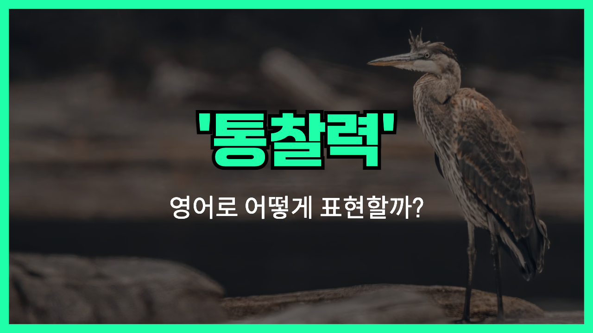

## 🌟 영어 표현 - insight

안녕하세요 여러분! 오늘은 '**insight**'라는 영어 표현에 대해 이야기해볼게요. '**insight**'는 한국어로 '**통찰력**'이라고 해요. 단순한 정보나 지식이 아니라, 어떤 문제나 상황을 깊이 이해하고 본질을 꿰뚫어 보는 능력을 말해요.

이 단어는 누군가가 단순히 보고 듣는 것을 넘어서서 내면의 의미나 숨겨진 진실을 깨달을 때 자주 사용돼요. 그래서 '**이해**'나 '**깨달음**'이라는 의미도 함께 포함돼 있답니다.

예를 들어, 팀 회의에서 누군가가 복잡한 문제에 대해 중요한 포인트를 명확하게 설명했다면, "She provided valuable insights." 라고 말할 수 있어요. 즉, "그녀가 귀중한 통찰력을 제공했어요."라는 의미가 되는 거죠.

또 다른 예시는 연구 결과를 통해 새로운 사실을 발견했을 때 "This study offers new insights into the disease." 라고 표현할 수 있어요. "이 연구는 그 질병에 대해 새로운 이해를 제공해요." 라는 의미에요.

## 📖 예문

1. "그의 통찰력 덕분에 문제가 빠르게 해결되었어요."

   "Thanks to his insight, the problem was quickly solved."

2. "이 책은 인생에 대한 깊은 깨달음을 줘요."

   "This book gives deep insights into life."

## 💬 연습해보기

<ul data-interactive-list>
  <li data-interactive-item>
    조언 고마워요, 꼭 기억해둘게요.
    Thanks for your insight. I’ll definitely <a href="/blog/in-english/222.keep-in-mind/">keep it in mind</a>.
  </li>
  <li data-interactive-item>
    이 상황 어떻게 대처해야 할지 조언 좀 해줄 수 있어요?
    Can you <a href="/blog/in-english/248.share/">share</a> any insight on how to handle this situation?
  </li>
  <li data-interactive-item>
    걔가 새로운 시각을 줘서 우리 접근 방식을 다시 생각하게 됐어요.
    She offered some fresh insight that made us rethink our whole <a href="/blog/in-english/267.approach/">approach</a>.
  </li>
  <li data-interactive-item>
    이 일이 계속 일어나는 이유에 대해 아는 거 있어요?
    Do you have any insight into why this <a href="/blog/in-english/291.keep-ing/">keeps happening?</a>
  </li>
  <li data-interactive-item>
    그거 진짜 흥미로운 생각인데, 난 그런 식으로는 한 번도 안 생각해봤어요.
    That’s an interesting insight, I hadn’t thought about it that way before.
  </li>
  <li data-interactive-item>
    걔는 항상 고객들이 진짜 원하는 게 뭔지 잘 파악하고 있어요.
    She always has some great insight into what customers actually want.
  </li>
  <li data-interactive-item>
    걔랑 얘기하고 나서 그 회사가 어떻게 돌아가는지 많이 알게 됐어요.
    After talking to him, I gained a lot of insight about how that company operates.
  </li>
  <li data-interactive-item>
    그 분의 시장에 대한 통찰 덕분에 큰 실수를 피할 수 있었어요.
    His insight into the market helped us avoid some big mistakes.
  </li>
  <li data-interactive-item>
    어른들이랑 얘기하면 인생에 대해 많은 걸 배울 수 있어요.
    Talking to older people can really give you a lot of insight about life.
  </li>
</ul>

## 🤝 함께 알아두면 좋은 표현들

### understanding

'understanding'은 '**상황이나 문제에 대한 이해**'를 의미해요. 'insight'와 비슷하게 어떤 사물이나 상황의 본질을 파악하는 능력을 나타내지만, 좀 더 포괄적이고 일반적인 이해를 뜻해요.

- "Her deep understanding of human nature helped her connect with people easily."
- "그녀는 인간 본성에 대해 깊이 이해해서 사람들과 쉽게 친해졌어요."

### awareness

'awareness'는 '무엇에 대해 **인지하고 있는 상태**'를 말해요. 'insight'가 더 깊은 통찰을 의미한다면, 'awareness'는 단순히 알고 있는 상태나 의식을 뜻해요.

- "Raising awareness about environmental issues is important for a sustainable future."
- "환경 문제에 대한 인식을 높이는 건 지속 가능한 미래를 위해 중요해요."

### ignorance

'ignorance'는 '**무지**'를 의미해요. 'insight'의 반대말로, 어떤 사실이나 진실에 대해 모르거나 이해하지 못하는 상태를 나타내요.

- "His ignorance about the topic [led to](/blog/vocab-1/004.lead-to/) many misunderstandings."
- "그가 그 주제에 대해 몰라서 오해가 많이 생겼어요."

### confusion

'confusion'은 '**혼란**'이나 '**혼동**'을 뜻해요. 'insight'가 명확한 통찰력을 의미하는 반면, 'confusion'은 상황이나 문제를 제대로 이해하지 못하고 헷갈리는 상태를 나타내요.

- "There was a lot of confusion about the schedule change."
- "일정 변경에 대해 많이 헷갈렸어요."

---

오늘은 '**통찰력**', '**이해**', '**깨달음**'이라는 의미를 가진 영어 표현 '**insight**'에 대해 알아봤어요. 어떤 상황에서든 깊이 생각하고 본질을 파악할 때 이 단어를 떠올리면 좋아요! 😊

오늘 배운 표현과 예문들을 꼭 여러 번 소리 내어 읽으면서 익혀보세요. 다음에도 더 흥미롭고 유용한 영어 표현으로 돌아올게요! 감사합니다!
