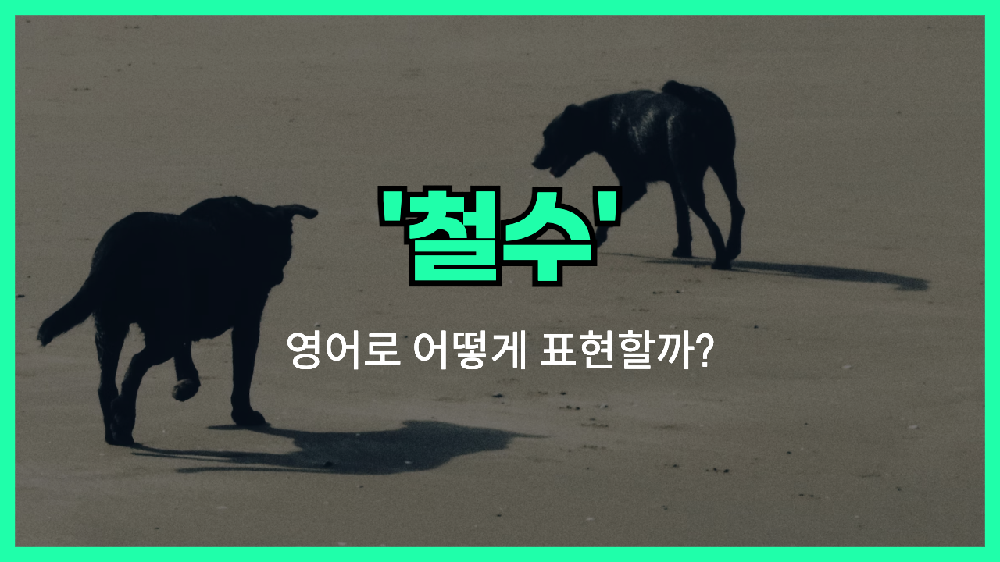

## 🌟 영어 표현 - withdrawal

안녕하세요 👋 오늘은 '**withdrawal**'이라는 영어 표현에 대해 이야기해볼게요. '**withdrawal**'은 주로 '**철수**', '**탈퇴**', 혹은 '**출금**'라는 의미를 가지고 있어요. 어떤 상황에서 사용되는지와 뉘앙스를 함께 살펴볼게요.

먼저 '**withdrawal**'은 어떤 장소나 조직, 활동 등에서 **물러나거나 빠져나가는 것**을 뜻해요. 예를 들면, 군대가 전장에서 철수할 때나, 동호회에서 탈퇴할 때, 계약을 철회하는 상황에 쓸 수 있죠.

이 단어는 명사로 쓰이고, 동사 형태는 '**withdraw**'예요. 예를 들어, "The army's withdrawal was completed last night."라고 하면 "군대의 철수가 어젯밤에 완료되었다."는 뜻이죠.

또, 은행에서 돈을 인출할 때도 'withdrawal'이라는 단어를 쓰는데, 이 경우는 '돈을 빼내는 행위'를 뜻해요.

## 📖 예문

1. "그 회사는 시장에서 철수를 결정했어요."

   "The company decided on withdrawal from the market."

2. "그는 클럽에서 탈퇴했어요."

   "He made a withdrawal from the club."

## 💬 연습해보기

<ul data-interactive-list>

  <li data-interactive-item>
    ATM에 갔는데 카드가 만료돼서 돈을 뽑을 수가 없었어요.
    I went to the ATM, but I couldn't make a withdrawal because my card was expired.
  </li>

  <li data-interactive-item>
    미안, 출발하기 전에 은행 가서 잠깐 돈 좀 뽑아야 해요.
    Sorry, I have to go to the bank for a quick withdrawal before we can <a href="/blog/in-english/402.leave/">leave</a>.
  </li>

  <li data-interactive-item>
    지난주에 담배 끊고 나서 금단 증상이 나타나기 시작했어요.
    He started feeling withdrawal symptoms after quitting smoking last week.
  </li>

  <li data-interactive-item>
    앱에서 출금 및 입금 내역을 실시간으로 확인할 수 있어요.
    The app lets you track your withdrawals and deposits in real time.
  </li>

  <li data-interactive-item>
    알코올 금단 치료 때문에 병원에 입원했어요.
    He was admitted to the clinic for alcohol withdrawal treatment.
  </li>

  <li data-interactive-item>
    군대가 갑자기 철수해서 다들 깜짝 놀랐어요.
    The sudden withdrawal of troops caught everyone by surprise.
  </li>

  <li data-interactive-item>
    프로젝트에서 빠지기로 결정했어요.
    We decided on withdrawal from the project.
  </li>

  <li data-interactive-item>
    계약을 철회하고 싶으면 언제든지 말씀해 주세요.
    If you want to withdraw from the contract, just <a href="/blog/in-english/241.let-someone-know/">let us know</a>.
  </li>

</ul>

## 🤝 함께 알아두면 좋은 표현들

### recession

'recession'은 **경제적 맥락**에서 '후퇴', '침체'를 의미해요. 경제가 위축되는 상황을 나타내며, 'withdrawal'이 물리적 혹은 심리적 철수라면, 'recession'은 경제적 후퇴를 뜻해요.

- "The country [faced](/blog/in-english/144.face-something/) a severe recession last year."
- "그 나라는 작년에 심각한 경기 침체를 겪었어요."

### advance

'advance'는 '**전진하다**', '**진격하다**'라는 뜻으로, 'withdrawal'의 반대 의미예요. 어떤 위치나 상태에서 앞으로 나아가는 행동을 나타냅니다.

- "The army began to advance towards the enemy lines."
- "군대가 적진을 향해 전진하기 시작했어요."

### engagement

'engagement'는 '**참여**', '**개입**'이라는 뜻으로, 'withdrawal'과 반대되는 개념이에요. 어떤 활동이나 상황에 적극적으로 참여하거나 관여하는 상태를 나타내죠.

- "The country's engagement in international affairs has increased."
- "그 나라가 국제 문제에 더 적극적으로 참여하고 있어요."

---

오늘은 '**철수**', '**탈퇴**', '**출금**'라는 뜻을 가진 영어 표현 '**withdrawal**'에 대해 알아봤어요. 상황에 맞게 쓰면 정말 유용하니 꼭 기억해 두세요! 😊

오늘 배운 표현과 예문들을 여러 번 소리 내서 연습해 보시고, 다음에도 더 재미있고 실용적인 영어 표현으로 찾아올게요! 감사합니다!
