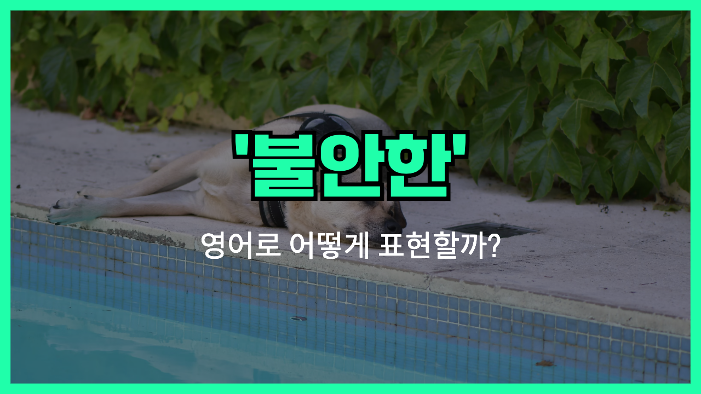

## 🌟 영어 표현 - restless

안녕하세요 여러분! 오늘은 '**restless**'라는 영어 표현에 대해 이야기해보려고 해요. 'restless'는 한국어로 '**불안한**', '**초조한**', 또는 '**가만히 못 있는**' 상태를 뜻해요. 어떤 상황에서 마음이 편하지 않고 자꾸 움직이거나 집중하기 힘들 때 쓰는 단어랍니다.

예를 들어, 시험 전이나 중요한 발표를 기다릴 때, 혹은 잠이 오지 않아서 뒤척일 때 'restless'라는 표현이 딱이에요. 단순히 몸이 가만히 있지 못한다는 의미뿐 아니라 마음이 불안하고 초조한 느낌까지 담고 있어서 꽤 다양하게 사용할 수 있어요.

"I felt restless before my big presentation."(중요한 발표 전에 불안했어요)처럼 말할 수 있죠. 또, "She couldn't sleep because she was restless all night."(그녀는 밤새 불안해서 잠을 못 잤어요)처럼도 쓰여요.

## 📖 예문

1. "아기가 너무 가만히 못 있어요."

   "The baby is restless."

2. "회의 동안 계속 불안하고 초조했어요."

   "I felt restless throughout the meeting."

## 💬 연습해보기

<ul data-interactive-list>

  <li data-interactive-item>
    요즘 걔 진짜 가만히 못 있더라고요, 5분도 못 앉아 있는 것 같아요.
    He's been really restless lately, like he can't sit still for more than five minutes.
  </li>

  <li data-interactive-item>
    주말 내내 집에만 있어서 애들이 점점 답답해했어요.
    After being <a href="/blog/in-english/389.stuck/">stuck</a> inside all weekend, the kids were getting restless.
  </li>

  <li data-interactive-item>
    일하면서 점점 답답해져서 진로를 바꿔야겠다고 생각했대요.
    She started feeling restless at work and decided she needed a career change.
  </li>

  <li data-interactive-item>
    저녁 산책을 안 가면 우리 강아지가 가만히 못 있어요.
    My dog gets restless if we <a href="/blog/in-english/369.skip/">skip</a> our evening walk.
  </li>
  
  <li data-interactive-item>
    프로젝트 끝내고 나서 계속 심심해요. 뭔가 집중할 게 필요해요.
    I've been so restless ever since I finished that project. I need something new to <a href="/blog/in-english/186.focus-on/">focus on</a>.
  </li>

  <li data-interactive-item>
    가끔 그냥 답답해서 아무 데나 차 몰고 가고 싶을 때가 있어요.
    <a href="/blog/in-english/270.sometimes/">Sometimes</a> I just feel restless and want to drive somewhere, anywhere.
  </li>

  <li data-interactive-item>
    TV 오래 보면 답답해져서 다른 걸 해야겠더라고요.
    I get restless if I watch TV for too long. I have to do something else.
  </li>

</ul>

## 🤝 함께 알아두면 좋은 표현들

### anxious

'anxious'는 **불안하거나 걱정되어 마음이 편하지 않은 상태**를 의미해요. 'restless'와 비슷하게 긴장되거나 초조한 느낌을 줄 때 자주 사용돼요.

- "She felt anxious before the big presentation."
- "그녀는 중요한 발표 전에 불안했어요."

### uneasy

'uneasy'는 **마음이 불편하고 편안하지 않은 상태**를 나타내요. 'restless'처럼 불안하거나 걱정스러운 감정을 표현할 때 사용돼요.

- "He felt uneasy about the upcoming exam."
- "그는 다가오는 시험 때문에 불안했어요."

### calm

'calm'은 **침착하고 평온한 상태**를 의미해요. 'restless'와는 반대로 마음이 안정되고 차분할 때 쓰이는 표현이에요.

- "She [stayed](/blog/in-english/119.stay/) calm even during the emergency."
- "그녀는 긴급 상황에서도 침착했어요."

---

오늘은 '**불안한**', '**초조한**', 그리고 '**가만히 못 있는**' 뜻을 가진 영어 표현 '**restless**'에 대해 알아봤어요. 혹시 마음이 조급하거나 몸이 계속 움직이고 싶을 때 이 표현을 떠올려 보세요! 😊

오늘 배운 표현과 예문을 꼭 여러 번 소리 내어 연습해 보시고, 다음에도 신나는 영어 표현으로 만나길 기대할게요! 감사합니다!
