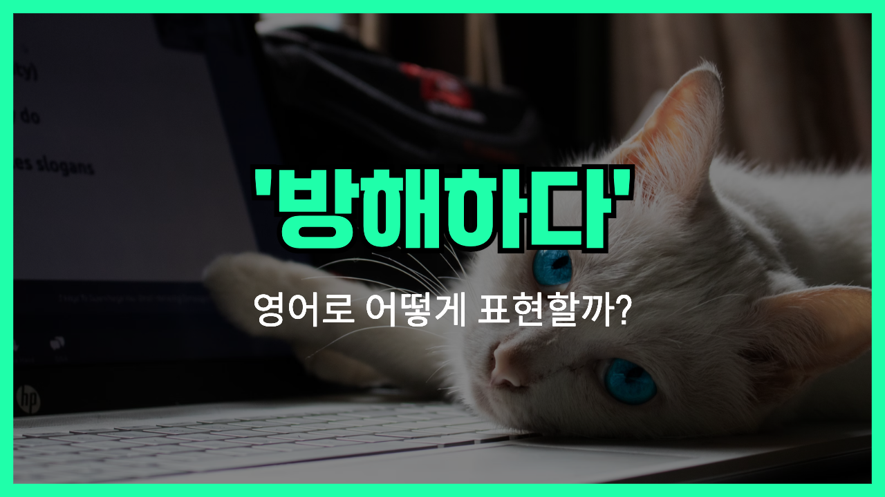

## 🌟 영어 표현 - interrupt

안녕하세요 👋 오늘은 '**interrupt**'라는 영어 표현에 대해 알아볼게요. '**interrupt**'는 한국어로 '**방해하다**', '**끼어들다**', 또는 '**중단시키다**'라는 뜻을 가지고 있어요. 누군가 말을 하거나 어떤 행동을 할 때 그 흐름을 끊거나 멈추게 만드는 상황을 표현할 때 사용돼요.

이 표현은 일상 생활에서 정말 자주 쓰이는데요, 예를 들어 친구가 말을 하다가 다른 사람이 갑자기 말을 끊는 장면에서 쓸 수 있어요. 혹은 중요한 회의 도중 누군가 예상치 못한 행동으로 중단시키는 상황에도 딱 맞는 표현이에요.

간단한 예시로, "Please don't interrupt me while I'm speaking."는 "내가 말하는 도중에 방해하지 마세요."라는 뜻이에요.

또 다른 예시로, "The power outage interrupted the meeting."는 "정전 때문에 회의가 중단됐어요."라는 의미로 쓰여요.

## 📖 예문

1. "그가 내 말을 자꾸 끊어서 당황했어요."

   "He <a href="/blog/in-english/291.keep-ing/">kept interrupting</a> me, so I was confused."

2. "전화가 와서 수업이 중단됐어요."

   "The call interrupted the class."

## 💬 연습해보기

<ul data-interactive-list>

  <li data-interactive-item>
    설명하려고 하는데 자꾸 끼어들더라고요.
    He kept interrupting me while I was <a href="/blog/in-english/117.try-to/">trying to</a> <a href="/blog/in-english/909.explain/">explain</a>.
  </li>

  <li data-interactive-item>
    잠깐만요, 시간 좀 있어요?
    Sorry to interrupt, but do you have a minute?
  </li>

  <li data-interactive-item>
    잠깐만요, 끝까지 말하게 해주세요.
    Hold on, let me finish. Please don't interrupt.
  </li>

  <li data-interactive-item>
    저녁 먹는 거 방해해서 미안한데, 전화 왔어요.
    I <a href="/blog/in-english/392.hate/">hate</a> to interrupt your dinner, but there's a call for you.
  </li>

  <li data-interactive-item>
    제가 누군가랑 얘기할 때마다 꼭 끼어들어요.
    She always interrupts whenever I'm <a href="/blog/in-english/359.talk-to/">talking to</a> someone.
  </li>

  <li data-interactive-item>
    말할 때 끼어들지 말아줄래요?
    Can you please not interrupt me when I'm speaking?
  </li>

  <li data-interactive-item>
    잠깐만요, 할 말 있어요.
    Can I interrupt for a second? I have some <a href="/blog/in-english/536.news/">news</a>.
  </li>

</ul>

## 🤝 함께 알아두면 좋은 표현들

### cut in

'cut in'은 대화 중에 **다른 사람 말을 끊고 끼어드는 상황**을 나타내요. 'interrupt'와 비슷하게 누군가의 말을 중단시키는 행동을 의미해요.

- "She cut in while I was explaining the plan."
- "내가 계획을 설명하는 중에 그녀가 끼어들었어요."

### break in

'break in'은 **대화나 행동을 갑자기 중단시키거나 개입**하는 것을 의미해요. 'interrupt'와 비슷하게 누군가의 흐름을 방해할 때 쓰여요.

- "He broke in to correct the mistake."
- "그가 실수를 고치려고 갑자기 끼어들었어요."

### let go on

'let go on'은 누군가의 말을 중단하지 않고 **계속하게 내버려 두는 것**을 의미해요. 'interrupt'의 반대 표현으로, 방해하지 않고 존중하는 태도를 나타내요.

- "Please let me go on with my [story](/blog/in-english/537.story/)."
- "내 이야기를 끊지 말고 계속하게 해줘요."

### hold back

---

오늘은 '**방해하다**', '**끼어들다**', '**중단시키다**'라는 뜻을 가진 영어 표현 '**interrupt**'에 대해 배워봤어요. 누군가의 행동이나 말을 멈추게 할 때 딱 떠오르는 단어죠? 😊

오늘 배운 표현과 예문들을 3번씩 소리 내어 읽으면서 자연스럽게 익혀보세요! 다음에도 재미있고 유익한 영어 표현으로 찾아올게요. 감사합니다!
