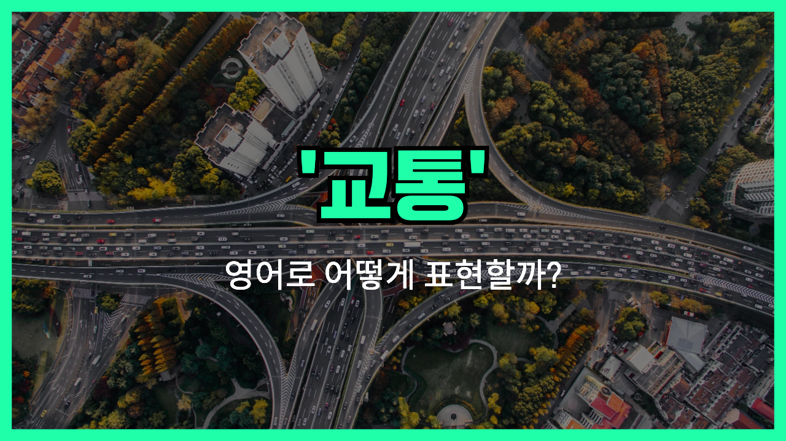

## 🌟 영어 표현 - traffic

안녕하세요 👋 오늘은 '**교통**'이라는 뜻을 가진 영어 표현 '**traffic**'에 대해 이야기해보려고 해요. '**traffic**'은 사람이나 차량, 물건 등이 길이나 도로를 통해 오가는 것을 뜻해요. 즉, 주로 **도로 위에서 차량과 사람들의 이동이나 혼잡한 상황**을 표현할 때 쓰인답니다.

이 단어는 일상에서 정말 자주 만날 수 있는데, 출퇴근길의 차량량이 많거나 도로가 막힐 때 '교통 체증'에 대해 이야기할 때 꼭 사용해요. 예를 들어 "There is heavy traffic on the highway."라고 하면 "고속도로에 교통이 많이 막혀 있어."라는 뜻이에요.

또한, 'traffic'은 '차량'뿐만 아니라 '사람들의 이동'이나 '데이터 전송' 같은 의미로도 쓰일 수 있어서 정말 다양하고 유용한 단어에요.

## 📖 예문

1. "오늘 아침 교통이 너무 혼잡했어요."

   "The traffic was very heavy this morning."

2. "도로 공사 때문에 교통이 지연되고 있어요."

   "Traffic is delayed due to road construction."

## 💬 연습해보기

<ul data-interactive-list>

  <li data-interactive-item>
    이 시간대엔 다들 집에 가려고 해서 차가 항상 엄청 막혀요.
    There's always a ton of traffic around this time because everyone's <a href="/blog/in-english/117.try-to/">trying to</a> get home.
  </li>

  <li data-interactive-item>
    경기 끝나고 나면 차가 엄청 막히는 편이에요.
    Traffic <a href="/blog/in-english/259.tend-to/">tends to</a> get really bad after the game lets out.
  </li>

  <li data-interactive-item>
    아, 오늘 아침 차가 완전 막혀서 고속도로에서 한 시간 넘게 꼼짝도 못했어요.
    Ugh, the traffic was a nightmare this morning. I was stuck on the freeway for over an hour.
  </li>

  <li data-interactive-item>
    늦어서 미안해요, 시내에서 차가 너무 막혔거든요.
    Sorry I'm late, I got caught in really bad traffic downtown.
  </li>

  <li data-interactive-item>
    지금 출발하면 차 막히기 전에 갈 수 있을 것 같아요.
    If we leave now, we can <a href="/blog/in-english/281.probably/">probably</a> beat the traffic.
  </li>

  <li data-interactive-item>
    요즘 차가 왜 이렇게 막히는 거예요? 출퇴근 시간도 아닌데.
    What's up with all this traffic lately? It's not even rush hour.
  </li>

  <li data-interactive-item>
    혹시 모르니까 일찍 출발하는 게 좋겠어요.
    We should leave early, just <a href="/blog/in-english/253.in-case/">in case</a> there's traffic.
  </li>

  <li data-interactive-item>
    차 막혀서 앉아 있는 거 너무 싫어요, 시간 완전 낭비 같아요.
    I hate sitting in traffic, it just feels like such a waste of time.
  </li>

</ul>

## 🤝 함께 알아두면 좋은 표현들

### traffic jam

'traffic jam'은 '**교통 체증**'을 의미해요. 차량이 많아 도로가 막히는 상황을 나타내죠. 일상에서 출퇴근 시간이나 휴일에 자주 경험하는 표현이에요.

- "I was late to work because of a terrible traffic jam on the highway."
- "고속도로에서 심한 교통 체증 때문에 회사에 늦었어요."

### rush hour

'rush hour'는 '**출퇴근 시간**'을 뜻해요. 이 시간대에는 도로와 대중교통이 매우 혼잡해져서 교통량이 많아지는 때를 말해요.

- "The subway is always crowded during rush hour."
- "지하철은 항상 출퇴근 시간에 엄청 붐벼요."

### traffic congestion

'traffic congestion'은 '**교통 혼잡**' 또는 '**교통 체증**'과 비슷한 의미지만, 좀 더 공식적이고 전문적인 표현이에요. 많은 차량이 도로에 몰려 정체된 상태를 말해요.

- "The city is investing in public transport to reduce traffic congestion."
- "도시는 교통 혼잡을 줄이기 위해 대중교통에 투자하고 있어요."

---

오늘은 '**교통**', '**차량**', '**도로**'라는 뜻을 가진 영어 표현 '**traffic**'에 대해 알아봤어요. 도로에서나 일상 대화에서 자주 쓰이는 표현이니 꼭 기억해두세요! 😊

오늘 배운 표현과 예문들을 최소 3번씩 소리 내서 읽어보면 더 익숙해질 거예요. 다음에도 더 유익한 영어 표현으로 찾아올게요! 감사합니다!
