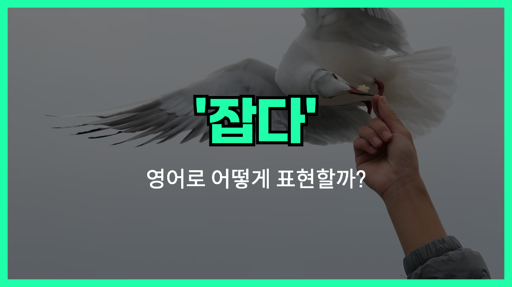

## 🌟 영어 표현 - hold

안녕하세요 👋 오늘은 '**hold**'라는 영어 표현에 대해 이야기해볼게요. '**hold**'는 한국어로 '잡다'라는 뜻이 가장 기본적이에요. 하지만 이 단어는 그 외에도 '유지하다', '개최하다' 같은 다양한 의미를 가진 멀티플레이어 같은 단어랍니다.

먼저, '**hold**'가 '잡다'라는 뜻일 때는 물리적으로 무언가를 손으로 쥐거나 붙드는 상황에서 사용해요. 예를 들어, "Hold my hand."라고 하면 "내 손을 잡아줘."라는 뜻이에요.

둘째로, '**hold**'는 '유지하다'라는 의미로도 많이 쓰여요. 예를 들어, "Please hold your position."은 "너의 위치를 유지해 주세요." 라는 뜻이죠.

마지막으로, '**hold**'는 '행사나 모임을 개최하다'라는 의미도 있어요. "The company will hold a meeting tomorrow."는 "회사가 내일 회의를 개최할 거야."라는 뜻이에요.

이처럼 '**hold**'는 상황에 따라 다양한 의미로 쓰이니 문맥을 잘 파악하는 게 중요해요.

## 📖 예문

1. "내 손을 잡아줘."

   "Hold my hand."

2. "회의는 다음 주에 개최돼요."

   "The meeting will be held next week."

## 💬 연습해보기

<ul data-interactive-list>

  <li data-interactive-item>
    영화 보면서 눈물 참으려고 했어요.
    She <a href="/blog/in-english/117.try-to/">tried to</a> hold back her tears during the movie.
  </li>

  <li data-interactive-item>
    검사 결과 기다리면서 숨을 참았어요.
    He held his breath as he <a href="blog/in-english/377.wait-for/">waited for</a> the test results.
  </li>

  <li data-interactive-item>
    신발 끈 묶는 동안 이거 잠깐 들어줄래요?
    Can you hold this for a second while I tie my shoe?
  </li>

  <li data-interactive-item>
    잠깐만요, 일정 확인해보고 계획 세워요.
    Hold on, let me check my calendar before we make any plans.
  </li>

  <li data-interactive-item>
    이 가방들 다 못 들겠어요, 좀 도와줄래요?
    I can't hold all these bags by myself, can you help?
  </li>

  <li data-interactive-item>
    꽉 잡아요, 곧 출발해요!
    Hold tight, the ride is about to start!
  </li>

  <li data-interactive-item>
    문 좀 잡아줘요, 금방 갈게요.
    Just hold the door open for me, I'll be right there.
  </li>

  <li data-interactive-item>
    집에 갈 때까지 핸드폰 배터리가 버틸지 모르겠어요.
    I don't know if my phone's battery will hold till I get home.
  </li>

  <li data-interactive-item>
    엘리베이터 좀 잡아줄 수 있어요?
    Can you hold the elevator, please?
  </li>

  <li data-interactive-item>
    길 건널 때 할머니 손 꼭 잡았어요.
    She held onto her grandma's hand while crossing the street.
  </li>

  <li data-interactive-item>
    아기가 안 깨게 조심히 안았어요.
    She held the baby gently so he wouldn't wake up.
  </li>

</ul>

## 🤝 함께 알아두면 좋은 표현들

### grip

'grip'은 '**손이나 도구로 꽉 잡다**'라는 뜻이에요. 'hold'와 비슷하게 무언가를 단단히 잡거나 쥐는 상황에서 자주 사용돼요.

- "She had a firm grip on the rope during the climb."
- "그녀는 등반하는 동안 밧줄을 단단히 잡고 있었어요."

### clutch

'clutch'는 '**갑자기 꽉 잡다**'라는 뜻이에요. 주로 긴장하거나 무언가를 꼭 쥐어야 할 때 쓰이는 표현이에요.

- "He clutched his bag tightly as he walked through the dark alley."
- "그는 어두운 골목을 걸을 때 가방을 꼭 쥐었어요."

### release

'release'는 '**놓다**', '**풀어주다**'라는 뜻으로, 'hold'의 반대되는 의미를 가지고 있어요. 무언가를 잡고 있다가 놓을 때 쓰여요.

- "After holding the bird gently, he released it back into the wild."
- "그는 새를 조심스럽게 잡았다가 다시 자연으로 풀어줬어요."

---

오늘은 '잡다', '유지하다', '개최하다'라는 뜻을 가진 '**hold**'에 대해 알아봤어요. 일상에서 정말 자주 쓰이는 단어이니 꼭 기억해두고 자연스럽게 써보세요! 다음에도 더 재미있고 유익한 영어 표현으로 찾아올게요! 감사합니다! 😊
