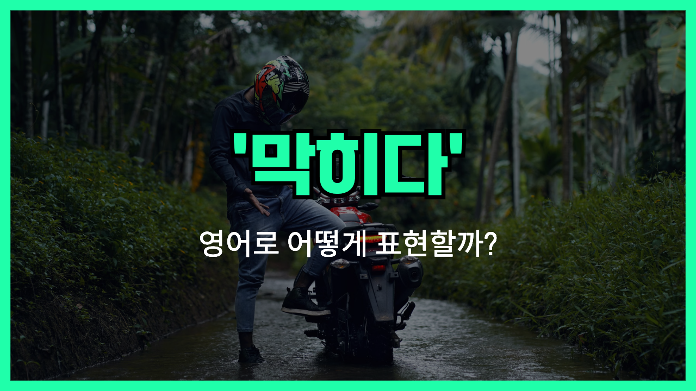

## 🌟 영어 표현 - stuck

안녕하세요 👋 오늘은 '**stuck**'이라는 영어 표현에 대해 이야기해보려고 해요. '**stuck**'은 기본적으로 '**막히다**', '**갇히다**', '**꼼짝 못하다**'라는 뜻을 가지고 있어요. 무언가가 움직이지 못하거나 빠져나올 수 없는 상태를 말할 때 쓰는 단어랍니다.

예를 들어, 차가 교통체증 때문에 움직이지 못할 때 "I'm stuck in [traffic](/blog/in-english/384.traffic/)."라고 하죠. 또, 문제가 너무 복잡해서 빠져나올 수 없거나 해결이 안 될 때 "I'm stuck on this problem."처럼 쓸 수 있어요.

즉, 'stuck'은 물리적인 장애뿐만 아니라 정신적, 상황적인 제한도 표현할 수 있어서 정말 유용해요.

## 📖 예문

1. "나는 엘리베이터에 갇혔어."

   "I was stuck in the elevator."

2. "숙제 때문에 완전 꼼짝 못 하고 있어요."

   "I'm stuck with my homework."

## 💬 연습해보기

<ul data-interactive-list>

  <li data-interactive-item>
    두 가지 선택지 사이에서 완전 고민 중이에요.
    I'm stuck between two choices and I just can't <a href="/blog/in-english/062.decide-to/">decide</a>.
  </li>

  <li data-interactive-item>
    또 야근이라서 저녁은 못 먹을 것 같아요.
    I'm stuck at work late again, so I'll have to <a href="/blog/in-english/369.skip/">skip</a> dinner.
  </li>

  <li data-interactive-item>
    고속도로에서 차가 고장 나서 두 시간 동안 꼼짝 못 했어요.
    My car broke down on the highway and I was stuck there for two hours.
  </li>

  <li data-interactive-item>
    아, 차가 막혀서 완전 늦을 것 같아요.
    Ugh, I'm stuck in traffic. I'm gonna be late.
  </li>

  <li data-interactive-item>
    이 수학 문제 풀어보려 했는데 완전 막혔어요.
    I tried to solve this math problem, but I'm totally stuck.
  </li>

  <li data-interactive-item>
    비가 너무 많이 와서 집에만 갇혀 있어요.
    I'm stuck at home because it's raining so hard.
  </li>

  <li data-interactive-item>
    미팅 때문에 오후 내내 꼼짝 못 해서 답장 늦었어요, 미안해요.
    Sorry I didn't respond <a href="/blog/in-english/397.earlier/">earlier</a>, I was stuck in a meeting all afternoon.
  </li>

  <li data-interactive-item>
    지퍼가 걸려서 자켓을 못 벗겠어요.
    My zipper is stuck and I can't get my jacket off.
  </li>

  <li data-interactive-item>
    노래가 머릿속에서 계속 맴돌아서 안 사라져요.
    The song is stuck in my head and I can't <a href="/blog/in-english/398.get-rid-of/">get rid of</a> it.
  </li>

</ul>

## 🤝 함께 알아두면 좋은 표현들

### jammed

'jammed'는 '**끼이거나 막힌 상태**'를 뜻해요. 기계나 교통 등이 움직이지 못할 때, 'stuck'과 유사하게 쓰여요.

- "The printer got jammed again during my presentation."
- "내 발표 중에 프린터가 또 막혀서 난감했어요."

### free

'free'는 '**자유로운** 상태'를 의미해요. 'stuck'과 반대로 어떤 제약이나 구속이 없이 움직이거나 행동할 수 있는 상태를 나타내요.

- "Once the door was unlocked, we were <a href="/blog/in-english/182.finally/">finally</a> free to leave."
- "문이 열리자 드디어 우리는 자유롭게 나갈 수 있었어요."

### unblocked

'unblocked'는 '막힘이 해제된 상태'를 뜻해요. 'stuck'처럼 막히거나 가로막힌 상태에서 벗어난 것을 의미해요.

- "After the plumber fixed the pipe, the water flow was unblocked."
- "배관공이 파이프를 고친 후에 물이 막힘 없이 잘 흘렀어요."

---

오늘은 '**막히다**', '**갇히다**', '**꼼짝 못하다**'라는 뜻을 가진 영어 표현 '**stuck**'에 대해 알아봤어요. 만약 어떤 상황에서 움직이거나 진행하기 어려울 때 이 표현을 생각해보면 좋을 것 같아요! 😊

오늘 배운 표현과 예문을 꼭 여러 번 소리 내서 연습해보세요. 다음에도 더 재미있고 유익한 영어 표현으로 찾아올게요! 감사합니다!
