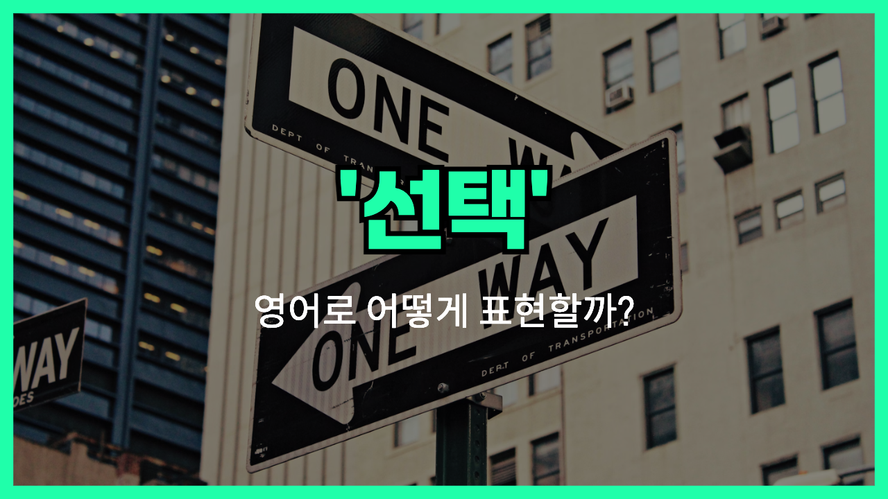

## 🌟 영어 표현 - choice

안녕하세요 👋 오늘은 '**선택**'이라는 뜻을 가진 영어 표현 '**choice**'에 대해 이야기해볼게요. '**choice**'는 여러 가지 중에서 하나를 고르는 행동이나 결과를 뜻해요. 즉, 무엇인가를 결정하거나 선택할 때 쓰이는 말이에요.

이 단어는 일상생활에서 정말 자주 사용돼요. 예를 들어, 메뉴에서 음식을 고를 때, 혹은 여러 가지 옵션 중에서 결정을 내릴 때 모두 '**choice**'라는 단어를 활용할 수 있어요.

예를 들어, "You have a choice between coffee and tea."라고 하면 "너는 커피와 차 중에서 선택할 수 있어."라는 뜻이에요. 여기서 선택지가 여러 개 있다는 의미가 잘 드러나죠!

또한, '**make a choice**'라는 표현도 자주 쓰는데, "선택을 하다"라는 뜻이에요. 예를 들어, "It's time to make a choice."라고 하면 "이제 선택할 시간이야." 라는 의미가 됩니다.

## 📖 예문

1. "좋은 선택을 했어요."

   "You made a good choice."

2. "선택의 여지가 많아요."

   "There are many choices."

## 💬 연습해보기

<ul data-interactive-list>

  <li data-interactive-item>
    솔직히 그건 네 선택이지, 내 선택은 아니에요.
    <a href="blog/in-english/336.honestly/">Honestly</a>, that's your choice, not mine.
  </li>

  <li data-interactive-item>
    별다른 선택지가 없어서 그냥 있는 거 아무거나 골랐어요.
    I didn't have much choice, so I just went with whatever was <a href="/blog/in-english/188.available/">available</a>.
  </li>

  <li data-interactive-item>
    차가 고장 나서 어쩔 수 없이 버스를 탔어요.
    I had no choice but to take the bus when my car broke down.
  </li>

  <li data-interactive-item>
    선택할 수 있다면 오늘 밤은 집에 있고 싶어요.
    If I had a choice, I'd rather stay home tonight.
  </li>

  <li data-interactive-item>
    안 보일 뿐 항상 선택지는 있어요.
    You always have a choice, even if it doesn't seem like it.
  </li>

  <li data-interactive-item>
    늦게까지 일하거나 일찍 출근하는 것 중에 선택하래요.
    They gave me a choice between working late or coming in early.
  </li>

  <li data-interactive-item>
    여기로 이사 온 게 잘한 선택인 것 같아요.
    I feel like I made the right choice moving here.
  </li>

  <li data-interactive-item>
    이게 네한테 진짜 최선의 선택이 맞아요?
    Are you sure this is the best choice for you?
  </li>

  <li data-interactive-item>
    네 선택이긴 한데, 내가 너라면 다른 걸 고를 것 같아요.
    It's your choice, but I'd <a href="/blog/vocab-1/021.go-with/">go with</a> the other option if I were you.
  </li>

  <li data-interactive-item>
    가끔은 그냥 선택하고 그걸 밀고 나가야 해요.
    <a href="/blog/in-english/270.sometimes/">Sometimes</a> you just have to make a choice and stick with it.
  </li>

</ul>

## 🤝 함께 알아두면 좋은 표현들

### pick an option

"pick an option"은 "**옵션을 선택하다**"라는 뜻으로, 여러 선택지 중 하나를 고를 때 자연스럽게 쓰는 표현이에요.

- "She picked an option that suited her schedule best."
- "그녀는 본인 일정에 가장 맞는 옵션을 골랐어요."

### have a preference

"have a [preference](/blog/in-english/509.preference/)"는 "**선호하다**" 또는 "더 좋아하다"라는 의미로, 여러 선택지 중에서 더 마음에 드는 것을 말할 때 사용해요.

- "I have a preference for tea [over coffee](/blog/in-english/504.over-coffee/)."
- "저는 커피보다 차를 더 좋아해요."

### make no choice

"make no choice"는 "**선택하지 않다**" 또는 "결정을 미루다"라는 뜻으로, 어떤 상황에서 선택을 하지 않는 반대 의미예요.

- "He made no choice and let others decide for him."
- "그는 선택하지 않고 다른 사람들이 결정하게 냅뒀어요."

---

오늘은 '**선택**', '**고르기**', '**결정하기**'라는 뜻을 가진 영어 표현 '**choice**'에 대해 알아봤어요. 다음에 무언가를 결정하거나 결정해야 할 때 이 단어를 기억해두면 좋겠죠? 😊

오늘 배운 표현과 예문을 꼭 여러 번 따라 말해보세요! 다음에 또 재미있고 유용한 영어 표현으로 만나요! 감사합니다!
