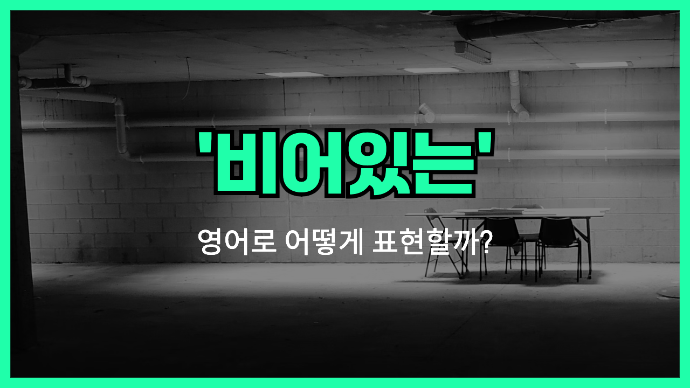

## 🌟 영어 표현 - empty

안녕하세요 👋 오늘은 '**empty**'라는 영어 표현에 대해 이야기해볼게요. '**empty**'는 기본적으로 '비어 있다', '내용물이 없다'는 뜻이에요. 즉, 무언가가 꽉 차 있지 않고 텅 비어 있는 상태를 나타낼 때 사용하죠.

이 표현은 물건, 장소, 마음 상태 등 다양한 상황에 적용할 수 있어요. 예를 들어, 텅 빈 상자나 방을 묘사할 때 "The box is empty." 또는 "The room is empty."라고 말할 수 있어요. 이처럼 눈에 보이는 물리적 공간이 아무것도 없을 때 쓰는 경우가 많아요.

뿐만 아니라, 감정적으로도 사용돼요. 누군가의 마음이 '텅 빈 느낌'일 때 "I feel empty inside."라고 표현할 수 있답니다.

## 📖 예문

1. "냉장고가 비어 있어요."

   "The fridge is empty."

2. "회의실이 지금 텅 비어 있어요."

   "The meeting room is empty now."

3. "그의 눈에는 공허함이 가득했어요."

   "There was emptiness in his eyes."

## 💬 연습해보기

<ul data-interactive-list>

  <li data-interactive-item>
    자정 지나니까 길이 완전 텅 비었더라고요.
    The streets were totally empty after midnight.
  </li>

  <li data-interactive-item>
    시험 보는 동안 머리가 완전 멍해졌어요.
    My mind just went empty during the test.
  </li>

  <li data-interactive-item>
    가게 들어갔는데 거의 텅 비어 있었어요.
    I walked into the store and it was <a href="/blog/in-english/854.almost/">almost</a> empty.
  </li>

  <li data-interactive-item>
    이 상자 비었는데, 버릴까요?
    This box is empty—should I <a href="/blog/in-english/458.throw/">throw</a> it out?
  </li>

  <li data-interactive-item>
    소식 전했더니 표정이 좀 멍했어요.
    Her expression was kind of empty when I told her the <a href="/blog/in-english/536.news/">news</a>.
  </li>

  <li data-interactive-item>
    보통 주차장 꽉 차는데, 오늘 밤은 텅 비었어요.
    That parking lot is usually <a href="/blog/in-english/301.pack/">packed</a>, but tonight it's empty.
  </li>

  <li data-interactive-item>
    집에 와서 텅 빈 집 보면 너무 싫어요.
    I <a href="/blog/in-english/392.hate/">hate</a> coming home to an empty house.
  </li>

  <li data-interactive-item>
    여기 음악 없으니까 좀 허전해요.
    It feels kind of empty in here without any music.
  </li>

</ul>

## 🤝 함께 알아두면 좋은 표현들

### vacant

'vacant'는 '비어 있는' 또는 '공석인'이라는 뜻으로, 공간, 자리, 방 등이 사용 중이지 않음을 나타내요.

- "The apartment has been vacant for several months."
- "그 아파트는 몇 달째 비어 있어요."

### blank

'blank'는 '빈칸의', '비어 있는'이라는 뜻으로, 주로 종이나 화면 등에 아무것도 쓰여 있지 않은 상태를 말해요.

- "He [stared at](/blog/in-english/087.stare-at/) the blank page, unsure of what to write."
- "그는 뭘 써야 할지 몰라서 빈 페이지를 멍하니 바라봤어요."

### full

'full'은 '가득 찬', '꽉 찬'이라는 뜻으로, 'empty'의 반대말이에요. 공간이나 용기가 꽉 차 있는 상태를 나타내요.

- "The glass is full of water."
- "그 컵은 물로 가득 차 있어요."

---

오늘은 '**비어 있는**', '**공허한**', '**텅 빈**'이라는 뜻을 가진 영어 표현 '**empty**'에 대해 알아봤어요. 물건이 없거나 공간이 비었을 때, 또 마음이 허전할 때 이 표현을 떠올리면 좋아요 😊

오늘 배운 표현들과 예문들을 꼭 크게 읽으면서 익혀보세요! 다음에도 더 재밌고 유익한 영어 표현으로 찾아올게요. 감사합니다!
