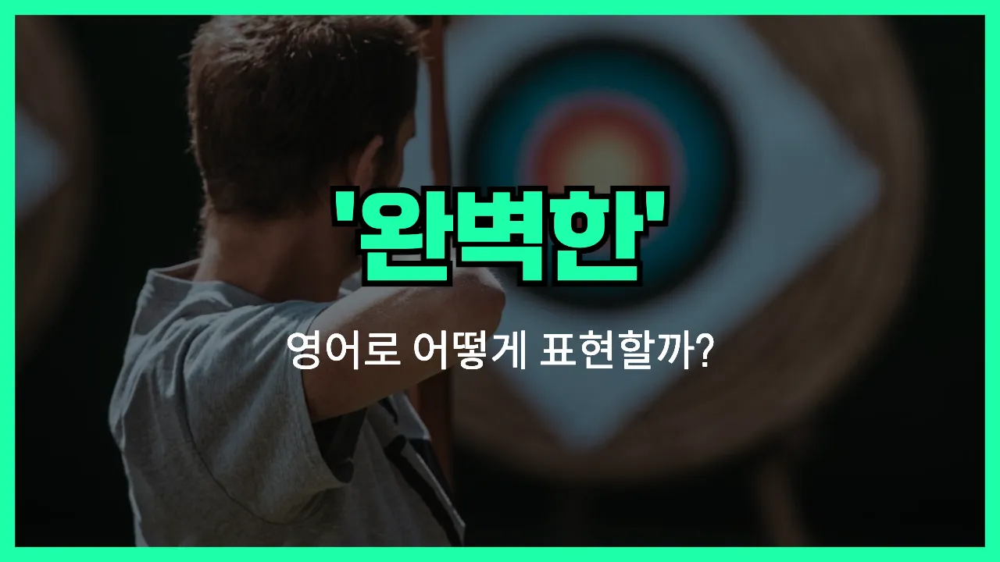

## 🌟 영어 표현 - perfect

안녕하세요 👋 오늘은 많은 분들이 궁금해하시는 영어 표현, '**완벽하다**'에 대해 알아보려고 해요. 바로 '**perfect**'라는 단어가 있어요.

'**perfect**'는 '흠잡을 데 없이 완전하다', '부족함이 없다'는 뜻이에요. 우리가 무언가 결과물이나 상황, 목표 등이 기대한 대로 아주 잘 되었을 때 자주 사용해요.

일상 회화에서 '정말 완벽해!', '이거 딱이야!'처럼 어떤 것이 뛰어나거나 바랐던 그대로일 때 자연스럽게 쓸 수 있어요. 특히 시험에서 만점이 나왔거나, 누군가의 행동이나 계획이 아주 훌륭할 때 'It's perfect!'라고 감탄할 수 있답니다.

또, 외모, 성과, 분위기 등 다양한 맥락에서 두루두루 활용하기 좋은 단어예요. '완벽하게 준비하다', '완벽한 선택'처럼 우리말의 '완벽하다'와 거의 똑같이 쓸 수 있으니 꼭 기억해 주세요!

## 📖 예문

1. "이번 발표는 완벽했어요!"

   "The presentation was perfect!"

2. "이 드레스는 너에게 완벽하게 잘 어울려요."

   "This dress fits you perfectly."

## 💬 연습해보기

<ul data-interactive-list>

  <li data-interactive-item>
    저 발표 완전 최고였어요. 진짜 제대로 하셨어요.
    That presentation was perfect. You really nailed it.
  </li>

  <li data-interactive-item>
    어젯밤 파티 완전 잘 됐어요. 너무 기뻐요.
    Everything <a href="/blog/vocab-1/038.turn-out/">turned out</a> perfect for the party last night. I'm so happy.
  </li>

  <li data-interactive-item>
    오늘 아침 내 커피 딱 내 스타일로 완벽해요.
    My coffee is perfect this morning. Just the way I like it.
  </li>

  <li data-interactive-item>
    이 드레스 결혼식에 딱 맞을까요?
    Do you think this dress is perfect for the wedding?
  </li>

  <li data-interactive-item>
    오늘 날씨 피크닉하기 완전 좋아요. 공원 가요!
    The weather is perfect for a picnic today. Let's go to the park.
  </li>

  <li data-interactive-item>
    너 답변 완벽했어요. 나 같아도 그렇게 못 했을걸요.
    Your answer was perfect. I couldn't have said it better myself.
  </li>

  <li data-interactive-item>
    여기 텐트 치기 딱 좋은 곳인 것 같아요. 어때요?
    I think this spot is perfect for setting up the tent. What do you think?
  </li>

  <li data-interactive-item>
    걔 연습 많이 했어서 공연 거의 완벽했어요.
    He <a href="/blog/in-english/247.practice/">practiced</a> a lot, so his performance was basically perfect.
  </li>

  <li data-interactive-item>
    시간 딱 맞췄네요. 막 전화하려던 참이었어요.
    This timing is perfect. I was just about to call you.
  </li>

  <li data-interactive-item>
    그 영화 금요일 밤에 딱 좋았어요. 진짜 재밌게 봤어요.
    That movie was perfect for a Friday night. I loved it.
  </li>

</ul>

## 🤝 함께 알아두면 좋은 표현들

### flawless

'flawless'는 '완벽하다', '흠잡을 데 없이 완벽하다'라는 뜻이에요. 어떤 대상이나 결과에 결점이나 오류가 전혀 없고, 아주 완전한 상태임을 강조할 때 사용해요.

- "Her performance last night was absolutely flawless."
- "어젯밤 그녀의 공연은 정말 흠잡을 데 없이 완벽했어요."

### impeccable

'impeccable'은 '결점이 전혀 없는', '흠이 없는', '완벽한'이라는 의미예요. 주로 태도, 서비스, 예의, 옷차림 등에서 실수나 결점이 하나도 없을 때 사용해요.

- "He always has impeccable manners."
- "그는 항상 예의가 정말 완벽해요."

### flawed

'flawed'는 '결함이 있는', '완벽하지 않은'이라는 뜻으로, 'perfect'와 반대되는 의미예요. 뭔가에 작은 문제나 결함이 있거나, 불완전할 때 쓰는 말이에요.

- "The plan was flawed from the beginning, so it didn't work out."
- "그 계획은 처음부터 결함이 있어서 잘 안 됐어요."

---

오늘은 영어로 '완벽하다'를 표현하는 '**perfect**'에 대해 공부해봤어요. 앞으로 칭찬하고 싶을 때 또는 무언가에 아주 만족할 때 자신 있게 써보세요 😊

오늘 배운 표현과 예문을 소리 내어서 3번씩 꼭 읽어보세요. 다음에도 더 알차고 재미있는 표현으로 찾아올게요! 감사합니다!

