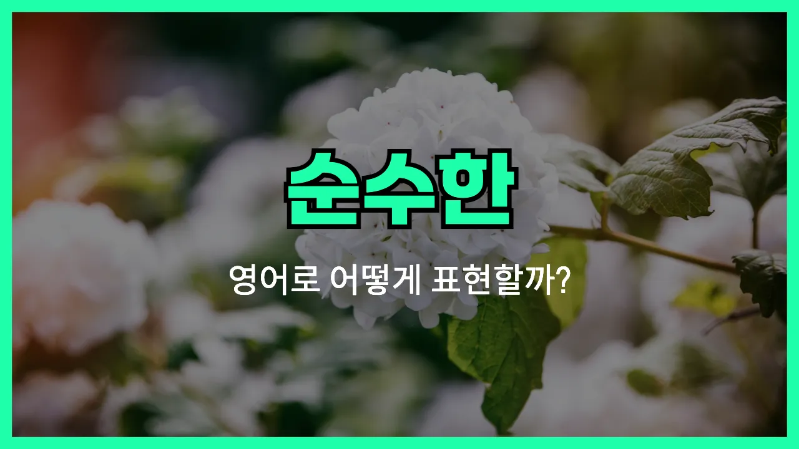

## 🌟 영어 표현 - pure

안녕하세요 👋 오늘은 '순수한', '깨끗한', '청순한'이라는 뜻을 가진 영어 단어 '**pure**'에 대해서 알아보려고 해요.

'**pure**'는 아주 '깨끗하다', '섞이지 않고 본연 그대로다'라는 뜻을 갖고 있어요. 그래서 물질, 마음, 공기 등 여러 가지 상황에서 많이 쓰여요. '순수한 마음', '깨끗한 물', '혼합물이 없는 금속' 등 정말 다양한 상황에 사용할 수 있는 단어에요!

예를 들어,
- '순수한 마음'은 'pure heart'라고 하고,
- '깨끗한 물'은 'pure water'라고 해요.

특히 어떤 것이 다른 것과 섞이지 않고 **본질적**이고 **청정하다**는 뜻을 담고 있어서, 더 깊은 느낌을 줄 수 있어요.

## 📖 예문

1. "그녀는 순수한 마음을 가지고 있어요."

   "She has a pure heart."

2. "산에는 정말 순수한 공기가 있어요."

   "There is really pure air in the mountains."

3. "이 제품은 100% 순수 우유로 만들어졌어요."

   "This product is made from 100% pure milk."

## 💬 연습해보기

<ul data-interactive-list>

  <li data-interactive-item>
    저 산속 개울물은 진짜 깨끗해서 그냥 마셔도 될 정도예요. 거기 물맛이 정말 끝내줘요.
    That mountain stream is so pure, you can actually drink from it. The water tastes amazing up there.
  </li>

  <li data-interactive-item>
    학교 끝나고 자기 강아지를 보면서 얼굴에 순수한 행복이 가득한 게 너무 좋아요. 정말 달달한 순간이에요.
    I love the pure joy on her face when she sees her dog after school. It's just such a sweet moment.
  </li>

  <li data-interactive-item>
    이 주스는 오렌지 100%로 만들어졌어요. 설탕이나 이상한 거 전혀 안 들어가 있어요.
    This juice is made from pure oranges. No added sugar or anything <a href="/blog/in-english/296.weird/">weird</a> in it.
  </li>

  <li data-interactive-item>
    걔는 수학에 관한 한 진짜 천재예요. 어떻게 하는지 나도 모르겠어요.
    He's a pure genius <a href="/blog/in-english/269.when-it-comes-to/">when it comes to</a> math. I don't know how he does it, <a href="/blog/in-english/336.honestly/">honestly</a>.
  </li>

  <li data-interactive-item>
    저는 싸구려 혼방이 아니라 순수한 울로 된 스웨터를 찾고 싶어요. 진짜 울은 느낌이 훨씬 좋아요.
    I want to find a sweater that's pure wool, not some cheap blend. The real stuff just feels better.
  </li>

  <li data-interactive-item>
    그녀가 소식을 듣고 목소리에서 순수한 설렘이 느껴졌어요. 정말 행복해 보였어요.
    You could hear pure excitement in her voice when she got the news. She was so happy.
  </li>

  <li data-interactive-item>
    산 위 공기는 도시보다 훨씬 깨끗하고 상쾌해요.
    The air up in the mountains feels so pure compared to the city. It's super refreshing.
  </li>

  <li data-interactive-item>
    그가 그녀를 바라보는 눈빛에 순수한 존경심이 가득했어요. 분명 좋아하는 게 티가 났어요.
    He <a href="/blog/in-english/319.look-at/">looked at</a> her with pure admiration—it was really obvious he likes her.
  </li>

  <li data-interactive-item>
    그 노래는 저한테 순수한 향수 같은 거예요. 바로 고등학교 시절로 돌아가게 만들어줘요.
    That song is pure nostalgia for me. It takes me straight back to high school.
  </li>

  <li data-interactive-item>
    시끄러운 하루 뒤에는 가끔 완전 조용한 시간이 필요해요. 그럴 때 조금씩 재충전이 돼요.
    <a href="/blog/in-english/270.sometimes/">Sometimes</a> I just need some pure silence after a <a href="/blog/in-english/311.loud/">loud</a> day. It helps me recharge.
  </li>

</ul>

## 🤝 함께 알아두면 좋은 표현들

### innocent

'[innocent](/blog/in-english/346.innocent/)'는 '순수한', '무구한', 또는 '죄 없는' 이라는 뜻이에요. 상황에 따라 사람의 마음이나 행동이 꾸밈없고 해롭지 않음을 나타낼 때 사용해요.

- "The child's innocent smile lit up the whole room."
- "그 아이의 천진난만한 미소가 방 전체를 밝게 만들었어요."

### untainted

'untainted'는 '오염되지 않은', '흠없는', '순수한 상태를 유지하는' 이라는 뜻이에요. 일반적으로 거짓이나 부패, 나쁜 영향을 받지 않은 깨끗한 상태를 강조할 때 써요.

- "Her reputation remained untainted [despite](/blog/in-english/341.despite/) the rumors."
- "소문에도 불구하고 그녀의 평판은 전혀 손상되지 않았어요."

### corrupted

'corrupted'는 '오염된', '타락한', 혹은 '순수성을 잃은' 이라는 뜻이에요. 뭔가 순수했던 것이 외부의 영향이나 부정적인 요인 때문에 망가졌거나 더러워졌을 때 사용해요.

- "The [original](/blog/in-english/424.original/) files were corrupted after the computer virus attack."
- "컴퓨터 바이러스 때문에 원래 파일들이 손상되어 버렸어요."

---

오늘은 '순수한', '깨끗한', '청순한'이라는 뜻의 영어 표현 '**pure**'에 대해서 같이 배워봤어요. 일상 속에서 마음이 맑거나, 물이나 공기, 혹은 다른 것들까지 '순수하다'라고 말할 때 한번 써보면 정말 좋아요 😊

이번에도 위의 예문들을 소리 내서 세 번씩 읽으면서 연습해 보세요~요

앞으로도 유용한 영어 표현으로 다시 찾아올게요! 감사합니다~요

